<div align="center">

# QSE
# Quality Score Engine

### Podręcznik wprowadzający

---

*Architektura oprogramowania w liczbach*

---

**Dla kogo?**
Studenci informatyki · Młodsi developerzy · Osoby wchodzące w temat jakości architektury

**Poziom:** Student 1 roku informatyki umiejący pisać kod

**Wersja projektu:** AGQ Core + AGQ Enhanced · Python / Java / Go
*(AGQ = Architecture Graph Quality — główna metryka QSE)*

---

> *„Możesz sprawdzić czy każda cegła jest dobra.*
> *Ale kto sprawdzi, czy budynek jest dobrze zaprojektowany?"*

</div>

---

## Spis treści

- [0. Kilka słów wstępu](#0-kilka-słów-wstępu)
- [1. Dlaczego powstał QSE — problem który rozwiązuje](#1-dlaczego-powstał-qse)
- [2. Czym jest dobra architektura oprogramowania](#2-czym-jest-dobra-architektura)
- [3. Jak działa QSE — od kodu do wyniku](#3-jak-działa-qse)
- [4. Cztery podstawowe metryki AGQ](#4-cztery-podstawowe-metryki-agq)
  - [4.1 Modularity](#41-modularity--czy-moduły-są-naprawdę-osobne)
  - [4.2 Acyclicity](#42-acyclicity--czy-nie-ma-błędnych-pętli)
  - [4.3 Stability](#43-stability--czy-architektura-ma-wyraźne-warstwy)
  - [4.4 Cohesion](#44-cohesion--czy-każda-klasa-robi-jedną-rzecz)
  - [4.5 QSE_test](#45-qse_test--metryki-jakości-testów)
- [5. Metryki rozszerzone — AGQ Enhanced](#5-metryki-rozszerzone--agq-enhanced)
  - [5.1 AGQ-z](#51-agq-z--gdzie-jesteś-na-tle-swojego-języka)
  - [5.2 Fingerprint](#52-fingerprint--jaki-to-wzorzec-architektoniczny)
  - [5.3 CycleSeverity](#53-cycleseverity--jak-poważne-są-cykle)
  - [5.4 ChurnRisk](#54-churnrisk--czy-zmiany-są-nierówno-rozłożone)
  - [5.5 AGQ-adj](#55-agq-adj--jak-wynik-wypada-po-uwzględnieniu-rozmiaru)
- [6. Jak czytać wynik QSE](#6-jak-czytać-wynik-qse)
- [7. AGQ a przyszły Predictor — ważne rozróżnienie](#7-agq-a-przyszły-predictor)
- [8. QSE w erze kodu generowanego przez AI](#8-qse-w-erze-kodu-generowanego-przez-ai)
- [9. Co już istnieje, co jest planowane](#9-co-już-istnieje-co-jest-planowane)
- [10. Ograniczenia i uczciwe zastrzeżenia](#10-ograniczenia-i-uczciwe-zastrzeżenia)
- [11. Przykładowy scenariusz użycia](#11-przykładowy-scenariusz-użycia)
- [12. Dlaczego ten projekt ma sens](#12-dlaczego-ten-projekt-ma-sens)
- [13. FAQ](#13-faq--często-zadawane-pytania)
- [14. Najkrócej: co trzeba zapamiętać](#14-najkrócej-co-trzeba-zapamiętać)
- [Dodatek A — Executive Summary](#dodatek-a--executive-summary)
- [Dodatek B — Słowniczek 10 pojęć](#dodatek-b--słowniczek-10-pojęć)
- [Dodatek C — Propozycje diagramów](#dodatek-c--propozycje-diagramów)
- [Dodatek D — Mini-podręcznik statystyki](#dodatek-d--mini-podręcznik-statystyki-dla-czytelnika-qse)
  - [1. Korelacja](#1-korelacja--czy-dwie-rzeczy-chodzą-razem)
  - [2. r — współczynnik korelacji](#2-r--współczynnik-korelacji)
  - [3. r² — wyjaśniona zmienność](#3-r--ile-procent-zmienności-wyjaśniamy)
  - [4. Korelacja Spearmana](#4-korelacja-spearmana--kiedy-dane-nie-są-grzeczne)
  - [5. p-value](#5-p-value--czy-wynik-to-przypadek)
  - [6. Istotność statystyczna ≠ praktyczna ważność](#6-istotność-statystyczna--praktyczna-ważność)
  - [7. n — liczebność próby](#7-n--liczebność-próby)
  - [8. Średnia i odchylenie standardowe](#8-średnia-i-odchylenie-standardowe)
  - [9. Z-score](#9-z-score--twoja-pozycja-względem-grupy)
  - [10. Percentyl](#10-percentyl--twoje-miejsce-w-rankingu-1100)
  - [11. Wariancja](#11-wariancja--miara-różnorodności)
  - [12. Kalibracja wag](#12-kalibracja-wag--jak-agq-dobiera-współczynniki)
  - [13. Cross-validation i LOO-CV](#13-cross-validation-i-loo-cv--czy-model-się-nie-nauczył-na-pamięć)
  - [14. Baseline](#14-baseline--punkt-odniesienia)
  - [15. Ortogonalność](#15-ortogonalność--niezależne-wymiary)

---

## 0. Kilka słów wstępu

Wyobraź sobie, że budujesz dom. Możesz sprawdzić, czy każda cegła jest dobra — solidna, bez pęknięć. Możesz sprawdzić, czy każde okno jest szczelne. Ale to nie powie ci, czy dom jest dobrze zaprojektowany: czy ściany nośne stoją w odpowiednich miejscach, czy instalacja elektryczna nie krzyżuje się z wentylacją, czy dach nie opiera się na jednym kluczowym murku, który ktoś może chcieć pewnego dnia usunąć.

W oprogramowaniu jest dokładnie tak samo. Większość znanych narzędzi jakości kodu sprawdza "cegły" — czy kod jest czytelny, czy nie ma oczywistych błędów, czy nikt nie zostawił hasła w pliku. Nikt dotąd nie stworzył prostego, szybkiego i otwartego narzędzia, które spojrzałoby na **cały budynek** i powiedziało: *„ta architektura jest dobra lub zła, i oto dlaczego"*.

Tym właśnie jest **QSE — Quality Score Engine**.

QSE produkuje jedną główną liczbę: **AGQ** (*Architecture Graph Quality* — Jakość Architektury Grafowej), wynik od 0 do 1 opisujący strukturę projektu jako całości. To właśnie AGQ jest "pomiarem budynku", a nie jego poszczególnych cegieł.

Ten podręcznik tłumaczy:
- po co powstał,
- jak działa,
- co mierzy i co te liczby oznaczają,
- gdzie są granice tego narzędzia,
- i co jest jeszcze do zrobienia.

Nie znajdziesz tu marketingowego języka ani obietnic bez pokrycia. Znajdziesz rzetelny opis projektu — z wynikami, które zostały zmierzone, i otwartymi pytaniami, które jeszcze czekają na odpowiedź.

---

## 1. Dlaczego powstał QSE

### 1.1 Kod rośnie, ale nikt nie patrzy na strukturę

Każdy projekt oprogramowania zaczyna się od prostego pomysłu. Po kilku miesiącach ma dziesiątki modułów, setki klas, tysiące funkcji. Każdy nowy developer dodaje swoje rzeczy, każdy sprint przynosi nowe zależności między modułami.

Nikt tego specjalnie nie planuje złośliwie. Po prostu: moduł A potrzebuje czegoś z modułu B, więc ktoś dodaje import. Za tydzień B potrzebuje czegoś z C, C z D, D z A. Mamy cykl. System zaczyna "rozmawiać sam ze sobą".

Z zewnątrz kod wygląda normalnie. Testy przechodzą. CI jest zielone. Ale zmiana jednej rzeczy wymaga zmian w pięciu innych miejscach. Nowy developer spędza tydzień próbując zrozumieć, co od czego zależy. Bugi pojawiają się w miejscach pozornie niezwiązanych ze zmianą.

To jest **dług architektoniczny** — i większość narzędzi go nie wykrywa.

### 1.2 Co robi SonarQube i czego nie robi

SonarQube jest najpopularniejszym narzędziem jakości kodu. Analizuje każdy plik osobno i wykrywa:
- błędy programistyczne,
- code smells (czytelność, styl),
- luki bezpieczeństwa,
- zduplikowany kod.

Robi to dobrze. Ale SonarQube **nie patrzy na graf zależności** — nie wie, jak moduły są ze sobą powiązane i czy ta sieć powiązań ma zdrową strukturę.

Projekt może mieć **ocenę A w SonarQube** (czysty kod na poziomie pliku) i jednocześnie **zdegradowaną architekturę** (splątane zależności między modułami). I odwrotnie.

Empiryczne wyniki QSE potwierdzają brak korelacji między tymi dwoma wymiarami: n=78, wszystkie p>0.10. Nie ma statystycznej zależności między oceną SonarQube a wynikiem AGQ. To nie jest wada żadnego z narzędzi — to dowód, że **mierzą dwa różne wymiary jakości i wzajemnie się uzupełniają**.

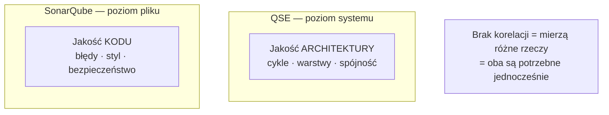

### 1.3 Era AI i nowe zagrożenie

Sytuacja zaostrzyła się wraz z upowszechnieniem narzędzi AI do generowania kodu — GitHub Copilot, Cursor, Claude Code i podobne.

AI generuje kod szybko i lokalnie poprawny. Widzi plik, który edytujesz. Widzi kilka plików kontekstowych. **Nie widzi całego grafu zależności projektu.**

Kiedy AI proponuje `from module_x import something_useful`, nie wie:
- czy `module_x` powinien w ogóle wiedzieć o module, który teraz edytujesz,
- czy ten import zamknie cykl zależności,
- czy przekracza granicę warstw architektonicznych.

Kod przechodzi testy. CI jest zielone. Architektura się degraduje — po cichu, commit po commicie.

QSE może działać jako **guardrail** — automatyczny alarm, który powie "coś się dzieje ze strukturą projektu", zanim dług architektoniczny stanie się problemem niemożliwym do spłacenia.

> ⚠️ **Ważne zastrzeżenie:** QSE wykrywa degradację *po fakcie* — mierzy stan architektury w danym momencie. Nie przewiduje przyszłych problemów. Ta funkcja jest przedmiotem planowanych badań (warstwa Predictor, omówiona w sekcji 7).

---

## 2. Czym jest dobra architektura

### 2.1 Intuicja: miasto, nie spaghetti

Wyobraź sobie miasto zaplanowane z głową:
- **Dzielnice** — mieszkalna, przemysłowa, centrum. Każda ma swój charakter.
- **Granice** — z dzielnicy mieszkalnej do przemysłowej jedzie się drogą główną, nie przez podwórka.
- **Hierarchia** — są drogi lokalne, gminne, krajowe. Każda ma swoją rolę.
- **Samodzielność** — jeśli zamkniesz jedną uliczkę, ruch w mieście się nie zatrzymuje.

Teraz wyobraź sobie miasto bez planu. Każdy budował gdzie chciał. Każde podwórko połączone z każdym innym. Zamknięcie jednej uliczki blokuje połowę ruchu, bo ktoś przypadkowo poprowadził tędy 47 tras.

W oprogramowaniu "miasto z planem" to dobra architektura. "Miasto bez planu" to **big ball of mud** — najgorszy znany anty-pattern architektoniczny.

### 2.2 Cztery właściwości dobrej architektury

QSE mierzy cztery konkretne właściwości:

| Właściwość | Pytanie które zadajemy | Jeśli jest źle... |
|---|---|---|
| **Modularność** | Czy moduły są wyraźnie od siebie oddzielone? | Zmiana jednego dotyka wszystkich |
| **Brak cykli** | Czy zależności idą w jednym kierunku? | Nie można zmienić nic bez zmieniania wszystkiego |
| **Warstwowość** | Czy system ma wyraźne "jądro" i "obrzeże"? | Nikt nie wie co jest "ważne", a co nie |
| **Spójność** | Czy każda klasa robi jedną rzecz? | Klasy to "człowiek-orkiestra" — trudne w testowaniu i rozumieniu |

### 2.3 Czym architektura NIE jest

> 💡 **Częste nieporozumienie:** Architektura i jakość kodu to dwa różne wymiary.

**Architektura ≠ styl kodu.** Dwa projekty mogą mieć identyczny styl (wcięcia, nazewnictwo, długość funkcji) i zupełnie różną architekturę.

**Architektura ≠ coś abstrakcyjnego "dla dużych firm".** Każdy projekt powyżej kilku plików już ma architekturę — dobrą albo złą. Im wcześniej zadbasz o strukturę, tym mniej boli jej późniejsza pielęgnacja.

**Architektura ≠ skomplikowanie.** Dobra architektura jest zazwyczaj prosta. Skomplikowanie to często *objaw* złej architektury.

---

## 3. Jak działa QSE

QSE to narzędzie uruchamiane z linii poleceń (CLI), które analizuje cały projekt i zwraca wyniki w kilka sekund. Oto każdy krok.

### Krok 1 — Uruchomienie

```bash
qse agq /ścieżka/do/projektu
```

QSE automatycznie wykrywa język projektu (Python, Java, Go) i uruchamia odpowiedni skaner.

### Krok 2 — Skanowanie kodu

Pod spodem działa skaner napisany w języku **Rust**, oparty na bibliotece **tree-sitter** — tej samej, która służy do podświetlania składni w edytorach kodu. Skaner analizuje kod *statycznie* (bez uruchamiania), wyciągając:
- listę modułów i klas,
- informacje o importach między modułami,
- strukturę metod i atrybutów klas.

Szybkość: **mediana 0.32 sekundy** na typowy projekt. Skaner Rust jest 7–46× szybszy niż wcześniejsze podejście oparte na interpreterze Pythona.

### Krok 3 — Budowa grafu zależności

Moduły stają się **węzłami** grafu. Importy stają się **krawędziami** — od modułu który importuje, do modułu który jest importowany.

**Kluczowy filtr:** z grafu usuwane są węzły zewnętrzne — biblioteki systemowe (`os`, `java.util`) i zewnętrzne (`requests`, `spring`). Cykl przez zewnętrzną bibliotekę nie jest Twoim problemem architektonicznym. Liczymy tylko zależności między własnymi modułami projektu.

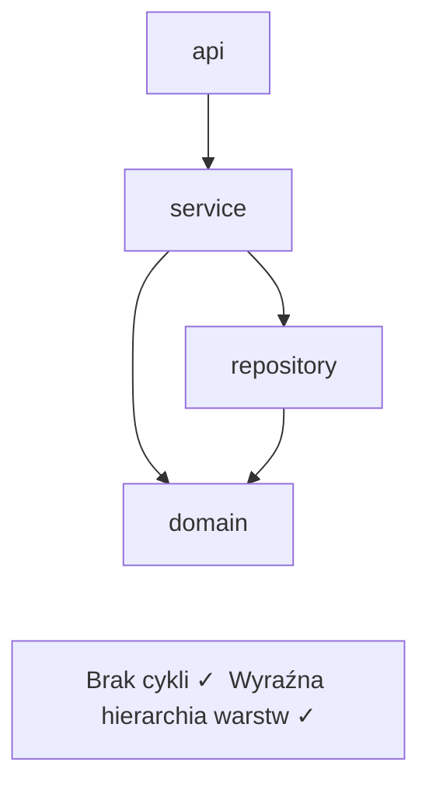

### Krok 4 — Obliczenie AGQ — Architecture Graph Quality

Na grafie zależności QSE oblicza **AGQ** (*Architecture Graph Quality* — Jakość Architektury Grafowej): liczbę [0, 1] będącą ważoną sumą czterech metryk grafowych. To właśnie AGQ jest głównym wynikiem systemu.

Cztery metryki (szczegóły w sekcji 4) — każda od 0 do 1, **1 = najlepsza jakość**:
- **Modularity** — czy moduły są wyraźnie od siebie oddzielone
- **Acyclicity** — czy nie ma cyklicznych zależności
- **Stability** — czy architektura ma wyraźne warstwy
- **Cohesion** — czy każda klasa robi jedną rzecz

### Krok 5 — AGQ Enhanced

Na podstawie wyników AGQ Core obliczane są metryki rozszerzone: normalizacja względem języka (AGQ-z), klasyfikacja wzorca architektonicznego (Fingerprint), ocena powagi cykli i inne. Omówione w sekcji 5.

### Krok 6 — Wynik z wyjaśnieniem

Zamiast suchego `0.46`:

```
AGQ = 0.471  [TANGLED]  z=-1.61 (5%ile Java)
  Modularity=0.57  Acyclicity=0.73  Stability=0.26  Cohesion=0.16
  CycleSeverity=HIGH (15% modułów w cyklach)
  → Projekt w dolnych 5% repozytoriów Java
  → 15% modułów uwięzionych w cyklach — priorytetowa naprawa
  → Wzorzec TANGLED: niska spójność + cykle = architektoniczny dług
```

### Krok 7 — Integracja z CI/CD

```yaml
# .github/workflows/quality.yml
- name: Architecture gate
  run: qse agq . --threshold 0.75 --lang python
  # Pipeline kończy się błędem jeśli AGQ < 0.75
```

QSE zwraca wynik poniżej 1 sekundy — integracja nie spowalnia pracy.

### Krok 8 — Policy-as-a-Service

```bash
# Automatyczne wykrycie granic architektonicznych
qse discover /ścieżka/do/repo --output-constraints .qse/arch.json

# Każdy PR sprawdzany pod kątem naruszeń reguł
qse agq . --constraints .qse/arch.json
```

`qse discover` automatycznie wykrywa klastry w grafie (algorytm Louvain) i generuje plik z regułami architektonicznymi. Od tej pory QSE sprawdza nie tylko metrykę globalną, ale też konkretne naruszenia granic między modułami.

> 📌 **Mini-podsumowanie:** QSE skanuje kod, buduje graf zależności, oblicza cztery metryki grafowe, klasyfikuje wzorzec architektoniczny i zwraca wynik z wyjaśnieniem — w mniej niż sekundę.

---

## 4. Cztery podstawowe metryki AGQ

AGQ (Architecture Graph Quality) to ważona suma czterech metryk. Każda mieści się w przedziale `[0, 1]`, gdzie **1 = idealna jakość**.

```
AGQ = w₁·Modularity + w₂·Acyclicity + w₃·Stability + w₄·Cohesion

Wagi empiryczne (kalibracja na OSS-Python):
  Acyclicity  = 0.730  ← dominująca
  Cohesion    = 0.174
  Stability   = 0.050
  Modularity  = 0.000  ← nie różnicuje niezależnie od reszty
```

---

### 4.1 Modularity — "czy moduły są naprawdę osobne?"

**Co mierzy:** Stopień, w jakim projekt dzieli się na wyraźne, stosunkowo izolowane grupy modułów.

**Intuicja:**
Dobra dzielnica ma wiele wewnętrznych połączeń (sąsiedzi znają sąsiadów) i tylko kilka głównych wylotów do reszty miasta. Kiedy każda uliczka łączy się z każdą inną — nie ma dzielnic, jest chaos.

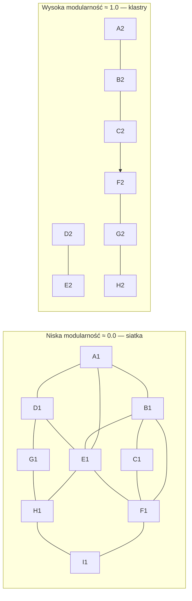

**Jak obliczamy:** Algorytm **Louvain** — ten sam, który służy do wykrywania "społeczności" w sieciach społecznych. Obliczamy **Newman's Q** (stosunek połączeń wewnątrzgrupowych do oczekiwanych przy losowej strukturze).

```
Normalizacja: max(0, Q) / 0.75
(empiryczny sufit dla projektów OSS to Q ≈ 0.75)
```

**Interpretacja:**

| Wartość | Znaczenie |
|---|---|
| `1.0` | Moduły tworzą wyraźne, izolowane grupy |
| `0.5` | Umiarkowana struktura (lub projekt < 10 węzłów — za mały do wiarygodnej analizy) |
| `0.0` | Brak struktury — wszystko połączone ze wszystkim ("big ball of mud") |

> 💡 **Ciekawostka:** Po kalibracji empirycznej waga modularity w AGQ wynosi **0.0**. Oznacza to, że na zbiorze 74 projektów OSS-Python modularity nie wnosiła unikalnego sygnału, gdy pozostałe trzy metryki były obecne. To nie znaczy, że jest bez wartości diagnostycznej — ale jako predyktor procesu nie różnicowała niezależnie od reszty. Kalibracja per-język jest planowanym kierunkiem badań.

---

### 4.2 Acyclicity — "czy nie ma błędnych pętli?"

**Co mierzy:** Czy w grafie zależności istnieją cykle — sytuacje gdzie moduł A zależy od B, B od C, C z powrotem od A.

**Intuicja:**
Wyobraź sobie dział w firmie, gdzie:
- Kadrowe czekają na decyzję Finansów
- Finanse czekają na plan Kadr
- Plan Kadr wymaga akceptacji Finansów

Nikt nic nie zrobi. W kodzie to samo: zmiana modułu A wymusza zmianę B, zmiana B wymusza zmianę C, zmiana C wymusza zmianę A. Są nierozerwalne.

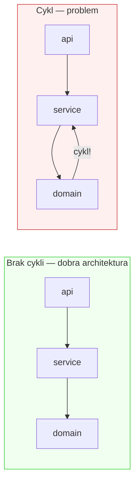

**Jak obliczamy:** **Algorytm Tarjana** (Strongly Connected Components) z teorii grafów. Szukamy największego "splotu" — zbioru węzłów, gdzie każdy jest osiągalny z każdego innego.

```
Acyclicity = 1 − (rozmiar największego SCC / liczba wewnętrznych modułów)
```

> ⚠️ **Ważna decyzja projektowa:** Używamy *największego* cyklu, nie średniej. Jeden "boski cykl" obejmujący 100 modułów jest katastrofą — nie powinien się "rozcieńczać" w dużym projekcie.

**Interpretacja:**

| Wartość | Znaczenie |
|---|---|
| `1.0` | Zero cykli — wszystkie zależności idą "w dół" |
| `0.85` | Kilka procent modułów w cyklach — uwaga |
| `0.50` | Połowa projektu splątana w pętle — poważny problem |
| `0.0` | Cały projekt to jeden wielki cykl |

**Waga empiryczna: 0.73** — najwyższa z czterech metryk. Zgodne z niezależnymi badaniami: cykliczne zależności najsilniej korelują z defektami (Gnoyke et al., JSS 2024).

**Z benchmarku 240 repo:**
- Python: 4% projektów z cyklami
- Go: 0% projektów z cyklami (ekosystem aktywnie wymusza brak cykli)
- Java: **71%** projektów z cyklami

---

### 4.3 Stability — "czy architektura ma wyraźne warstwy?"

**Co mierzy:** Stopień, w jakim moduły projektu pełnią wyraźnie różne role architektoniczne — jedne są "stabilnym jądrem", inne "zmiennym obrzeżem".

**Intuicja:**
Dobrze zorganizowana armia ma wyraźną hierarchię. Generałowie wydają rozkazy wielu oficerów, sami raportują do niewielu. Szeregowcy raportują do oficerów, nikt do nich nie raportuje. Każdy stopień ma inną, jasną rolę.

W złej armii — wszyscy raportują do wszystkich. Nikt nie wie, kto jest "ważny", a kto nie.

**Jak obliczamy:** Dla każdego pakietu (grupy modułów) obliczamy **Instability (I)**:

```
I = importy_wychodzące / (importy_wychodzące + importy_przychodzące)

I ≈ 0.0  →  "jądro" — wiele zależy od tego pakietu, sam zależy od niewielu
I ≈ 1.0  →  "obrzeże" — sam zależy od wielu, nikt nie zależy od niego
I ≈ 0.5  →  "nieuchwytny środek" — brak jasnej roli
```

Dobra architektura warstwowa: pakiety mają zróżnicowane I (0.0, 0.2, 0.5, 0.8, 1.0).
Architektura płaska: wszystkie pakiety I ≈ 0.5.

```
Stability = wariancja(I wszystkich pakietów) / 0.25   (ograniczone do [0,1])

Wysoka wariancja = wyraźna hierarchia = wysoki score
```

**Interpretacja:**

| Wartość | Znaczenie |
|---|---|
| `1.0` | Wyraźna separacja jądra od obrzeży |
| `0.0` | Wszystkie pakiety mają podobną "wagę" — brak warstw |

> 💡 **Uwaga metodologiczna:** Oryginalny wzór Roberta Martina (Distance from Main Sequence, 1994) wymaga danych o abstrakcji klas, które w praktyce są niedostępne (w Pythonie prawie zawsze A=0). Wzór oparty na wariancji instability jest empirycznie zwalidowanym zamiennikiem.

---

### 4.4 Cohesion — "czy każda klasa robi jedną rzecz?"

**Co mierzy:** Stopień, w jakim metody w klasie faktycznie współpracują — czy klasa ma jedną spójną odpowiedzialność.

**Intuicja:**
Dobry pracownik ma jedno stanowisko z kompletem narzędzi do jednego celu. Wszystkie jego narzędzia współpracują. Kiepski pracownik to "człowiek-orkiestra" — ma biurko programisty, stół operacyjny i stanowisko kierowcy tira jednocześnie. Narzędzia się nie łączą. Powinny to być trzy różne osoby.

**Jak obliczamy:** **LCOM4** (Lack of Cohesion of Methods, wersja 4). Budujemy graf dla każdej klasy: metody są węzłami, krawędź łączy dwie metody jeśli dzielą wspólny atrybut klasy. Liczymy liczbę rozłącznych "wysp" (spójnych składowych).

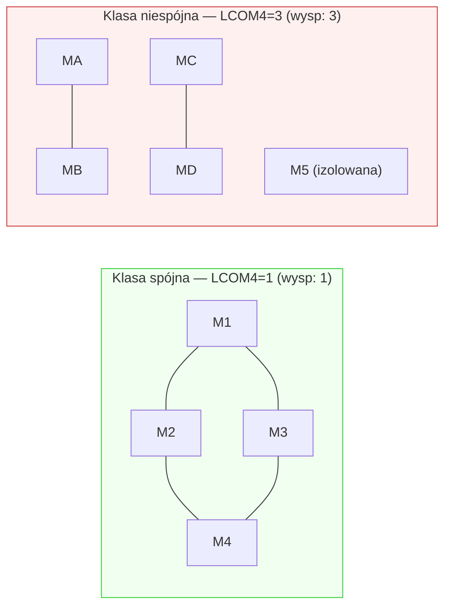

```
Cohesion = 1 − mean((LCOM4 − 1) / max_LCOM4)    na wszystkich klasach
```

**Interpretacja:**

| Wartość | Znaczenie |
|---|---|
| `1.0` | Każda klasa jest jednym spójnym bytem |
| `0.0` | Klasy to zbiory niezwiązanych metod |

> ⚠️ **Language bias — bardzo ważne:**
> - **Go:** zawsze cohesion=1.0 — nie dlatego, że Go-projekty są perfekcyjne, ale dlatego że Go nie ma dziedziczenia klas z atrybutami (interfejsy zamiast hierarchii). LCOM4=1 zawsze z przyczyn językowych.
> - **Java:** średnio 0.38 — Java pozwala na złożone hierarchie klas, gdzie LCOM4 naturalnie rośnie.
>
> Nie porównuj cohesion bezpośrednio między językami. Używaj AGQ-z.

---

### 4.5 QSE_test — metryki jakości testów

Oprócz metryk architektonicznych QSE mierzy jakość zestawu testów w pięciu wymiarach:

| Metryka | Co mierzy |
|---|---|
| **Assertion density** | Średnia liczba asercji na test (test bez asercji niczego nie sprawdza) |
| **Test-to-code ratio** | Stosunek kodu testowego do produkcyjnego |
| **Naming quality** | % testów z opisową nazwą (`test_should_reject_invalid_email` zamiast `test_42`) |
| **Isolation score** | % testów izolowanych od zewnętrznych systemów (mocki, fixtures) |
| **Coverage potential** | % klas domenowych mających przynajmniej jeden test |

```
QSE_test = średnia tych pięciu metryk ∈ [0, 1]
```

> 📌 **Mini-podsumowanie sekcji 4:** AGQ to cztery liczby od 0 do 1, każda mierząca inny aspekt struktury projektu. Acyclicity jest empirycznie najważniejsza (waga 0.73). Language bias sprawia, że surowych wartości nie można bezpośrednio porównywać między językami — do tego służy AGQ-z.

---

## 5. Metryki rozszerzone — AGQ Enhanced

Cztery metryki AGQ Core mówią "jak jest". Metryki Enhanced odpowiadają na pytanie "jak jest *w kontekście*" — co ten wynik znaczy dla tego języka, jakiego wzorca to objaw, jak poważny jest problem.

> 💡 **Kluczowe:** Wszystkie Enhanced metrics są wyliczane z wyników AGQ Core — **nie wymagają dodatkowego skanowania kodu**.

---

### 5.1 AGQ-z — "gdzie jesteś na tle swojego języka?"

**Problem który rozwiązuje:** AGQ=0.65 to dobry wynik dla Javy (powyżej średniej 0.622) i słaby dla Go (poniżej średniej 0.815). Surowa liczba bez kontekstu języka jest myląca.

**Jak oblicza:** Z-score — standaryzacja względem rozkładu danego języka:

```
AGQ-z = (AGQ − średnia_języka) / odchylenie_std_języka
```

Wartości referencyjne z benchmarku 240 repo:

| Język | Średnia AGQ | Std |
|---|---|---|
| Go | 0.815 | 0.063 |
| Python | 0.749 | 0.062 |
| Java | 0.622 | 0.094 |

**Interpretacja:**

| AGQ-z | Znaczenie |
|---|---|
| `+2.0` | Top ~2% dla swojego języka |
| `+1.0` | Lepszy niż ~84% projektów w tym języku |
| `0.0` | Dokładnie przeciętny dla swojego języka |
| `−1.0` | Gorszy niż ~84% projektów w tym języku |
| `−2.0` | Bottom ~2% |

**Przykład z benchmarku:** `kubernetes` ma AGQ=0.655. Absolutnie nie jest to dramatyczny wynik. Ale w porównaniu z innymi projektami Go: AGQ-z = −2.58, czyli **0.5%ile**. Kubernetes jest architektonicznie najsłabszym projektem Go w zbiorze — nie ze względu na cykle (Go ich nie ma), ale przez wzorzec FLAT (brak hierarchii warstw).

---

### 5.2 Fingerprint — "jaki to wzorzec architektoniczny?"

**Problem który rozwiązuje:** Liczba AGQ=0.72 nie mówi, co konkretnie jest nie tak. Fingerprint klasyfikuje wzorzec architektoniczny na podstawie kombinacji acyclicity, cohesion i stability.

**Siedem wzorców** (rozkład z benchmarku 240 repo):

| Wzorzec | Łącznie | Charakterystyka | Typowe dla |
|---|---|---|---|
| **LAYERED** | 68 | Wyraźna hierarchia warstw, ewentualne drobne cykle | Python (57 z 68) |
| **CLEAN** | 51 | Brak cykli, wysoka spójność, wyraźne warstwy | Go (47 z 51) |
| **LOW_COHESION** | 44 | Klasy robią za dużo, niska spójność | Java (40 z 44) |
| **MODERATE** | 40 | Brak wyraźnych patologii | Wszystkie języki |
| **FLAT** | 23 | Brak hierarchii warstw, "równe" pakiety | Duże projekty platformowe |
| **TANGLED** | 9 | Cykle + niska spójność — podwójny dług | Java (9 z 9) |
| **CYCLIC** | 5 | Cykle bez innych wyróżniających problemów | Java (5 z 5) |

> ⚠️ **Ważna uwaga:** FLAT nie zawsze jest defektem. `kubernetes` i `grafana` mają wzorzec FLAT — ale są to ogromne projekty platformowe, gdzie płaska struktura może wynikać z przemyślanych decyzji architektonicznych adekwatnych do skali i liczby kontrybutorów. AGQ-z pozwala odróżnić "płaski z zaniedbania" od "płaski z powodu domenowego uzasadnienia".

---

### 5.3 CycleSeverity — "jak poważne są cykle?"

**Problem który rozwiązuje:** Acyclicity=0.85 mówi "15% modułów jest w cyklach". Ale czy to 3 małe, niezależne cykle, czy jeden wielki splot? To ogromna różnica dla priorytetyzacji naprawy.

| Poziom | Zakres | Rekomendacja |
|---|---|---|
| `NONE` | 0% modułów w cyklach | Brak problemu |
| `LOW` | < 5% | Izolowane przypadki, monitor |
| `MEDIUM` | 5–15% | Wymaga uwagi, planuj refaktoryzację |
| `HIGH` | 15–30% | Pilna refaktoryzacja |
| `CRITICAL` | > 30% | Strukturalny problem, wymagana planowana interwencja |

---

### 5.4 ChurnRisk — "czy zmiany są nierówno rozłożone?"

**Problem który rozwiązuje:** Jeśli 80% zmian w projekcie dotyka 5% modułów, te moduły są *hotspotami* — prawdopodobnie robią za dużo i są trudne w utrzymaniu.

ChurnRisk szacuje ryzyko tego wzorca na podstawie metryk strukturalnych (niska spójność + cykle → wysoki churn jest bardziej prawdopodobny).

**Skala:** `LOW` / `MEDIUM` / `HIGH` / `CRITICAL`

> ⚠️ **Zastrzeżenie:** ChurnRisk to szacunek na podstawie metryk strukturalnych, nie bezpośredni pomiar historii git. To wskaźnik ostrzegawczy, nie pewna prognoza.

---

### 5.5 AGQ-adj — "jak wynik wypada po uwzględnieniu rozmiaru?"

**Problem który rozwiązuje:** Małe projekty (<50 modułów) mają strukturalnie zawyżone AGQ — brak cykli w 10-plikowym projekcie jest trywialny. Duże projekty (>1000 modułów) mają wynik bardziej "zasłużony" przez złożoność.

AGQ-adj normalizuje wynik względem rozmiaru projektu, kalibrując do bazowej linii 500 węzłów.

**Wynik:** AGQ-adj jest rzetelniejszy przy porównywaniu projektów różnej wielkości. W benchmarku koreluje silniej z metrykami procesowymi niż surowe AGQ (r=+0.236 dla AGQ-adj vs hotspot_ratio, p<0.001).

> 📌 **Mini-podsumowanie sekcji 5:** Enhanced metrics dają kontekst do surowych liczb: pozycja względem języka (AGQ-z), wzorzec architektoniczny (Fingerprint), powaga cykli (CycleSeverity), ryzyko procesowe (ChurnRisk), korekta rozmiaru (AGQ-adj).

---

## 6. Jak czytać wynik QSE

### 6.1 Pełny przykład — projekt z problemami

```
AGQ GATE FAIL  agq=0.471  lang=Java
  Modularity=0.57  Acyclicity=0.73  Stability=0.26  Cohesion=0.16
  [TANGLED]  z=−1.61  percentyl=5.3% Java
  CycleSeverity=HIGH (15% modułów w cyklach)
  ChurnRisk=HIGH
  AGQ-adj=0.449
  → Projekt w dolnych 5% repozytoriów Java
  → 15% modułów uwięzionych w cyklach — priorytetowa naprawa
  → Wzorzec TANGLED: niska spójność + cykle = architektoniczny dług
```

*(jackson-databind — rzeczywisty projekt z benchmarku)*

### 6.2 Pełny przykład — projekt dobry

```
AGQ GATE PASS  agq=0.876  lang=Go
  Modularity=0.71  Acyclicity=1.00  Stability=0.84  Cohesion=1.00
  [CLEAN]  z=+0.95  percentyl=82.8% Go
  CycleSeverity=NONE
  ChurnRisk=LOW
  → Strukturalnie czysty: zero cykli, wysoka spójność, wyraźne warstwy
```

### 6.3 Przewodnik interpretacji

| Element | Co oznacza |
|---|---|
| `agq=0.471` | Score composite [0–1]. Liczba diagnostyczna, nie ocena szkolna. |
| `lang=Java` | Kluczowy kontekst — bez niego liczba jest nieczytelna. |
| `[TANGLED]` | Wzorzec architektoniczny. Mówi *jaki typ problemu*, nie tylko "ile". |
| `z=−1.61` / `5.3%ile` | Pozycja na tle innych projektów Java. Dolne 5%. |
| `CycleSeverity=HIGH` | 15% modułów w cyklach. Nie "mamy jakieś cykle" — "problem jest poważny". |
| `GATE FAIL` | Projekt nie spełnił ustalonego progu (konfigurowalnego). |

### 6.4 Ostrożna interpretacja niskiego AGQ

Niskie AGQ **nie oznacza automatycznie**, że projekt jest zły lub nieużywalny. Może oznaczać:

- **Realny problem:** nagromadzone cykle, brak warstw, "god classes" — wymagają uwagi
- **Specyfikę domeny:** duże projekty platformowe mogą mieć płaską strukturę z uzasadnienia domenowego
- **Ograniczenia skali:** bardzo małe projekty (<50 modułów) mają zawyżone AGQ z przyczyn technicznych
- **Language bias:** Java strukturalnie ma niższe cohesion — porównuj tylko w obrębie języka

### 6.5 Czego AGQ Ci nie powie

- ❌ Czy kod działa poprawnie — to zadanie testów
- ❌ Czy kod jest bezpieczny — to zadanie narzędzi bezpieczeństwa
- ❌ Czy projekt będzie miał problemy w przyszłości — AGQ jest diagnostyczny, nie predykcyjny
- ❌ Dlaczego architektura jest taka, a nie inna — QSE wykrywa wzorzec, nie przyczynę

---

## 7. AGQ a przyszły Predictor

> 🔴 **To jest jedna z najważniejszych sekcji. Musi być zrozumiana poprawnie.**

### 7.1 AGQ = score diagnostyczny

AGQ Core odpowiada na pytanie: **"Jaka jest teraźniejsza struktura projektu?"**

Jest:
- **interpretowalny** — każda składowa ma jednoznaczne znaczenie architektoniczne
- **deterministyczny** — ten sam kod zawsze daje ten sam wynik
- **szybki** — poniżej 1 sekundy
- **niezależny od zewnętrznych danych** — nie potrzebuje historii git ani etykiet

**Analogia:** AGQ to **badanie krwi**. Mówi aktualne wartości parametrów. Sam wynik nie prognozuje choroby — to wejście do dalszej analizy.

### 7.2 Predictor = planowana warstwa predykcyjna

Predictor ma odpowiedzieć na pytanie: **"Jakie jest prawdopodobieństwo, że ten projekt będzie miał problemy utrzymaniowe w przyszłości?"**

To **planowane badawczo** rozwinięcie, konceptualnie odrębne od AGQ. Będzie:
- przyjmować AGQ jako jeden z wielu sygnałów wejściowych
- uzupełniać go cechami temporalnymi (historia zmian), procesowymi (churn, autorzy), boundary (granice architektoniczne)
- wymagać osobnego datasetu z etykietami procesowymi
- być walidowany osobną metodologią (cross-validation, przedziały ufności)

**Analogia:** Predictor to **model ryzyka kardiologicznego** — bierze wyniki badań krwi *plus* wiek, wywiad rodzinny, styl życia i szacuje ryzyko przyszłej choroby.

### 7.3 Dlaczego NIE należy ich mylić

Częsty błąd: *"AGQ jest niskie → projekt będzie miał problemy"*. To niepoprawna interpretacja.

AGQ wykazuje statystycznie istotne, ale **umiarkowane** korelacje z metrykami procesowymi (n=234, Spearman cross-language):
- r=+0.236 z hotspot_ratio (p<0.001)
- r=−0.154 z churn_gini (p=0.018)

Efekty tłumaczą **r²≈3–6% wariancji** zmiennych procesowych. Architektura ma związek z jakością procesu — ale AGQ samo w sobie wyjaśnia małą część zmienności churn czy defektów.

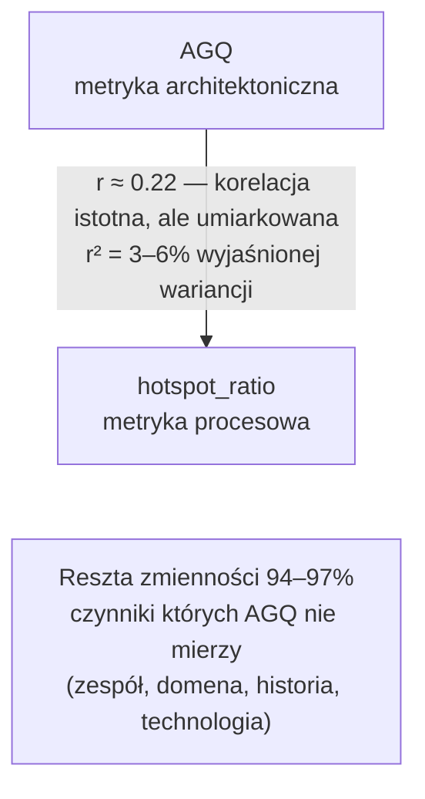

> ✅ **Zapamiętaj:** AGQ = "jak jest teraz". Predictor = "co może się zdarzyć" (planowane, nieistniejące). Dwie różne warstwy, konceptualnie odrębne.

---

## 8. QSE w erze kodu generowanego przez AI

### 8.1 Jakie problemy wnosi AI do architektury

Modele językowe generują kod świetnie w lokalnym kontekście. Mają jednak fundamentalne ograniczenie — **nie widzą całego grafu zależności projektu**.

Typowe wzorce degradacji w kodzie AI-generowanym:

**Import "na skróty":** AI potrzebuje funkcji i importuje ją z modułu, który akurat ją ma — niekoniecznie z modułu który architektonicznie powinien ją dostarczać. Zamyka cykl, który nigdy nie powinien powstać.

**Naruszenia warstw:** AI może zaproponować import z modułu "obrzeża" w module "jądra" — lokalnie sensowny, architektonicznie odwracający hierarchię.

**Koncentracja logiki:** AI często łączy zadania w jednym miejscu zamiast delegować, bo delegowanie wymaga znajomości *całego* kontekstu projektu.

### 8.2 QSE jako guardrail

```yaml
# Każdy PR sprawdzany automatycznie
- name: Architecture gate
  run: qse agq . --threshold 0.80 --lang python
```

Jeśli seria commitów AI-generowanych obniża AGQ, developer dostaje sygnał zanim dług architektoniczny stanie się poważny.

### 8.3 Uczciwe granice QSE

| Co QSE robi | Czego QSE nie robi |
|---|---|
| ✅ Wykrywa degradację po tym jak nastąpiła | ❌ Nie zapobiega problemom przed ich powstaniem |
| ✅ Mówi że "coś się zmieniło na gorsze" | ❌ Nie mówi który konkretny plik naprawić |
| ✅ Pokazuje trend w czasie | ❌ Nie ocenia semantycznej poprawności kodu |
| ✅ Działa jako bramka w CI/CD | ❌ Nie zastępuje code review |

---

## 9. Co już istnieje, co jest planowane

### 9.1 Istniejące i działające

| Element | Status | Lokalizacja |
|---|---|---|
| AGQ Core (4 metryki) | ✅ Zaimplementowany, 244 testy | `qse/graph_metrics.py` |
| AGQ Enhanced (5 metryk) | ✅ Zaimplementowany | `qse/agq_enhanced.py` |
| Skaner Python/Java/Go (Rust) | ✅ Działający, 7–46× szybszy | `qse-core/` |
| CLI: `qse agq`, `qse gate`, `qse discover` | ✅ Działają | `qse/cli.py` |
| Benchmark 240 repo (Python/Java/Go) | ✅ Przeprowadzony | `artifacts/benchmark/` |
| QSE_test (metryki jakości testów) | ✅ Zaimplementowany | `qse/test_quality.py` |
| Kalibracja wag (OSS-Python, n=74) | ✅ Przeprowadzona | acyclicity=0.73 |
| Pre-commit / CI/CD integracja | ✅ Dostępna przez CLI | — |

### 9.2 Przebadane (wyniki empiryczne)

- Benchmark 240 repozytoriów — statystyki opisowe, korelacje, fingerprints
- Ortogonalność AGQ i SonarQube (n=78, brak korelacji, p>0.10)
- Korelacje AGQ z metrykami procesowymi (r≈0.18–0.24, istotne lecz umiarkowane)
- Language bias metryk — empiryczne potwierdzenie biasu Go w cohesion i Java w cyklach

### 9.3 Planowane badawczo — jeszcze nie istnieje

- **Kalibracja wag per język** — obecna tylko na OSS-Python; Java i Go mogą wymagać innych wag
- **Warstwa Predictor** — osobny model ML, konceptualnie oddzielny od AGQ
- **Walidacja na projektach przemysłowych** — czy wyniki z OSS generalizują się na closed-source?
- **Expert labeling** — ocena projektów przez architektów oprogramowania (pilotaż z ludzkim ground truth)
- **Temporal AGQ** — analiza drift architektury przez historię git, per commit
- **Cykl życia naruszenia** — jak długo żyje naruszenie architektoniczne zanim zostanie naprawione?

> 🔴 **Warstwa Predictor nie istnieje w obecnej wersji systemu.** Jest to planowany kierunek badawczy, nie zaplanowana funkcja do wdrożenia w konkretnym terminie.

---

## 10. Ograniczenia i uczciwe zastrzeżenia

Żadne narzędzie nie jest doskonałe. Oto uczciwy obraz ograniczeń QSE.

### 10.1 Language bias

Cohesion jest strukturalnie zawyżona dla Go (zawsze 1.0) i zaniżona dla Javy (średnio 0.38). To nie jest błąd implementacji — to odzwierciedlenie różnic między paradygmatami językowymi.

**Co zrobić:** Porównuj zawsze w obrębie jednego języka. Używaj AGQ-z i AGQ-adj.

### 10.2 Małe projekty mają zawyżone AGQ

Projekty z mniej niż ~50 węzłami wewnętrznymi mają zawyżone AGQ. Mały projekt bez cykli dostaje acyclicity=1.0 — ale brak cykli w 5-plikowym projekcie jest trywialny.

**Co zrobić:** AGQ na małych projektach jest informatywne, ale wymaga ostrożnej interpretacji. AGQ-adj częściowo koryguje ten efekt.

### 10.3 Umiarkowana siła predykcyjna

Korelacje AGQ z metrykami procesowymi są statystycznie istotne, ale wyjaśniają tylko r²≈3–6% wariancji. Architektura to ważny, ale niejedyny czynnik wpływający na procesy wytwarzania.

**Co zrobić:** Niskie AGQ to sygnał ostrzegawczy, nie wyrok. Wysoki AGQ nie gwarantuje braku problemów.

### 10.4 Kalibracja tylko na OSS-Python

Wagi empiryczne zostały wyznaczone na otwartych projektach Python. Mogą nie być optymalne dla projektów Java/Go, komercyjnych, embedded, data science.

**Co zrobić:** Traktuj wagi jako wstępne. Kalibracja per-język jest planowanym badaniem.

### 10.5 Skaner pomija `__init__.py`

W Pythonie skaner nie śledzi importów przez pliki `__init__.py`. Cross-package importy "przez init" mogą nie być widoczne w grafie.

**Co zrobić:** Bądź świadomy że graf może być niekompletny dla projektów intensywnie używających init jako fasady.

### 10.6 Brak walidacji przemysłowej

Cały benchmark opiera się na projektach open-source z GitHuba. Projekty komercyjne mogą mieć inne charakterystyki.

**Co zrobić:** Przed wdrożeniem QSE w środowisku korporacyjnym przeprowadź pilotaż na wewnętrznych projektach.

---

## 11. Przykładowy scenariusz użycia

### "AI pomaga, ale architektura cierpi"

**Sytuacja:**

Mały zespół (4 osoby) buduje serwis backendowy w Pythonie. Używają AI intensywnie — ~40% nowego kodu pochodzi z AI lub jest przez AI mocno modyfikowane. Projekt działa. Testy przechodzą. CI jest zielone. Ale onboarding nowego developera trwa coraz dłużej.

---

**Tydzień 1 — pomiar baseline:**

```bash
$ qse agq ./src

AGQ = 0.84  [LAYERED]  z=+1.17 (88%ile Python)
  Modularity=0.61  Acyclicity=1.00  Stability=0.79  Cohesion=0.96
  CycleSeverity=NONE
```

Dobry wynik. Czysta architektura warstwowa, zero cykli.

---

**Po 3 miesiącach intensywnego AI-assisted development:**

```bash
$ qse agq ./src

AGQ = 0.71  [MODERATE]  z=−0.61 (27%ile Python)
  Modularity=0.55  Acyclicity=0.89  Stability=0.51  Cohesion=0.89
  CycleSeverity=MEDIUM (8% modułów w cyklach)
  ChurnRisk=MEDIUM
```

Wynik wciąż "akceptowalny" numerycznie, ale sygnały alarmowe:
- Pojawiły się cykle: acyclicity 1.00 → 0.89
- Stability drastycznie: 0.79 → 0.51 — architektura traci hierarchię
- Projekt spadł z 88%ile do 27%ile

---

**Feedback QSE:**

```
⚠ UWAGA: Wykryto degradację vs baseline (3 miesiące temu)
  - Acyclicity:  1.00 → 0.89  (pojawiły się cykle)
  - Stability:   0.79 → 0.51  (zanik hierarchii warstw)
  - Percentyl:   88% → 27% Python (trend: ↓)

  Wykryte cykle [CycleSeverity=MEDIUM]:
  - service.order ↔ service.payment ↔ repository.transaction

  Rekomendacja: przejrzyj importy w module service.order i service.payment
```

---

**Co zrobił zespół:**

Przejrzeli git log ostatnich 3 miesięcy. AI kilkakrotnie "skracało drogę" przez import modułu z innej warstwy. Każda taka zmiana miała sens lokalnie — AI widziało potrzebną funkcję w tamtym module. Globalnie — zamykała cykl.

Refaktoryzacja: przeniesienie wspólnej funkcji do modułu `domain` (właściwa warstwa). Czas naprawy: **2 godziny**. Gdyby odkryto to po roku — prawdopodobnie kilka dni.

---

**Lekcja:**

QSE nie zapobiegło problemowi. Ale pozwoliło wykryć go po 3 miesiącach zamiast po roku. **Trend AGQ jest często ważniejszy niż pojedynczy wynik.**

---

## 12. Dlaczego ten projekt ma sens

### Wartość naukowa

QSE dostarcza pierwszego otwartego, empirycznie zwalidowanego benchmarku metryk architektonicznych na 240 repozytoriach w trzech językach. Wyniki:
- potwierdzają language bias LCOM4 na dużym zbiorze danych
- empirycznie kalibrują wagi composite metric (dotychczas ustalane heurystycznie w literaturze)
- pokazują ortogonalność AGQ i SonarQube — uzasadniając ich komplementarne stosowanie

### Wartość dla software engineering

- Szybki (<1s) feedback architektoniczny — możliwy w pre-commit hooku
- Fingerprint daje nazwę problemowi — "[TANGLED]" jest bardziej informatywne niż "0.47"
- Language-normalized score (AGQ-z) pozwala na sprawiedliwe porównania cross-project

### Wartość dla firm

- Wczesne wykrywanie degradacji architektury — zanim stanie się droga do naprawy
- Quality gate w CI/CD — automatyczna egzekucja standardów architektonicznych
- Komplementarność z istniejącymi narzędziami — nie zastępuje, uzupełnia

### Wartość w erze AI-assisted development

- Guardrail dla kodu AI-generowanego — dokładnie tam gdzie AI jest słabe (globalny kontekst grafu)
- Metryka trendu — śledzenie czy AI-assisted development degraduje architekturę szybciej
- Obszar wciąż słabo zbadany naukowo — dużo otwartych pytań, dużo do odkrycia

---

## 13. FAQ — często zadawane pytania

**Q: Czy niskie AGQ oznacza, że projekt jest "zły"?**

Nie bezpośrednio. AGQ mierzy jeden wymiar jakości — strukturę architektoniczną. Projekt może mieć niskie AGQ i być doskonały funkcjonalnie, bezpieczny i dobrze przetestowany. AGQ to sygnał, nie wyrok.

---

**Q: Czy AGQ zastępuje SonarQube?**

Nie. SonarQube patrzy na jakość kodu na poziomie pliku (błędy, styl, bezpieczeństwo). AGQ patrzy na strukturę systemu (zależności między modułami). Brak korelacji między nimi oznacza, że oba są potrzebne jednocześnie.

---

**Q: Dlaczego Go ma zawsze wyższe AGQ niż Java?**

Częściowo przez language bias: Go strukturalnie nie ma cykli (ekosystem je wymusza) i zawsze ma cohesion=1.0 (brak hierarchii klas). Nie oznacza to, że Go-projekty są "lepiej napisane". Do porównań cross-language używaj AGQ-z.

---

**Q: Jak ustalić próg AGQ dla quality gate?**

Nie ma jednej odpowiedzi. Zacznij od zmierzenia aktualnego AGQ projektu jako baseline. Ustaw próg poniżej obecnego wyniku, żeby gate nie blokował natychmiast. Stopniowo podnoś próg w miarę refaktoryzacji.

---

**Q: Czy QSE działa na projektach monolitycznych i mikroserwisowych?**

Obecna wersja analizuje jeden projekt (jeden katalog) jako jednostkę. Mikroserwisy należy analizować per serwis. Cross-service architektura nie jest jeszcze zaimplementowana.

---

**Q: Czy AGQ zmienia się jeśli refaktoryzuję kod bez zmiany zależności?**

- Modularity i Acyclicity — nie (zależą od grafu importów)
- Cohesion — może się zmienić (zależy od metod i atrybutów klas)
- Stability — nie (zależy od struktury pakietów)

---

**Q: Co znaczy "Predictor jest planowany"? Kiedy będzie gotowy?**

Predictor jest kierunkiem badawczym, nie zaplanowaną funkcją do wdrożenia w konkretnym terminie. Wymaga zebrania cech, analizy, walidacji modelu, oceny interpretowalności. To wieloetapowy projekt badawczy.

---

**Q: Czy mogę używać QSE na swoich projektach teraz?**

Tak. Pakiet jest dostępny:
```bash
pip install git+https://github.com/PiotrGry/qse-pkg.git
qse agq /ścieżka/do/projektu
```
Benchmark i wagi kalibrowane na OSS — dla projektów komercyjnych traktuj wyniki diagnostycznie, nie normatywnie.

---

**Q: Czy QSE działa z innymi językami niż Python, Java, Go?**

Aktualnie nie. Skaner Rust obsługuje te trzy języki. Rozszerzenie jest możliwe technologicznie, ale nie jest obecnym priorytetem.

---

## 14. Najkrócej: co trzeba zapamiętać

```
╔══════════════════════════════════════════════════════════════════╗
║  10 rzeczy o QSE które warto zapamiętać                         ║
╚══════════════════════════════════════════════════════════════════╝

 1. QSE mierzy ARCHITEKTURĘ, nie kod.
    Inny wymiar niż SonarQube. Oba są potrzebne jednocześnie.

 2. AGQ = cztery metryki grafowe.
    Modularity · Acyclicity · Stability · Cohesion
    Każda od 0 do 1, wyższa = lepsza struktura.

 3. Acyclicity jest najważniejsza (waga 0.73).
    Cykliczne zależności korelują najsilniej z problemami
    utrzymaniowymi. Brak cykli = podstawa dobrej architektury.

 4. Nie porównuj surowego AGQ między językami.
    Go ma zawsze cohesion=1.0 z przyczyn językowych, nie
    jakościowych. Używaj AGQ-z do porównań cross-project.

 5. Fingerprint mówi więcej niż liczba.
    [TANGLED] = cykle + niska spójność.
    [CLEAN]   = brak patologii.
    [FLAT]    = brak hierarchii warstw (nie zawsze defekt).

 6. AGQ jest DIAGNOSTYCZNY, nie predykcyjny.
    Mierzy teraźniejszą strukturę.
    Nie prognozuje przyszłych problemów (r²≈3–6%).

 7. Predictor NIE ISTNIEJE jeszcze.
    To planowany kierunek badań, odrębny od AGQ.
    Nie mieszaj diagnostyki z predykcją.

 8. Trend AGQ ważniejszy niż pojedynczy wynik.
    Spadek 0.84 → 0.71 przez 3 miesiące to sygnał.
    Statyczne 0.71 bez kontekstu to tylko liczba.

 9. QSE ma ograniczenia. Uczciwe.
    Mały projekt = zawyżone AGQ.
    Wagi kalibrowane tylko na OSS-Python.
    Brak walidacji na projektach przemysłowych.

10. QSE to narzędzie, nie wyrocznie.
    Dostarcza sygnałów.
    Decyzje podejmuje człowiek.
```

---
---

# Dodatek A — Executive Summary

## QSE — Quality Score Engine: krótki opis projektu

**Co to jest:**
Otwarte narzędzie do automatycznego pomiaru jakości architektonicznej oprogramowania. Analizuje graf zależności między modułami i oblicza kompozytową metrykę AGQ.

**Problem który rozwiązuje:**
Istniejące narzędzia (SonarQube, linters) mierzą jakość kodu na poziomie pliku. Żadne nie mierzy struktury systemu jako całości — modularności, cykli zależności, hierarchii warstw, spójności klas. QSE wypełnia tę lukę.

**Jak działa:**
Skanuje projekt (Python, Java lub Go), buduje graf zależności między własnymi modułami, oblicza cztery metryki grafowe (modularity, acyclicity, stability, cohesion), agreguje je do wyniku AGQ i klasyfikuje wzorzec architektoniczny (Fingerprint). Czas: mediana < 1 sekunda.

**Co pokazuje wynik:**

| Element | Opis |
|---|---|
| AGQ [0–1] | Composite score architektury |
| Fingerprint | Wzorzec: CLEAN / LAYERED / FLAT / TANGLED / CYCLIC / LOW_COHESION / MODERATE |
| AGQ-z | Percentyl w danym języku (kluczowy do cross-project porównań) |
| CycleSeverity | Powaga cykli: NONE / LOW / MEDIUM / HIGH / CRITICAL |
| PASS / FAIL | Względem konfigurowalnego progu |

**Stan projektu:**

| | Status |
|---|---|
| AGQ Core, AGQ Enhanced, CLI, skaner Rust | ✅ Zaimplementowane |
| Benchmark 240 repo (Python, Java, Go) | ✅ Przeprowadzony |
| Warstwa Predictor, kalibracja per-język | 🔬 Planowane badawczo |

**Kluczowe wyniki empiryczne (n=240):**
- Brak korelacji AGQ z SonarQube (p>0.10) → komplementarne narzędzia
- Korelacja AGQ-adj z hotspot_ratio: r=+0.236, p<0.001
- Language bias: Go cohesion=1.0 zawsze, Java cohesion=0.38 średnio
- Optymalne wagi: acyclicity=0.73, cohesion=0.17, stability=0.05, modularity=0.0

**Ważne zastrzeżenia:**
- AGQ jest diagnostyczny, nie predykcyjny (r²≈3–6%)
- Wagi kalibrowane na OSS-Python — wymagają replikacji per-język
- Brak walidacji na projektach przemysłowych

```bash
# Instalacja i użycie
pip install git+https://github.com/PiotrGry/qse-pkg.git
qse agq /ścieżka/do/projektu
```

---

# Dodatek B — Słowniczek 10 pojęć

**1. AGQ (Architecture Graph Quality)**
Kompozytowa metryka jakości architektury, wartość 0–1. Wyliczana jako ważona suma czterech metryk grafowych. Wyższa wartość = lepsza struktura architektoniczna.

**2. Graf zależności**
Sieć powiązań między modułami projektu. Węzeł = moduł. Krawędź = import między modułami. Cała analiza QSE opiera się na tym grafie.

**3. Acyclicity (brak cykli)**
Miara braku cyklicznych zależności. Cykl: A zależy od B, B od C, C od A — zmiana jednego wymaga zmian w całym łańcuchu. Acyclicity=1.0 → brak cykli. Najważniejsza metryka AGQ (waga 0.73).

**4. Cohesion (spójność)**
Miara tego, czy metody w klasie faktycznie ze sobą współpracują. Wysoka cohesion = klasa robi jedną rzecz. Niska cohesion = klasa jest przypadkowym zbiorem niezwiązanych metod.

**5. Fingerprint (odcisk architektoniczny)**
Klasyfikacja wzorca: CLEAN, LAYERED, FLAT, TANGLED, CYCLIC, LOW_COHESION, MODERATE. Mówi jaki typ struktury (lub problemu) charakteryzuje projekt.

**6. AGQ-z (z-score)**
Normalizacja AGQ względem języka. Mówi gdzie projekt plasuje się na tle innych projektów w tym samym języku. Konieczny do porównań cross-project.

**7. Language bias**
Zjawisko, w którym ta sama wartość metryki ma inne znaczenie w różnych językach — z powodu paradygmatu języka, nie jakości kodu. Przykład: Go cohesion=1.0 zawsze.

**8. SCC (Strongly Connected Component)**
Z teorii grafów: zbiór węzłów, gdzie każdy jest osiągalny z każdego innego. SCC o rozmiarze >1 to cykl zależności. Rozmiar największego SCC służy do obliczenia acyclicity.

**9. Predictor**
Planowana (nieistniejąca) warstwa predykcyjna QSE. Miałaby szacować ryzyko przyszłych problemów utrzymaniowych. Konceptualnie odrębna od diagnostycznego AGQ.

**10. Quality Gate**
Automatyczna bramka w CI/CD: jeśli AGQ spada poniżej ustalonego progu, pipeline kończy się błędem i PR jest blokowany. Narzędzie do egzekwowania standardów architektonicznych.

---

# Dodatek C — Propozycje diagramów

### Diagram 1: Trójwarstwowa architektura QSE

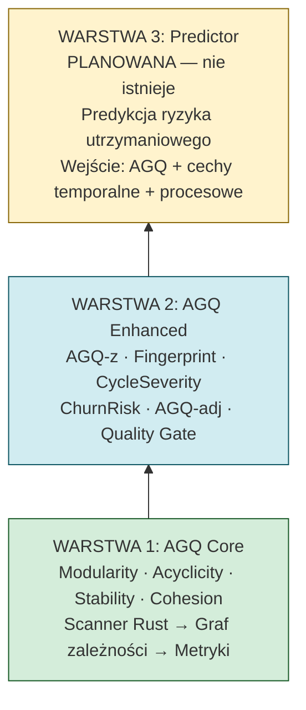

*Cel: pokazać hierarchię systemu i wyraźne rozdzielenie diagnostyki (warstwy 1–2) od planowanej predykcji (warstwa 3).*

---

### Diagram 2: Cztery metryki AGQ — wizualna intuicja

**Modularity:**

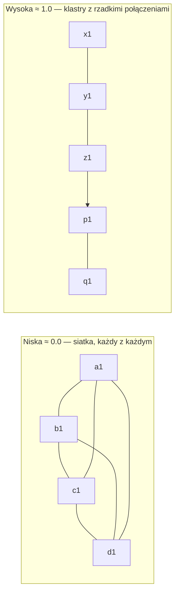

**Acyclicity:**

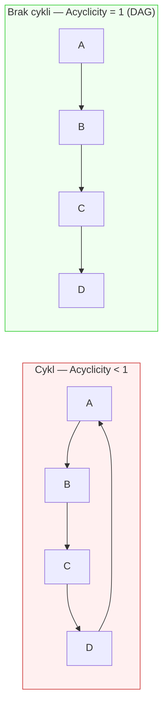

**Stability:**

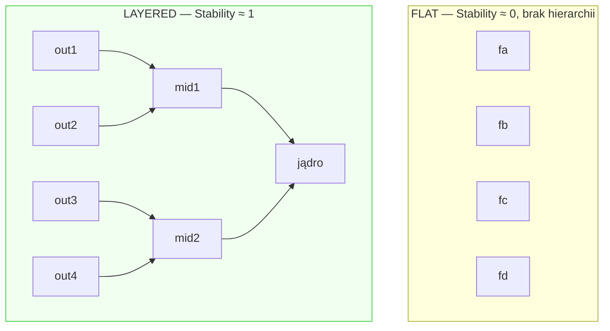

**Cohesion:**

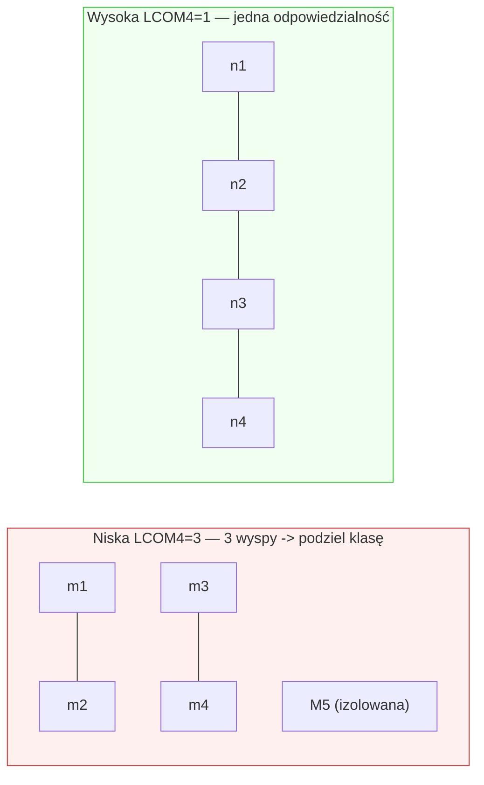

*Cel: wizualne wytłumaczenie każdej metryki zanim student zobaczy wzory i liczby.*

---

### Diagram 3: Pipeline QSE — od kodu do wyniku

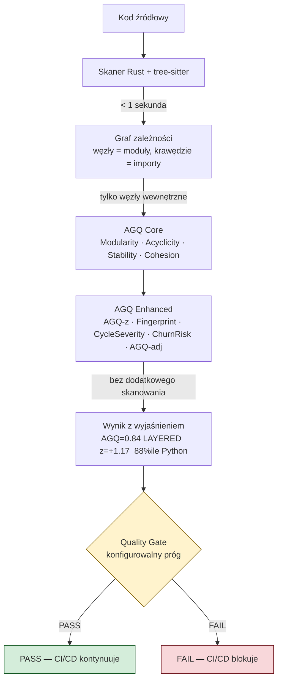

*Cel: pokazać end-to-end przepływ danych — co się dzieje pod spodem wywołania `qse agq ./src`.*

# Dodatek D — Mini-podręcznik statystyki dla czytelnika QSE

> Ten dodatek wyjaśnia wszystkie pojęcia statystyczne używane w tym podręczniku.
> Nie zakłada żadnej wcześniejszej wiedzy ze statystyki.
> Pojęcia ułożone są od podstawowych do bardziej złożonych.

---

## Grupa 1 — Podstawy korelacji

---

### 1. Korelacja — czy dwie rzeczy "chodzą razem"?

**Intuicja:**

Wyobraź sobie, że mierzysz wzrost i wagę 100 osób. Zauważasz, że wyższe osoby są zazwyczaj cięższe. To nie jest przypadek — wzrost i waga są **skorelowane**. Nie zawsze (są niscy i ciężcy ludzie), ale ogólnie: jeśli rośnie jedno, rośnie drugie.

W QSE pytamy na przykład: *czy projekty z lepszą architekturą (wyższe AGQ) mają mniej hotspotów w kodzie?* Jeśli tak — AGQ i hotspot_ratio są skorelowane.

**Dwa rodzaje korelacji:**

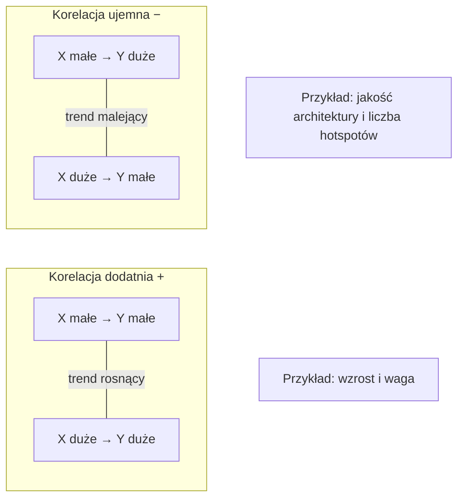

**Brak korelacji:**
Jeśli wiedzą o X nic nie mówi Ci o Y — zmienne są od siebie niezależne. Tak jest z AGQ i SonarQube: wiedząc, że projekt ma AGQ=0.8, nie możesz przewidzieć jego oceny w SonarQube.

---

### 2. r — współczynnik korelacji

**Co to jest:**
Liczba od −1 do +1, która mówi jak silna i w jakim kierunku jest korelacja.

```
r = −1.0   Idealna korelacja ujemna (jeden rośnie, drugi maleje perfekcyjnie)
r = −0.5   Umiarkowana korelacja ujemna
r =  0.0   Brak korelacji — zmienne niezależne
r = +0.5   Umiarkowana korelacja dodatnia
r = +1.0   Idealna korelacja dodatnia (jeden rośnie, drugi też perfekcyjnie)
```

**Jak czytać wartości z QSE:**

| Wartość r | Interpretacja |
|---|---|
| `r = +0.236` | Słaba-umiarkowana korelacja dodatnia — im wyższe AGQ-adj, tym wyższy hotspot_ratio (lekki trend) |
| `r = −0.154` | Słaba korelacja ujemna — im wyższe AGQ-adj, tym niższe churn_gini (lekki trend) |
| `r ≈ 0.0` | Brak korelacji — tak wygląda relacja AGQ z metrykami SonarQube |

> ⚠️ **Typowe nieporozumienie:** r=0.236 to nie jest "słaby wynik" w kontekście badań nad oprogramowaniem. Systemy złożone rzadko mają korelacje r>0.5 między statycznymi metrykami a dynamicznymi procesami. Korelacja r≈0.2 przy n=234 jest **statystycznie istotna i merytorycznie sensowna** — oznacza realny, powtarzalny związek, choć niesilny.

---

### 3. r² — ile procent zmienności "wyjaśniamy"?

**Intuicja:**

r mówi o kierunku i sile korelacji. r² (r do kwadratu) mówi o czymś konkretniejszym: **jaki procent zmienności jednej zmiennej jest "wyjaśniony" przez drugą**.

```
r = +0.236  →  r² = 0.236² = 0.056  →  ~5.6% "wyjaśnionej" zmienności
```

Co to znaczy praktycznie?

Wyobraź sobie, że badamy 234 projekty i ich hotspot_ratio (ile procent kodu to hotspoty). Każdy projekt ma inną wartość — jest "zmienność". AGQ-adj wyjaśnia **ok. 5–6%** tej zmienności. Pozostałe 94–95% to inne czynniki: rozmiar zespołu, domena projektu, styl zarządzania, technologia, historia projektu.

**Dlaczego 5% to nie jest mało:**

W naukach o oprogramowaniu, gdzie mierzysz statyczne właściwości kodu i porównujesz je z dynamicznymi procesami zespołów, r²=5% oznacza realny, powtarzalny sygnał. Literatura naukowa regularnie publikuje wyniki na tym poziomie jako wartościowe. Nie należy tego mylić z "AGQ wyjaśnia architekturę projektu" — to byłoby inne pytanie.

---

### 4. Korelacja Spearmana — kiedy dane nie są "grzeczne"

**Czym różni się od Pearsona:**

Standardowy współczynnik korelacji (Pearson's r) zakłada, że dane mają **rozkład normalny** (dzwonowy) i że związek między zmiennymi jest **liniowy** (im więcej X, tym proporcjonalnie więcej Y).

W praktyce dane z projektów oprogramowania często łamią te założenia:
- AGQ nie ma idealnie dzwonowego rozkładu (jest lekko asymetryczny)
- Zależność między AGQ a churn może być nieliniowa (słaby projekt degeneruje dramatycznie, dobry zmienia się mało)
- Mogą być wartości skrajne (outliers) — np. kubernetes, które jest wyjątkowe na tle innych Go-projektów

**Spearman rozwiązuje ten problem przez rangi:**

Zamiast porównywać wartości bezpośrednio, zamienia je na rangi (miejsca w rankingu) i koreluje rangi.

```
Wartości oryginalne:    AGQ:   [0.65, 0.82, 0.71, 0.90, 0.55]
Rangi AGQ:                     [  3,    4,    2,    5,    1  ]

Wartości oryginalne:    churn: [0.45, 0.20, 0.38, 0.15, 0.60]
Rangi churn:                   [  4,    2,    3,    1,    5  ]

Korelacja Spearmana = korelacja między rangi_AGQ i rangi_churn
```

**Wynik:** Spearman jest odporny na wartości skrajne i nieliniowe zależności. Dlatego QSE raportuje korelacje Spearmana — to uczciwy wybór dla danych z projektów OSS.

> 💡 Wartości r_s (Spearman) interpretuje się tak samo jak r (Pearson): zakres −1 do +1, zero = brak związku.

---

## Grupa 2 — Istotność statystyczna

---

### 5. p-value — czy wynik to przypadek?

**Intuicja:**

Wyobraź sobie, że rzucasz monetą 10 razy i wychodzi Ci 7 reszek. Czy to dowód, że moneta jest nieuczciwa? Może. Ale może to po prostu przypadek — przy uczciwej monecie 7/10 reszek zdarza się dość często.

p-value to odpowiedź na pytanie: **"Jakie jest prawdopodobieństwo, że ten wynik zobaczyłbym przez czysty przypadek, gdyby naprawdę nic nie było?"**

```
p = 0.60  →  60% szans że to przypadek  →  wynik mało wiarygodny
p = 0.10  →  10% szans że to przypadek  →  słabe wsparcie
p = 0.05  →  5% szans że to przypadek   →  konwencjonalny próg istotności
p = 0.01  →  1% szans że to przypadek   →  dobry wynik
p < 0.001 →  < 0.1% szans               →  bardzo silne wsparcie
```

**Jak czytać wyniki z QSE:**

| Wynik | Co znaczy |
|---|---|
| `p < 0.001` | Prawdopodobieństwo przypadku poniżej 0.1% — korelacja realna i powtarzalna |
| `p = 0.018` | 1.8% szans że to przypadek — wynik istotny statystycznie |
| `p > 0.10` | Powyżej 10% szans na przypadek — brak istotnej statystycznie korelacji (tak jest z AGQ vs SonarQube) |

> ⚠️ **Ważne:** p-value mówi czy wynik jest **przypadkowy**, nie czy jest **ważny lub duży**. Przy dużej próbie (n=234) nawet bardzo mała korelacja (r=0.05) może mieć p<0.05. Dlatego zawsze patrz na r i r² razem z p-value.

---

### 6. Istotność statystyczna ≠ praktyczna ważność

To jedno z najczęstszych nieporozumień w interpretacji wyników.

**Istotność statystyczna** (p<0.05) mówi tylko: "ten wynik prawdopodobnie nie jest przypadkowy". Nie mówi, jak duży lub ważny jest efekt.

**Praktyczna ważność** (effect size) — to mierzy r, r², Cohen's d i podobne.

```
Przykład A: n=10 000, r=0.03, p<0.001
  → Statystycznie istotne (mała próba, ale ogromna n)
  → Praktycznie bez znaczenia (r²=0.0009 = 0.09% zmienności)

Przykład B: n=50, r=0.45, p=0.001
  → Statystycznie istotne
  → Praktycznie sensowne (r²=0.20 = 20% zmienności)
```

**W kontekście QSE:**
Korelacje r≈0.18–0.24 przy n=234 są zarówno statystycznie istotne (p<0.02), jak i merytorycznie sensowne w kontekście badań nad oprogramowaniem. Ale r²=3–6% oznacza, że AGQ to jeden sygnał wśród wielu — nie pełna odpowiedź.

---

### 7. n — liczebność próby

**Co to jest:** n to po prostu liczba obserwacji (projektów, pomiarów) w analizie.

**Dlaczego ma znaczenie:**

Przy małym n łatwo "trafić" na wynik przez przypadek. Przy dużym n przypadkowe wyniki uśredniają się i znikają.

```
n=5:   r=0.80, p=0.10  →  Może przypadek — za mała próba
n=50:  r=0.30, p=0.03  →  Prawdopodobnie realny efekt
n=234: r=0.22, p=0.001 →  Bardzo wiarygodny wynik
```

**W QSE:**
- `n=74` — kalibracja wag na OSS-Python
- `n=78` — porównanie AGQ z SonarQube
- `n=234` — korelacje cross-language (240 repo minus kilka wykluczonych)
- `n=240` — pełny benchmark (Python-80, Java-79, Go-81)

Różne n dla różnych analiz — bo nie wszystkie projekty mają dostępne dane do każdej analizy (np. nie każdy projekt miał dane SonarQube).

---

## Grupa 3 — Normalizacja i rozkłady

---

### 8. Średnia i odchylenie standardowe

**Średnia (mean)** — suma wszystkich wartości podzielona przez ich liczbę. "Typowa" wartość w zbiorze.

```
AGQ Java: [0.62, 0.55, 0.71, 0.63, 0.58, ...]
Średnia = (0.62 + 0.55 + 0.71 + 0.63 + 0.58 + ...) / 79 = 0.622
```

**Odchylenie standardowe (std)** — miara "jak bardzo wartości rozrzucone są wokół średniej".

```
Mały std = wartości skupione blisko średniej
Duży std = wartości mocno rozrzucone

Go:   mean=0.815, std=0.063  →  projekty Go są podobne do siebie (małe rozproszenie)
Java: mean=0.622, std=0.094  →  projekty Java bardziej zróżnicowane (większe rozproszenie)
```

**Intuicja ze std:**

```
Zakres "typowy" = mean ± std

Go:   0.815 ± 0.063  →  większość projektów Go między 0.75 a 0.88
Java: 0.622 ± 0.094  →  większość projektów Java między 0.53 a 0.72
```

---

### 9. Z-score — twoja pozycja względem grupy

**Definicja:**

```
z = (wartość − średnia) / odchylenie_standardowe
```

Z-score mówi: **"ile odchyleń standardowych jesteś powyżej lub poniżej średniej"**.

**Przykład krok po kroku:**

```
Projekt: kubernetes (Go)
AGQ = 0.655
Średnia Go = 0.815
Std Go = 0.063

z = (0.655 − 0.815) / 0.063 = −0.160 / 0.063 = −2.54
```

Interpretacja: kubernetes jest 2.54 odchylenia standardowego **poniżej** średniej Go. To rzadkie — mniej niż 1% projektów Go ma gorszy wynik.

**Skala intuicyjna:**

| Z-score | Co to znaczy |
|---|---|
| `+3.0` | Wyjątkowo dobry — lepszy niż 99.9% |
| `+2.0` | Bardzo dobry — top 2.3% |
| `+1.0` | Powyżej przeciętnej — lepszy niż ~84% |
| `0.0` | Dokładnie przeciętny |
| `−1.0` | Poniżej przeciętnej — gorszy niż ~84% |
| `−2.0` | Bardzo słaby — bottom 2.3% |
| `−3.0` | Wyjątkowo słaby — gorszy niż 99.9% |

**Dlaczego AGQ-z jest ważniejszy niż surowe AGQ:**

Bez z-score:
- kubernetes: AGQ=0.655 — "nieźle"
- jackson-databind: AGQ=0.471 — "słabo"

Z z-score:
- kubernetes: z=−2.54 — najgorszy projekt Go w zbiorze
- jackson-databind: z=−1.61 — w dolnych 5% Javy

Liczby zaczynają mówić co naprawdę oznaczają.

---

### 10. Percentyl — twoje miejsce w rankingu (1–100)

**Co to jest:**
Percentyl to Twoja pozycja w rankingu wyrażona jako procent — ile procent grupy jest **poniżej Ciebie**.

```
85. percentyl = lepszy niż 85% grupy
5. percentyl  = lepszy niż tylko 5% grupy (dolne 5%)
50. percentyl = mediana — połowa grupy lepsza, połowa gorsza
```

**Przekształcenie z-score → percentyl:**

Z-score i percentyl są matematycznie powiązane (przez funkcję rozkładu normalnego). QSE oblicza percentyl automatycznie z z-score.

```
z = +0.95  →  percentyl ≈ 82.8%   (kubernetes Go: z=−2.58 → 0.5%ile)
z = −1.61  →  percentyl ≈ 5.3%    (jackson-databind Java)
z = +2.52  →  percentyl ≈ 99.4%   (spotbugs Java — najlepszy Java w zbiorze)
```

**Dlaczego QSE używa percentyli zamiast samych z-score:**

Percentyl jest bardziej intuicyjny dla osoby bez statystycznego background'u. "Top 1% projektów Go" jest łatwiejsze do zrozumienia niż "z=+2.3".

---

## Grupa 4 — Wariancja i modele

---

### 11. Wariancja — miara różnorodności

**Definicja:**
Wariancja mierzy jak bardzo wartości w zbiorze różnią się od siebie (od swojej średniej).

```
Wariancja = średnia z (każda_wartość − średnia)²
```

**Intuicja:**

```
Zbiór A: [0.5, 0.5, 0.5, 0.5]   →  wariancja = 0.0    (wszystkie takie same)
Zbiór B: [0.1, 0.3, 0.7, 0.9]   →  wariancja = 0.08   (różne wartości)
Zbiór C: [0.0, 0.0, 1.0, 1.0]   →  wariancja = 0.25   (ekstremalna różnica)
```

**Dlaczego wariancja instability = dobra architektura w QSE:**

W metryce Stability, dla każdego pakietu obliczamy Instability (I) — od 0 (jądro systemu) do 1 (obrzeże). Potem mierzymy wariancję I między pakietami.

```
Architektura płaska (źle):
  Pakiet A: I=0.50  Pakiet B: I=0.48  Pakiet C: I=0.52
  Wariancja ≈ 0.0  →  Stability ≈ 0.0
  Wszyscy "równi" — nikt nie jest "jądrem", nikt "obrzeżem"

Architektura warstwowa (dobrze):
  Pakiet A: I=0.05  Pakiet B: I=0.50  Pakiet C: I=0.95
  Wariancja ≈ 0.17  →  Stability ≈ 0.68
  Jasna hierarchia: jądro (A), środek (B), obrzeże (C)
```

Wysoka wariancja instability = wyraźna struktura warstw = wysoka Stability.

---

### 12. Kalibracja wag — jak AGQ dobiera współczynniki

**Co to problem:**

AGQ to suma czterech metryk: `AGQ = w₁·M + w₂·A + w₃·St + w₄·Co`. Jakie wartości nadać wagom w₁...w₄?

Można założyć równe (0.25 każda). Ale może acyclicity jest ważniejsza niż modularity? Kalibracja odpowiada na to pytanie empirycznie.

**Jak to działa:**

1. Mamy 74 projekty Python z obliczonymi metrykami AGQ i zmierzonymi wartościami code churn (pośredni wskaźnik kosztów utrzymania)
2. Szukamy takich wag w₁...w₄, żeby AGQ jak najlepiej *przewidywało* churn
3. Używamy algorytmu optymalizacji numerycznej **L-BFGS-B** (Limited-memory BFGS with Bounds) — matematyczna procedura szukania minimum funkcji błędu, wyznaczająca optymalne wartości parametrów

```
Minimalizujemy: błąd(w₁, w₂, w₃, w₄) = Σ (churn_i − AGQ_i(w))²
Wynik:
  w_modularity  = 0.000  ← nie wnosi unikalnego sygnału
  w_acyclicity  = 0.730  ← dominująca
  w_stability   = 0.050
  w_cohesion    = 0.174
```

**Co znaczy waga = 0.0 dla modularity:**

Nie że modularity jest bez wartości jako wskaźnik diagnostyczny. Oznacza, że w tym zbiorze danych, gdy już znamy acyclicity, stability i cohesion — dodanie modularity nie poprawia predykcji churn. Może wynikać z korelacji między metrykami lub z ograniczeń zbioru. To wynik wymagający replikacji na innych zbiorach.

---

### 13. Cross-validation i LOO-CV — czy model się nie "nauczył na pamięć"?

**Problem overfittingu:**

Wyobraź sobie, że uczysz się do egzaminu ucząc się odpowiedzi na pamięć, bez rozumienia. Na tych samych pytaniach wypadniesz idealnie. Na nowych pytaniach — słabo. Model statystyczny może robić to samo: "nauczyć się na pamięć" danych treningowych i być bezużyteczny na nowych danych.

**Cross-validation:**

Testujemy model na danych których *nie widział podczas uczenia*.

**Leave-One-Out Cross-Validation (LOO-CV):**

Najprostszy wariant: mamy 74 projekty.

```
Iteracja 1:  Ucz się na projektach 2–74.  Testuj na projekcie 1.
Iteracja 2:  Ucz się na projektach 1, 3–74.  Testuj na projekcie 2.
...
Iteracja 74: Ucz się na projektach 1–73.  Testuj na projekcie 74.

Wynik = średni błąd predykcji na 74 "nowych" projektach
```

**Dlaczego LOO-CV ważne dla QSE:**

Kalibracja wag AGQ była przeprowadzona na n=74 projektach Python. LOO-CV sprawdza, czy wyznaczone wagi (acyclicity=0.73 itd.) działają nie tylko na tych 74 projektach, ale też na "niewidzianych" danych. Niska wartość MSE w LOO-CV to sygnał, że kalibracja jest stabilna — nie jest artefaktem konkretnego zbioru.

> 💡 **MSE (Mean Squared Error)** — średni kwadrat błędu. Im niższy MSE, tym lepsze dopasowanie modelu do danych.

---

## Grupa 5 — Specyfika kontekstu QSE

---

### 14. Baseline — punkt odniesienia

**Co to jest:**

Baseline to pomiar startowy (punkt zerowy), względem którego oceniamy zmiany. Nie jest to formalne pojęcie statystyczne — to praktyczna konwencja w badaniach i inżynierii.

**W kontekście QSE:**

```
Tydzień 1:  AGQ = 0.84  ← to jest baseline (punkt startowy)
Po 3 mies.: AGQ = 0.71  ← zmiana względem baseline = −0.13

Bez baseline:  "0.71 — nieźle"
Z baseline:    "spadek o 0.13 w 3 miesiące — alarm"
```

**Dlatego baseline jest ważniejszy niż wartość bezwzględna:**
- Projekt A: AGQ=0.70 (baseline=0.72, bez zmian) → OK
- Projekt B: AGQ=0.70 (baseline=0.88, duży spadek) → Problem

AGQ=0.70 mówi jedną historię. Trend AGQ mówi drugą.

---

### 15. Ortogonalność — "niezależne wymiary"

**Co to jest:**

Termin z geometrii. Dwa wektory są ortogonalne jeśli są **prostopadłe** — "nie mają ze sobą nic wspólnego". W statystyce mówimy o ortogonalności gdy dwie zmienne są **nieskorelowane** (r ≈ 0).

**Ortogonalność AGQ i SonarQube:**

```
AGQ = 0.85  →  SonarQube może być A, B lub C — nie wiadomo
AGQ = 0.45  →  SonarQube może być A, B lub C — nie wiadomo

Korelacja AGQ z metrykami Sonara: wszystkie p > 0.10
→ Zmienne ortogonalne = mierzą niezależne wymiary
```

**Dlaczego ortogonalność jest dobra:**

Gdyby AGQ i Sonar były silnie skorelowane (r=0.9) — jedno narzędzie byłoby zbędne. Skoro są ortogonalne, każde wnosi unikalną informację. Razem dają pełniejszy obraz niż każde z osobna.

**Wizualizacja:**

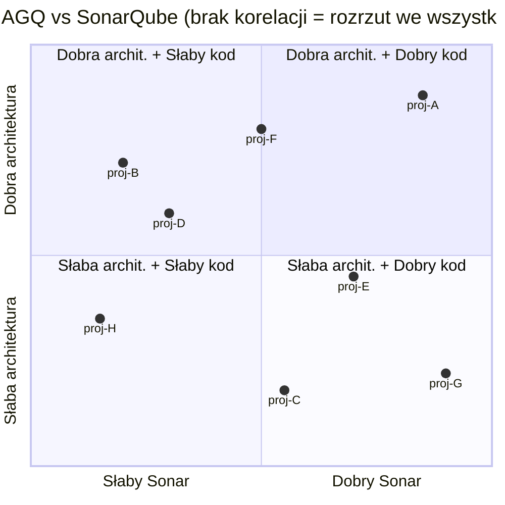

Projekt może być w dowolnym z czterech "narożników": dobra architektura + dobry kod, dobra architektura + słaby kod, słaba architektura + dobry kod, słaba architektura + słaby kod.

---

## Szybki słownik skrótów statystycznych w QSE

| Symbol | Pełna nazwa | Krótko |
|---|---|---|
| `r` | Współczynnik korelacji (Pearson lub Spearman) | Siła związku, zakres −1 do +1 |
| `r_s` | Korelacja Spearmana (rank-based) | Odporna na outliers i nieliniowość |
| `r²` | Współczynnik determinacji | % wyjaśnionej zmienności |
| `p` | p-value (poziom istotności) | Szansa że wynik to przypadek |
| `n` | Liczebność próby | Ile projektów/obserwacji |
| `mean` | Średnia arytmetyczna | Typowa wartość w grupie |
| `std` | Odchylenie standardowe | Miara rozrzutu wokół średniej |
| `z` | Z-score | Pozycja w stdach od średniej |
| `%ile` | Percentyl | % grupy poniżej Ciebie |
| `MSE` | Mean Squared Error | Średni błąd kwadratowy modelu |
| `LOO-CV` | Leave-One-Out Cross-Validation | Walidacja modelu na danych niewidzianych |
| `var` | Wariancja | Średnia kwadratów odchyleń od średniej |

---

---

<div align="center">

---

*QSE — Quality Score Engine*

*Projekt badawczy i narzędzie open-source*

*Repozytorium: https://github.com/PiotrGry/qse-pkg*

*Instalacja: `pip install git+https://github.com/PiotrGry/qse-pkg.git`*

---

*Dokument ma charakter edukacyjno-informacyjny.*
*Wyniki empiryczne oparte na benchmarku 240 repozytoriów (Python/Java/Go, marzec 2026).*
*Wagi AGQ kalibrowane na zbiorze OSS-Python (n=74).*

</div>
