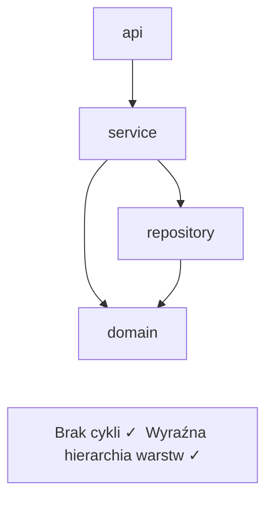
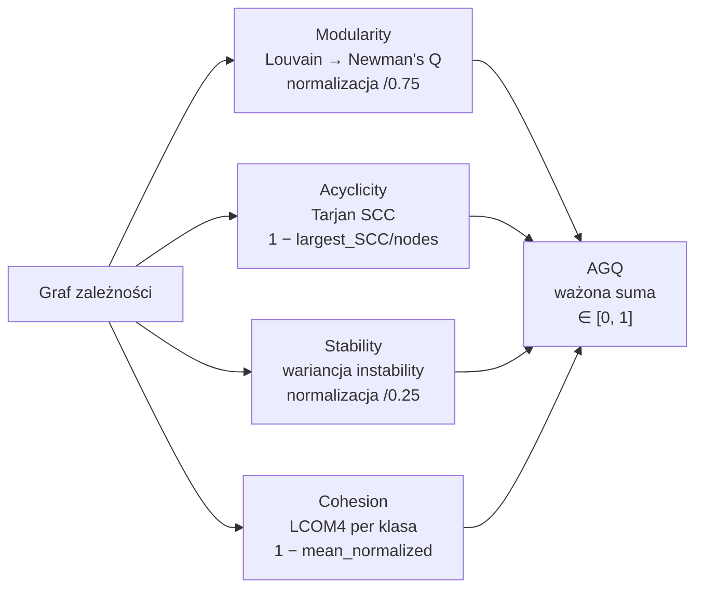

# Jak działa QSE — prosto

## Prostymi słowami

QSE działa jak badanie krwi dla kodu: uruchamiasz jedno polecenie, narzędzie skanuje projekt, buduje mapę powiązań między modułami i zwraca wynik z wyjaśnieniem — wszystko w mniej niż sekundę. Nie uruchamia kodu, nie zmienia żadnych plików, tylko czyta strukturę.

---

## Szczegółowy opis — pipeline krok po kroku

### Krok 1: Uruchomienie

```bash
qse agq /ścieżka/do/projektu
```

QSE automatycznie wykrywa język projektu (Python, Java, Go) i uruchamia odpowiedni skaner. Całe wywołanie zajmuje medianę **0.32 sekundy** na typowy projekt.

### Krok 2: Skanowanie kodu (analiza statyczna)

Pod spodem działa skaner napisany w języku **Rust**, oparty na bibliotece **tree-sitter** — tej samej, która służy do podświetlania składni w edytorach kodu. Skaner analizuje kod *statycznie* (bez uruchamiania), wyciągając:
- listę modułów i klas,
- informacje o importach między modułami,
- strukturę metod i atrybutów klas (potrzebne do LCOM4).

**Szybkość skanera Rust** (w porównaniu z wcześniejszym podejściem opartym na Pythonie):

| Projekt | Python (stare) | Rust (nowe) | Przyśpieszenie |
|---|---|---|---|
| `requests` | 37 ms | 6 ms | 7× |
| `django` | 2095 ms | 54 ms | 39× |
| `pandas` | 6162 ms | 134 ms | 46× |

> 📌 Skaner jest niezależny od runtime — nie potrzebujesz uruchamiać projektu, nie musisz mieć zainstalowanych jego zależności.

### Krok 3: Budowa grafu zależności

Moduły stają się **węzłami** grafu. Importy stają się **krawędziami** — od modułu który importuje, do modułu który jest importowany.

**Kluczowy filtr:** z grafu usuwane są węzły zewnętrzne — biblioteki systemowe (`os`, `java.util`) i zewnętrzne (`requests`, `spring`). Cykl przez zewnętrzną bibliotekę nie jest Twoim problemem architektonicznym. Liczymy tylko zależności między własnymi modułami projektu.



**Przykład z benchmarku:** projekt `attrs` (Python) ma w grafie 14 węzłów wewnętrznych, 0 cykli, 3 wyraźne klastry modułów — stąd AGQ = 1.000. Projekt `jackson-databind` (Java) ma 687 węzłów, 15% modułów w jednym wielkim cyklu SCC — stąd AGQ = 0.471.

### Krok 4: Obliczenie AGQ Core

Na grafie zależności QSE oblicza **AGQ** (*Architecture Graph Quality*): liczbę [0, 1] będącą ważoną sumą czterech metryk grafowych.



Cztery metryki (każda od 0 do 1, **1 = najlepsza jakość**):

| Metryka | Co mierzy | Algorytm | Waga (kalibracja OSS) |
|---|---|---|---|
| **Modularity** | Izolacja grup modułów | Louvain, Newman's Q | 0.000 (0.20 dla Java v3c) |
| **Acyclicity** | Brak cyklicznych zależności | Tarjan SCC | 0.730 (dominuje) |
| **Stability** | Wyraźna hierarchia warstw | Wariancja instability | 0.050 |
| **Cohesion** | Jednorodność klas | LCOM4 | 0.174 |

> ⚠️ Wagi 0.730/0.174/0.050/0.000 pochodzą z kalibracji na OSS-Python (L-BFGS-B + LOO-CV, n=74). Dla Javy i wersji v3c stosowane są równe wagi 0.20 dla każdej z pięciu składowych (M, A, S, C, CD). Wagi per-język są przedmiotem planowanej kalibracji.

### Krok 5: AGQ Enhanced — kontekst

Na podstawie wyników AGQ Core obliczane są metryki rozszerzone (bez dodatkowego skanowania kodu):

- **AGQ-z** — pozycja na tle języka: `(AGQ − średnia_języka) / std_języka`
- **Fingerprint** — wzorzec architektoniczny: CLEAN / LAYERED / FLAT / TANGLED / CYCLIC / LOW_COHESION / MODERATE
- **CycleSeverity** — NONE / LOW / MEDIUM / HIGH / CRITICAL (na podstawie % modułów w cyklach)
- **ChurnRisk** — szacowane ryzyko procesowe (LOW / MEDIUM / HIGH / CRITICAL)
- **AGQ-adj** — wynik skorygowany o rozmiar projektu

Wartości referencyjne z benchmarku (558 repozytoriów):

| Język | Średnia AGQ | Std |
|---|---|---|
| Go | 0.815 | 0.062 |
| Python | 0.753 | 0.062 |
| Java | 0.627 | 0.096 |

### Krok 6: Wynik z wyjaśnieniem

Zamiast suchego `0.46`:

```
AGQ GATE FAIL  agq=0.471  lang=Java
  Modularity=0.57  Acyclicity=0.73  Stability=0.26  Cohesion=0.16
  [TANGLED]  z=−1.61  percentyl=5.3% Java
  CycleSeverity=HIGH (15% modułów w cyklach)
  ChurnRisk=HIGH
  AGQ-adj=0.449
  → Projekt w dolnych 5% repozytoriów Java
  → 15% modułów uwięzionych w cyklach — priorytetowa naprawa
  → Wzorzec TANGLED: niska spójność + cykle = architektoniczny dług
```

*(jackson-databind — rzeczywisty projekt z benchmarku)*

### Krok 7: Quality Gate w CI/CD

```yaml
# .github/workflows/quality.yml
- name: Architecture gate
  run: qse agq . --threshold 0.75
  # Pipeline kończy się błędem jeśli AGQ < 0.75
```

QSE zwraca wynik poniżej 1 sekundy — integracja nie spowalnia pracy.

### Krok 8: Policy-as-a-Service (zaawansowane)

```bash
# Automatyczne wykrycie granic architektonicznych
qse discover /ścieżka/do/repo --output-constraints .qse/arch.json

# Każdy PR sprawdzany pod kątem naruszeń reguł
qse agq . --constraints .qse/arch.json
```

`qse discover` automatycznie wykrywa klastry w grafie (algorytm Louvain) i generuje plik z regułami architektonicznymi. Od tej pory QSE sprawdza nie tylko metrykę globalną, ale też konkretne naruszenia granic między modułami.

---

## Definicja formalna

Pełny pipeline matematyczny AGQ Core (wersja v3c Java, równe wagi):

```
Wejście: Graf G = (V, E) gdzie V = wewnętrzne moduły, E = importy między nimi

Modularity:
  Partycja społeczności algorytmem Louvain → Q_Newman
  M = max(0, Q_Newman) / 0.75

Acyclicity:
  Tarjan SCC na G → SCC_max (największy cykl)
  A = 1 − (|SCC_max| / |V|)

Stability:
  Dla każdego pakietu p: instability(p) = fan_out(p) / (fan_out(p) + fan_in(p))
  S = min(1, var({instability(p)}) / 0.25)

Cohesion:
  Dla każdej klasy k: LCOM4(k) = liczba spójnych składowych grafu metodowego
  C = 1 − mean_{k}((LCOM4(k) − 1) / max_LCOM4)

AGQ_v3c_Java = 0.20·M + 0.20·A + 0.20·S + 0.20·C + 0.20·CD
AGQ_v3c_Python = 0.15·M + 0.05·A + 0.20·S + 0.10·C + 0.15·CD + 0.35·flat_score
```

Złożoność obliczeniowa: dominuje Louvain O(n log n) i Tarjan O(V+E). Dla projektu 1000 węzłów: poniżej 1 sekundy.

---

## Zobacz też
[[What is QSE in Simple Words]] · [[AGQ Formulas]] · [[Scanner]] · [[Static Analysis]] · [[Architecture]]
