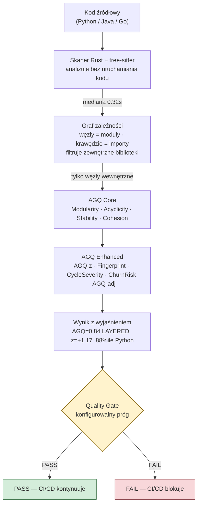

# Czym jest QSE prostymi słowami

## Prostymi słowami

Wyobraź sobie, że budujesz dom. Możesz sprawdzić, czy każda cegła jest dobra — solidna, bez pęknięć. Możesz sprawdzić, czy każde okno jest szczelne. Ale to nie powie Ci, czy dom jest dobrze zaprojektowany: czy ściany nośne stoją w odpowiednich miejscach, czy instalacja elektryczna nie krzyżuje się z wentylacją, czy dach nie opiera się na jednym kluczowym murku, który ktoś może chcieć pewnego dnia usunąć.

W oprogramowaniu jest dokładnie tak samo. **QSE (Quality Score Engine)** to narzędzie, które patrzy na cały budynek — na strukturę systemu jako całości — i mówi: *„ta architektura jest dobra lub zła, i oto dlaczego"*.

---

## Szczegółowy opis

### Co QSE produkuje

QSE produkuje jedną główną liczbę: **AGQ** (*Architecture Graph Quality* — Jakość Architektury Grafowej), wartość od 0 do 1. Im wyżej, tym zdrowsza architektura. Ale to nie tylko liczba — QSE wyjaśnia co za nią stoi:

```
AGQ = 0.571  [LAYERED]  z=+0.45  60%ile Java
  Modularity=0.668  Acyclicity=0.994  Stability=0.344  Cohesion=0.393
  CycleSeverity=NONE  ChurnRisk=LOW
  → Czysty DAG, brak cykli, umiarkowana spójność
```

Wynik zawiera:
- **Liczbę AGQ** — composite score architektury
- **Fingerprint** — jaki wzorzec architektoniczny (CLEAN / LAYERED / FLAT / TANGLED / CYCLIC / LOW_COHESION / MODERATE)
- **AGQ-z** — pozycja na tle innych projektów w tym samym języku (kluczowe do porównań)
- **CycleSeverity** — jak poważne są cykliczne zależności
- **ChurnRisk** — szacowane ryzyko procesowe

### Cztery właściwości — co QSE mierzy

QSE mierzy cztery konkretne właściwości grafu zależności między modułami:

**1. Modularność** — „Czy moduły są naprawdę osobne?"

Dobre miasto ma wyraźne dzielnice — mieszkalna, przemysłowa, centrum. Każda dzielnica ma wiele wewnętrznych połączeń i tylko kilka głównych wylotów do reszty. Kiedy każda uliczka łączy się z każdą inną — nie ma dzielnic, jest chaos.

Modularność mierzy to samo dla modułów w kodzie. Algorytm Louvain wykrywa „społeczności" — grupy modułów, które głównie rozmawiają ze sobą.

**2. Acyclicity (brak cykli)** — „Czy zależności idą w jednym kierunku?"

Wyobraź sobie dział w firmie, gdzie:
- Kadrowe czekają na decyzję Finansów
- Finanse czekają na plan Kadr
- Plan Kadr wymaga akceptacji Finansów

Nikt nic nie zrobi. W kodzie to samo: A importuje B, B importuje C, C importuje A — zmiana jednego wymaga zmiany całego łańcucha.

**3. Stability (warstwowość)** — „Czy system ma wyraźne jądro i obrzeże?"

Dobra armia ma hierarchię: generałowie wydają rozkazy wielu oficerów, sami raportują do niewielu. Szeregowcy raportują do oficerów, nikt do nich nie raportuje. Każdy ma jasną rolę.

Stability mierzy czy pakiety projektu mają zróżnicowane role: jedne są stabilnym „jądrem" (wiele zależy od nich), inne zmiennym „obrzeżem".

**4. Cohesion (spójność)** — „Czy każda klasa robi jedną rzecz?"

Dobry pracownik ma jedno stanowisko z kompletem narzędzi do jednego celu. Kiepski pracownik to „człowiek-orkiestra" — ma biurko programisty, stół operacyjny i stanowisko kierowcy tira jednocześnie. Powinny to być trzy różne osoby.

Cohesion mierzy to przy użyciu LCOM4: ile rozłącznych „wysp" metod ma klasa?

### Pipeline krok po kroku



### Przykłady projektów z benchmarku

| Projekt | AGQ | Fingerprint | Co to znaczy |
|---|---|---|---|
| `attrs` (Python) | 1.000 | CLEAN | Perfekcyjna izolacja modułów, zero cykli |
| `spring-boot` (Java) | 0.876 | LAYERED | Wyraźna hierarchia warstw, kilka drobnych cykli |
| `jackson-databind` (Java) | 0.471 | TANGLED | 15% modułów w cyklach, niska spójność — dolne 5% Java |
| `kubernetes` (Go) | 0.655 | FLAT | Brak hierarchii warstw, FLAT z domenowych powodów |

---

## Definicja formalna

QSE oblicza AGQ jako ważoną sumę czterech metryk grafowych na grafie zależności wewnętrznych modułów projektu:

```
AGQ = w_M·M + w_A·A + w_S·S + w_C·C  [Java: v3c z wagami 0.20 każda]
AGQ = w_M·M + w_A·A + w_S·S + w_C·C + w_CD·CD + w_f·flat_score  [Python: v3c]
```

Gdzie:
- **M** (Modularity) = max(0, Q_Newman) / 0.75, algorytm Louvain
- **A** (Acyclicity) = 1 − (rozmiar największego SCC / liczba węzłów wewnętrznych), algorytm Tarjana
- **S** (Stability) = min(1, var(instability_per_package) / 0.25)
- **C** (Cohesion) = 1 − mean((LCOM4 − 1) / max_LCOM4) na wszystkich klasach
- **CD** (Coupling Density) = 1 − (krawędzie / możliwe krawędzie)
- **flat_score** = 1 − (węzły z głębokością namespace ≤ 2 / wszystkie węzły)

Empiryczna kalibracja wag na OSS-Python n=74 (L-BFGS-B + LOO-CV):
- Acyclicity: 0.730 (dominuje)
- Cohesion: 0.174
- Stability: 0.050
- Modularity: 0.000 (nie różnicuje niezależnie od reszty)

Wyniki walidacji Java GT (n=59): Mann-Whitney U p=0.000221, Spearman ρ=0.380 (p=0.003), AUC-ROC = 0.767.

---

## Czego QSE NIE robi

AGQ mierzy jeden konkretny wymiar: strukturę architektoniczną. Nie mierzy:
- ❌ czy kod działa poprawnie (od tego są testy)
- ❌ czy kod jest bezpieczny (od tego są narzędzia bezpieczeństwa)
- ❌ czy kod jest czytelny, dobrze nazwany (od tego jest SonarQube)
- ❌ co spowodowało aktualną strukturę (QSE wykrywa wzorzec, nie jego przyczynę)

Szczegóły: [[What QSE Is Not]]

---

## Zobacz też
[[Why QSE Exists]] · [[How QSE Works Simply]] · [[AGQ Formulas]] · [[What QSE Is Not]] · [[QSE Canon]]
