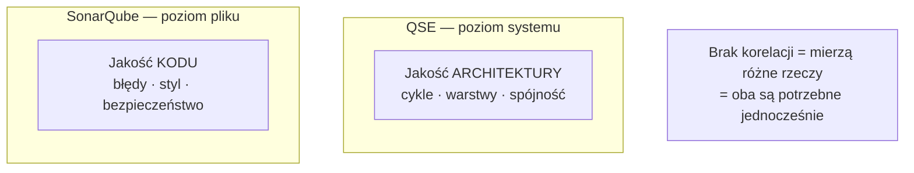

# Dlaczego istnieje QSE

## Prostymi słowami

Większość narzędzi jakości kodu sprawdza poszczególne „cegły" — czy kod jest czytelny, czy nie ma oczywistych błędów, czy nikt nie zostawił hasła w pliku. Nikt dotąd nie stworzył prostego, szybkiego i otwartego narzędzia, które spojrzałoby na **cały budynek** i powiedziało: *„ta architektura jest dobra lub zła, i oto dlaczego"*. QSE wypełnia tę lukę.

---

## Szczegółowy opis

### Problem 1: Dług architektoniczny rośnie niewidocznie

Każdy projekt oprogramowania zaczyna się od prostego pomysłu. Po kilku miesiącach ma dziesiątki modułów, setki klas, tysiące funkcji. Nikt tego specjalnie nie planuje złośliwie — moduł A potrzebuje czegoś z modułu B, więc ktoś dodaje import. Za tydzień B potrzebuje czegoś z C, C z D, D z A. Mamy cykl. System zaczyna „rozmawiać sam ze sobą".

Z zewnątrz kod wygląda normalnie:
- Testy przechodzą ✓
- CI jest zielone ✓
- Code review nie wychwytuje problemu — bo recenzent widzi tylko zmieniony plik

Ale zmiana jednej rzeczy wymaga zmian w pięciu innych miejscach. Nowy developer spędza tydzień próbując zrozumieć, co od czego zależy. Bugi pojawiają się w miejscach pozornie niezwiązanych ze zmianą.

To jest **dług architektoniczny** — i większość narzędzi go nie wykrywa.

### Problem 2: SonarQube nie patrzy na architekturę

SonarQube jest najpopularniejszym narzędziem jakości kodu. Analizuje każdy plik osobno i wykrywa:
- błędy programistyczne,
- code smells (czytelność, styl),
- luki bezpieczeństwa,
- zduplikowany kod.

Robi to dobrze. Ale SonarQube **nie patrzy na graf zależności** — nie wie, jak moduły są ze sobą powiązane i czy ta sieć powiązań ma zdrową strukturę.

Projekt może mieć **ocenę A w SonarQube** (czysty kod na poziomie pliku) i jednocześnie **zdegradowaną architekturę** (splątane zależności między modułami). I odwrotnie.

**Dowód empiryczny:** Spośród 78 dojrzałych projektów Python OSS przebadanych przez QSE, **21 z 78 (27%) dostaje od SonarQube rating „A"** (najwyższy możliwy), ale AGQ identyfikuje u nich problemy architektoniczne poniżej progu jakości. Dane: n=78, wszystkie p>0.10 — brak statystycznej korelacji między AGQ i oceną SonarQube.

To nie jest wada żadnego z narzędzi — to dowód, że **mierzą dwa różne wymiary jakości i wzajemnie się uzupełniają**.

### Problem 3: Era AI i nowe zagrożenie

Sytuacja zaostrzyła się wraz z upowszechnieniem narzędzi AI do generowania kodu — GitHub Copilot, Cursor, Claude Code i podobne. Narzędzia AI generują ponad 46% nowego kodu na GitHubie (dane 2025).

AI generuje kod szybko i lokalnie poprawny. Widzi plik, który edytujesz. Widzi kilka plików kontekstowych. **Nie widzi całego grafu zależności projektu.**

Kiedy AI proponuje `from module_x import something_useful`, nie wie:
- czy `module_x` powinien w ogóle wiedzieć o module, który teraz edytujesz,
- czy ten import zamknie cykl zależności,
- czy przekracza granicę warstw architektonicznych.

Kod przechodzi testy. CI jest zielone. Architektura się degraduje — po cichu, commit po commicie.

**Przykład scenariusza** (z benchmarku): mały zespół (4 osoby) używa AI intensywnie — ~40% nowego kodu pochodzi z AI. Po 3 miesiącach AGQ projektu spada z 0.84 (88. percentyl Python) do 0.71 (27. percentyl). Pojawiają się cykle (`service.order ↔ service.payment ↔ repository.transaction`), które każdy AI-commit zamykał „na skróty". Refaktoryzacja po wykryciu: 2 godziny. Gdyby odkryto to po roku — prawdopodobnie kilka dni.

QSE może działać jako **guardrail** — automatyczny alarm, który powie „coś się dzieje ze strukturą projektu", zanim dług architektoniczny stanie się problemem niemożliwym do spłacenia.

### Problem 4: Brak otwartego, empirycznie zwalidowanego narzędzia

Do momentu powstania QSE nie istniało żadne otwarte narzędzie, które:
- mierzyłoby architekturę całego systemu (nie poszczególnych plików),
- działałoby w mniej niż sekundę (możliwość użycia w pre-commit hooku),
- było empirycznie zwalidowane na dużym zbiorze repozytoriów (n≥500),
- podawało wynik z kontekstem językowym (AGQ-z) i klasyfikacją wzorca (Fingerprint).

---

## Definicja formalna — luka rynkowa

Istniejące narzędzia pokrywają dwa poziomy analizy:

| Poziom | Przykłady narzędzi | Co mierzą |
|---|---|---|
| Linia kodu | Pylint, ESLint, SonarQube | Błędy, styl, bezpieczeństwo, duplikaty |
| Pokrycie testami | pytest, JUnit, coverage.py | % kodu pokrytego testami |
| **Architektura systemu** | **QSE** | **Modularity, Acyclicity, Stability, Cohesion** |

Luka między poziomem linii kodu a architekturą systemu jest udokumentowana w literaturze:
- Gnoyke et al. (JSS 2024): cykliczne zależności najsilniej korelują z defektami
- Martin (1994): „Distance from Main Sequence" — pierwsze formalne ujęcie zdrowej architektury
- Jolak et al. (2025): 8 projektów przebadanych ekspercko, 4/5 wyników potwierdzone przez QSE

**Cel projektu QSE:** Udowodnić, że AGQ (Architecture Graph Quality) koreluje ze stabilnością systemu i może służyć jako automatyczny guardrail dla procesu wytwarzania oprogramowania.

---

## Uczciwe zastrzeżenia

> ⚠️ QSE wykrywa degradację *po fakcie* — mierzy stan architektury w danym momencie. Nie przewiduje przyszłych problemów. Ta funkcja (warstwa Predictor) jest przedmiotem planowanych badań, ale nie istnieje w obecnej wersji systemu.

Korelacje AGQ z metrykami procesowymi są statystycznie istotne, ale umiarkowane (n=234, Spearman):
- r=+0.236 z hotspot_ratio (p<0.001)
- r=−0.154 z churn_gini (p=0.018)

Efekty tłumaczą r²≈3–6% wariancji zmiennych procesowych. AGQ to ważny sygnał, ale nie jedyna determinanta jakości procesu.

---

## Zobacz też
[[What is QSE in Simple Words]] · [[How QSE Works Simply]] · [[What QSE Is Not]] · [[Architecture]] · [[QSE Canon]]
