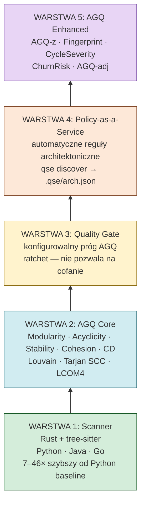

# Architektura systemu QSE

## Prostymi słowami

QSE jest zbudowany jak cebula — pięć warstw, każda wyższa opiera się na niższej. Na dole jest skaner kodu (warstwa 1), na górze metryki rozszerzone z kontekstem (warstwa 5). Każda warstwa ma jasno zdefiniowane zadanie. Możesz użyć tylko warstwy 1 i 2, albo wszystkich pięciu.

---

## Szczegółowy opis — architektura 5-warstwowa



### Warstwa 1: Scanner (Rust + tree-sitter)

**Zadanie:** Przeczytać kod źródłowy i wydobyć z niego strukturę — listę modułów, klas, metod i importów.

**Implementacja:**
- Skaner napisany w języku **Rust**, oparty na bibliotece **tree-sitter**
- Jeden silnik dla wszystkich języków: Python, Java (Maven/Gradle), Go
- **Analiza statyczna** — kod nie jest uruchamiany, skaner czyta tylko strukturę (AST)
- Granulacja węzłów: na poziomie pliku (`package.ClassName` dla Javy, moduł `.py` dla Pythona)

**Wydajność:**
| Projekt | Czas |
|---|---|
| `requests` (Python, ~40 modułów) | 6 ms |
| `django` (Python, ~800 modułów) | 54 ms |
| `pandas` (Python, ~1200 modułów) | 134 ms |
| Mediana projektu OSS | 0.32 s |

**Filtrowanie:** Skaner usuwa węzły zewnętrzne (`os`, `java.util`, `requests`, `spring`) — liczymy tylko własne moduły projektu.

Szczegóły: [[Scanner]]

### Warstwa 2: AGQ Core

**Zadanie:** Na grafie zależności (wyjście Warstwy 1) obliczyć cztery metryki grafowe i zagregować do AGQ.

**Implementacja:** `qse/graph_metrics.py`, 149 testów automatycznych.

```
Graf zależności G = (V, E)
  V = wewnętrzne moduły projektu (po filtrowaniu)
  E = importy między nimi (skierowane krawędzie)

Cztery obliczenia:
  M = Modularity(G)   — algorytm Louvain, Newman's Q
  A = Acyclicity(G)   — algorytm Tarjana, SCC
  S = Stability(G)    — wariancja instability per pakiet
  C = Cohesion(G)     — LCOM4 per klasa

AGQ = ważona suma(M, A, S, C, [CD], [flat_score])
```

Szczegóły wzorów: [[AGQ Formulas]]

### Warstwa 3: Quality Gate

**Zadanie:** Porównać AGQ z konfigurowalnym progiem i zwrócić PASS lub FAIL do CI/CD.

**Implementacja:**
```yaml
# .github/workflows/quality.yml
- name: Architecture gate
  run: qse agq . --threshold 0.75
```

**Tryb ratchet:** Próg może być automatycznie ustawiony na bieżący AGQ projektu — system nie pozwala na obniżenie wyniku poniżej historycznego maksimum. Każdy PR który obniża AGQ jest blokowany.

### Warstwa 4: Policy-as-a-Service

**Zadanie:** Automatycznie wykryć granice architektoniczne projektu i egzekwować je w każdym PR.

**Implementacja:** `qse discover` uruchamia algorytm Louvain na grafie, wykrywa klastry modułów i zapisuje je jako reguły:

```bash
# Generuje plik reguł
qse discover /ścieżka/do/repo --output-constraints .qse/arch.json

# Każdy PR sprawdzany pod kątem naruszeń granic
qse agq . --constraints .qse/arch.json
```

Wynik: nie tylko globalne AGQ, ale też lista konkretnych naruszeń granic modułowych z lokalizacją.

### Warstwa 5: AGQ Enhanced

**Zadanie:** Dać kontekst do surowych liczb z Warstwy 2 — bez dodatkowego skanowania kodu.

**Pięć metryk rozszerzonych:**

| Metryka | Co mówi | Przykład |
|---|---|---|
| **AGQ-z** | Pozycja na tle języka (z-score) | `kubernetes`: AGQ-z = −2.58 → 0.5%ile Go |
| **Fingerprint** | Wzorzec architektoniczny | CLEAN / LAYERED / FLAT / TANGLED / CYCLIC / LOW_COHESION / MODERATE |
| **CycleSeverity** | Powaga cyklicznych zależności | NONE / LOW / MEDIUM / HIGH / CRITICAL |
| **ChurnRisk** | Szacowane ryzyko procesowe | HIGH gdy niska spójność + cykle |
| **AGQ-adj** | Wynik skorygowany o rozmiar | Kalibracja do 500 węzłów jako baseline |

**Rozkład Fingerprintów w benchmarku (558 repozytoriów):**

| Wzorzec | Liczba | Charakterystyka | Typowe dla |
|---|---|---|---|
| LAYERED | 68 | Wyraźna hierarchia, ewentualne drobne cykle | Python (57 z 68) |
| CLEAN | 51 | Brak cykli, wysoka spójność, wyraźne warstwy | Go (47 z 51) |
| LOW_COHESION | 44 | Klasy robią za dużo | Java (40 z 44) |
| MODERATE | 40 | Brak wyraźnych patologii | Wszystkie języki |
| FLAT | 23 | Brak hierarchii warstw | Duże projekty platformowe |
| TANGLED | 9 | Cykle + niska spójność | Java (9 z 9) |
| CYCLIC | 5 | Cykle bez innych problemów | Java (5 z 5) |

---

## Definicja formalna — granice architektoniczne systemu

**Granice między warstwami:**
- Warstwa 1 → 2: interfejs `ScanResult` (lista węzłów + krawędzi)
- Warstwa 2 → 3: wartość skalarna AGQ ∈ [0,1] + próg konfigurowalny
- Warstwa 2 → 5: `AGQMetrics` dataclass (M, A, S, C, CD, flat_score)
- Warstwa 4: konfiguracja `.qse/arch.json` (lista ograniczeń modułowych)

**Niezmiennik architektoniczny:** Warstwy wyższe nie modyfikują wyników warstw niższych. Warstwa 5 (Enhanced) jest czysto obliczeniowa — nie dodaje nowych skanowań ani heurystyk.

**Planowana Warstwa 6 — Predictor** (nie istnieje):
```
WARSTWA 6: Predictor (PLANOWANA)
  Predykcja ryzyka utrzymaniowego
  Wejście: AGQ + cechy temporalne + procesowe
  Status: kierunek badawczy, nie zaplanowana funkcja
```

---

## Zobacz też
[[Scanner]] · [[AGQ Formulas]] · [[Static Analysis]] · [[QSE Canon]] · [[What is QSE in Simple Words]]
