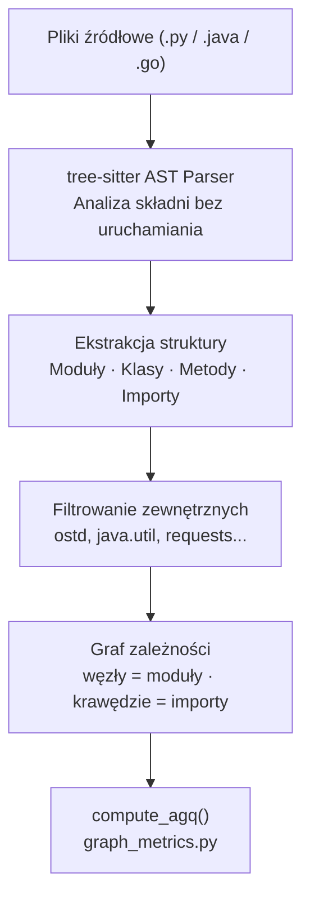

# Skaner QSE

## Prostymi słowami

Skaner to część QSE, która czyta repozytorium i wydobywa z niego strukturę — listę modułów, klas, metod i importów między nimi. Nie uruchamia programu. Czyta tylko tekst plików źródłowych i buduje mapę powiązań. Jest jak tłumacz, który przekształca kod w graf.

---

## Szczegółowy opis

### Pipeline skanera (wspólny dla wszystkich języków)



Każdy skaner realizuje ten sam interfejs: wyjściem jest lista węzłów (moduły) i lista krawędzi (importy), podana do funkcji `compute_agq()`.

---

## Skaner Python (`qse/scanner.py`)

- Używa **tree-sitter** dla AST Pythona
- Granulacja: **moduł** — jeden węzeł per plik `.py`
- Krawędzie: instrukcje `import` i `from...import`
- Obsługuje: importy względne, pakiety `__init__.py`

**Znane ograniczenie:** Skaner nie śledzi importów przez pliki `__init__.py` jako fasady. Cross-package importy „przez init" mogą nie być widoczne w grafie. Projekty intensywnie używające `__init__` jako fasady mogą mieć niekompletny graf.

---

## Skaner Java (`qse/java_scanner.py`)

- Używa **tree-sitter-java** dla AST Javy
- **Czysty Python** — brak zależności od Rust
- Granulacja: **plik** — jeden węzeł per plik `.java` (format: `package.ClassName`)
- Krawędzie: instrukcje `import`
- Ekstrakcja: interfejsy, klasy abstrakcyjne, liczba metod (dla LCOM4)
- Zwraca: dataclass `JavaScanResult`

### Znane ograniczenie: repozytoria multi-module

> ⚠️ **Znane ograniczenie:** CLI `qse scan` zwraca **puste wyniki** dla wielomodułowych repozytoriów Java (Maven multi-module, Gradle multi-project). Wyniki są puste lub nieprawidłowe — bez ostrzeżenia o błędzie.

**Objaw:** `qse scan /repo` zwraca `nodes=0, edges=0` lub niekompletny graf dla repozytoriów z podkatalogami `pom.xml` / `build.gradle` w wielu miejscach.

**Workaround — Python API bezpośrednio:**

```python
from qse.java_scanner import scan_java_repo, scan_result_to_agq_inputs
from qse.graph_metrics import compute_agq

# Skanuj każdy moduł osobno lub użyj głównego katalogu z opcją recursive
scan = scan_java_repo("/ścieżka/do/repo")  # bez polegania na CLI
graph, abstract_modules, lcom4_values = scan_result_to_agq_inputs(scan)
metrics = compute_agq(graph, abstract_modules, lcom4_values)
```

**Historia odkrycia:** Ograniczenie wykryto podczas walidacji P1 Jolak Cross-Validation (skanowanie 8 repozytoriów Java). Potwierdzone ponownie podczas serii eksperymentów E13 (Shopizer, Commons Collections — oba to projekty multi-module Maven).

**Status:** Nienaprawione. Wymagana przebudowa CLI żeby obsługiwał projekty wielomodułowe przez automatyczne wykrycie struktury.

---

### Historia krytycznego buga — zmiana granulacji

#### v1 (zepsuta) — granulacja na poziomie pakietu

```python
# v1: jeden węzeł per pakiet
# Wynik dla yavi (biblioteka walidacji):
#   20 węzłów
#   Acyclicity = 0.400  ← błędnie niskie
```

Błąd: pakiety Java zawierają wiele klas, które mogą mieć między sobą cykle. Agregacja do poziomu pakietu ukrywa te cykle — wynik jest zawyżony lub zaniżony losowo.

#### v2 (naprawiona) — granulacja na poziomie pliku

```python
# v2: jeden węzeł per plik .java (package.ClassName)
# Wynik dla yavi (ten sam projekt):
#   687 węzłów
#   Acyclicity = 0.994  ← poprawne (prawie brak cykli)
```

Naprawa: przepisanie skanera tak żeby tworzyć węzły jako `package.ClassName` per plik `.java`. To samo co skaner Rust.

**Lekcja:** Granulacja węzłów fundamentalnie zmienia wynik AGQ. Zbyt gruba granulacja (pakiet zamiast pliku) maskuje cykle wewnętrzne i daje fałszywe wyniki.

### Użycie skanera Java

```python
from qse.java_scanner import scan_java_repo, scan_result_to_agq_inputs
from qse.graph_metrics import compute_agq

scan = scan_java_repo("/ścieżka/do/repo")
graph, abstract_modules, lcom4_values = scan_result_to_agq_inputs(scan)
metrics = compute_agq(
    graph,
    abstract_modules,
    lcom4_values,
    weights=(0.20, 0.20, 0.20, 0.20)  # v3c Java: równe wagi
)
```

---

## Skaner Rust (`_qse_core`)

- Oryginalny skaner w języku **Rust**
- Używa `module_path()` do tworzenia węzłów na poziomie pliku
- Obsługuje: Python, Java (Maven/Gradle), Go
- **7–46× szybszy** od podejścia opartego na Pythonie

**Wydajność (release build + rayon — wielowątkowy):**

| Projekt | Python baseline | Rust | Przyśpieszenie |
|---|---|---|---|
| requests | 37 ms | 6 ms | 7× |
| django | 2095 ms | 54 ms | 39× |
| pandas | 6162 ms | 134 ms | 46× |
| home-assistant | 19604 ms | 655 ms | 30× |

Skaner Rust był walidowany przez porównanie wyników z wynikami skanera Python/Java — ta sama granulacja, te same węzły.

> ⚠️ Skaner Rust jest niedostępny w środowisku bez Rust toolchain. W takim przypadku używany jest skaner Python/Java (czysty Python).

---

## Filtrowanie węzłów zewnętrznych

Kluczowy krok w każdym skanerze: usunięcie węzłów zewnętrznych.

```
Usuwane:
  - biblioteki standardowe: os, sys, java.util, fmt
  - biblioteki zewnętrzne: requests, spring, numpy
  - własne moduły testowe (opcjonalnie)

Zachowywane:
  - własne moduły projektu (wewnętrzne węzły)
```

**Dlaczego?** Cykl przez zewnętrzną bibliotekę nie jest architektonicznym problemem projektu. `module_A → requests → module_B` nie oznacza że A i B są ze sobą powiązane — requests to zewnętrzna fasada. Liczymy tylko własne zależności.

---

## Definicja formalna

Skaner implementuje ekstrakcję grafu G = (V, E) gdzie:
- V = {m : m jest modułem wewnętrznym projektu}
- E = {(a, b) : moduł a importuje moduł b, oba ∈ V}

Graf jest skierowany (krawędź od importującego do importowanego).

Złożoność: O(n × k) gdzie n = liczba plików, k = średnia liczba importów per plik. Dominuje I/O, nie obliczenia. Optymalizacja Rust używa `rayon` do równoległego parsowania plików.

---

## Zobacz też
[[Static Analysis]] · [[Architecture]] · [[AGQ Formulas]] · [[How QSE Works Simply]] · [[Ground Truth]]
