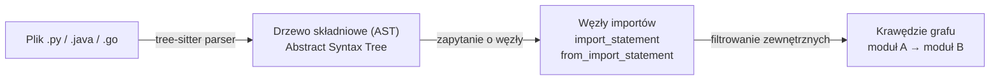

# Analiza statyczna w kontekście QSE

## Prostymi słowami

Analiza statyczna oznacza badanie kodu **bez jego uruchamiania**. Tak jak można ocenić plan architektoniczny budynku bez budowania go — wystarczy spojrzeć na projekt. QSE używa analizy statycznej, bo interesuje go struktura projektu (co importuje co), nie jego zachowanie w czasie wykonania (co zostało wywołane kiedy).

---

## Szczegółowy opis

### Co to jest analiza statyczna

Istnieją dwa podejścia do analizy kodu:

| Podejście | Jak działa | Przykłady |
|---|---|---|
| **Analiza statyczna** | Czyta kod bez uruchamiania — strukturę, typy, importy | QSE, ESLint, Pylint, SonarQube, mypy |
| **Analiza dynamiczna** | Uruchamia kod i obserwuje zachowanie | Coverage tools, profiler, fuzzing |

QSE używa wyłącznie analizy statycznej — z konkretnych powodów projektowych.

### Dlaczego QSE używa analizy statycznej

**Powód 1: Szybkość**

Uruchamianie projektu wymaga instalacji zależności, budowania, konfiguracji środowiska. Analiza statyczna potrzebuje tylko plików źródłowych. Wynik: mediana **0.32 sekundy** na projekt. Możliwe w pre-commit hooku — nie spowalnia pracy.

**Powód 2: Niezależność od środowiska**

Analiza statyczna działa na dowolnym projekcie, niezależnie od:
- systemu operacyjnego,
- zainstalowanych zależności,
- wymaganych usług zewnętrznych (baza danych, API),
- poprawności konfiguracji.

CI/CD może analizować projekt bez setupu środowiska.

**Powód 3: Deterministyczność**

Ten sam kod → zawsze ten sam wynik. Analiza dynamiczna może dawać różne wyniki w zależności od danych wejściowych, kolejności wywołań, stanu zewnętrznego.

**Powód 4: Interesuje nas struktura, nie zachowanie**

QSE pyta: „Jak moduły są ze sobą powiązane?" — to pytanie o strukturę deklaracji importów, nie o wywołania w runtime. Graf zależności z importów jest wystarczający i deterministyczny.

### Jak tree-sitter wspiera analizę statyczną w QSE

QSE używa biblioteki **tree-sitter** do parsowania kodu:

tree-sitter jest tą samą biblioteką która służy do podświetlania składni w edytorach kodu (VS Code, Neovim). Jest ekstremalnie szybka i odporna na błędy składniowe — parsuje nawet uszkodzone pliki.

### Co widzi analiza statyczna, czego nie widzi

**Widzi:**
- Statyczne deklaracje importów (`import X`, `from Y import Z`)
- Strukturę klas i metod (dla LCOM4)
- Hierarchię pakietów i namespace'ów
- Interfejsy i klasy abstrakcyjne (dla Java)

**Nie widzi:**
- Importów warunkowych (`if DEBUG: import X`) — te są pomijane
- Dynamicznych importów (`importlib.import_module(name)`) — niestatyczne
- Wywołań przez reflection (Java: `Class.forName(...)`)
- Zależności w runtime, które nie mają deklaracji importu

**Konsekwencja:** Graf QSE to *dolne ograniczenie* rzeczywistych zależności. Projekty intensywnie używające dynamicznych importów mogą mieć niekompletny graf — jest to znane ograniczenie, opisane w dokumentacji.

### Analiza statyczna vs code smell detection

SonarQube też używa analizy statycznej, ale w innym celu:

| Cel | QSE | SonarQube |
|---|---|---|
| Poziom analizy | System (graf modułów) | Plik (kod linijka po linijce) |
| Co szuka | Wzorce architektoniczne | Błędy, styl, bezpieczeństwo |
| Jednostka | Moduł / pakiet | Linia / funkcja / klasa |
| Wynik | AGQ ∈ [0,1] + Fingerprint | Issue list, rating A-F |

Brak korelacji empirycznej (n=78, p>0.10) potwierdza, że SonarQube i QSE mierzą ortogonalne wymiary.

---

## Definicja formalna

**Analiza statyczna** (*static analysis*) to analiza kodu źródłowego bez jego wykonania, w celu wydobycia właściwości strukturalnych lub semantycznych programu.

W kontekście QSE: analiza statyczna produkuje skierowany graf G = (V, E) gdzie:
- V = zbiór wewnętrznych modułów projektu (pliki / pakiety)
- E ⊆ V × V = zbiór par (a, b) gdzie moduł a deklaruje statyczny import modułu b

Graf G jest wejściem do wszystkich czterech metryk AGQ (Modularity, Acyclicity, Stability, Cohesion). Analiza nie wymaga informacji semantycznych ani typów danych — wystarczają deklaracje importów.

---

## Zobacz też
[[Scanner]] · [[Architecture]] · [[How QSE Works Simply]] · [[AGQ Formulas]] · [[What QSE Is Not]]
