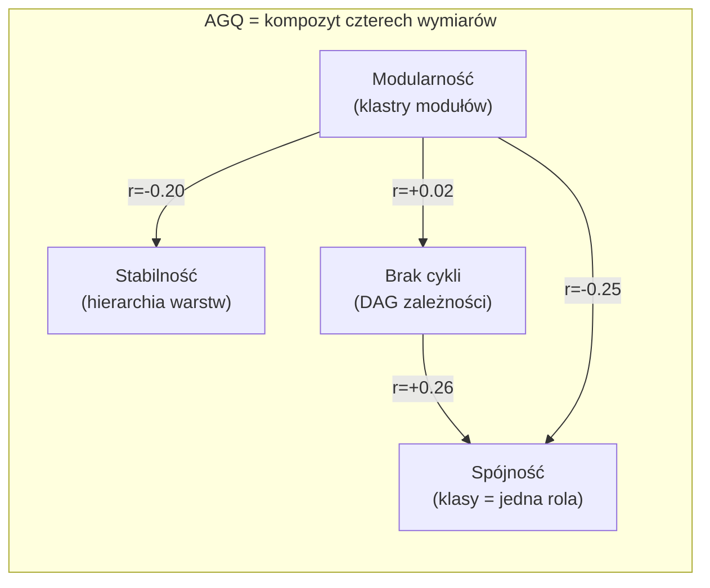

# Wymiary koncepcyjne QSE

## Prostymi słowami

Dobra architektura to nie jedna rzecz — to cztery niezależne właściwości naraz. Wyobraź sobie dom: może mieć dobre fundamenty (stabilność), ale bałagan w pokojach (słaba spójność). Albo czyste pokoje, ale poplątane rury biegnące przez wszystko (cykle). QSE mierzy te cztery wymiary osobno, bo każdy z nich może zawieść niezależnie od pozostałych.

## Szczegółowy opis

QSE opiera się na czterech wymiarach koncepcyjnych, każdy odpowiada na inne pytanie o strukturę projektu:

| Wymiar | Pytanie | Metryka | Wynik ≈ 1 oznacza |
|---|---|---|---|
| **Modularność** | Czy moduły są od siebie wyraźnie oddzielone? | [[Modularity]] | Wyraźne klastry, luźne sprzężenia |
| **Brak cykli** | Czy zależności idą w jednym kierunku? | [[Acyclicity]] | Żadnych pętli zależności |
| **Stabilność** | Czy system ma jądro i obrzeże? | [[Stability]] | Wyraźna hierarchia warstw |
| **Spójność** | Czy klasy mają jedną odpowiedzialność? | [[Cohesion]] | Każda klasa = jeden cel |

### Dlaczego akurat te cztery?

Wybór nie jest przypadkowy. Wywodzi się z teorii projektowania oprogramowania:

- **Modularność** — Newman's Modularity Q (2006): mierzalna struktura "społeczności" w grafie
- **Brak cykli** — Tarjan SCC (1972): ścisła definicja matematyczna pętli w grafie skierowanym
- **Stabilność** — Martin's Stable Dependencies Principle (2003): zasada że stabilne moduły powinny być abstrakcyjne
- **Spójność** — LCOM4 (Hitz & Montazeri, 1995): grafowa definicja wewnętrznej spójności klasy

Razem tworzą pełny opis grafu zależności na trzech poziomach: **między klasami** (Cohesion), **między modułami** (Modularity, Acyclicity) i **między warstwami** (Stability).

### Wzajemne relacje (macierz korelacji)

Dane z benchmarku 357 repozytoriów (correlation_matrix_v1.json, n=357):

```
Macierz korelacji Pearson — metryki AGQ:

         M       A       S       C
M    1.000   0.015  -0.203  -0.254
A    0.015   1.000   0.094   0.258
S   -0.203   0.094   1.000   0.096
C   -0.254   0.258   0.096   1.000
```

Kluczowe wnioski:

| Para | r | Interpretacja |
|---|---|---|
| M–A | 0.015 | Prawie ortogonalne — mierzą zupełnie różne aspekty |
| M–S | −0.203 | Lekka ujemna korelacja — duże moduły = płaski system |
| M–C | −0.254 | Lekka ujemna korelacja — klastry korelują z low-cohesion |
| A–S | 0.094 | Praktycznie niezależne |
| A–C | 0.258 | Lekka dodatnia — projekty bez cykli mają spójniejsze klasy |
| S–C | 0.096 | Niezależne |

Cztery wymiary są w dużej mierze **ortogonalne** (niezależne od siebie). Fakt że Modularity i Cohesion mogą być słabe jednocześnie nie wynika z matematyki — to realny wzorzec w kodzie (god classes żyjące we wszystkich modułach). Dlatego kompozytowy AGQ potrzebuje wszystkich czterech.



## Definicja formalna

Cztery właściwości dobrej architektury według podręcznika QSE (rozdz. 2.2):

1. **Modularność** — \(Q\) w sensie Newmana: stosunek krawędzi wewnątrzgrupowych do oczekiwanych przy losowej strukturze, maksymalizowany przez Louvain community detection. \(Q \in [-0.5, 1]\), normalizowane jako \(\max(0, Q)/0.75\).

2. **Acyclicity** — \(1 - n_{cykl} / n_{tot}\), gdzie \(n_{cykl}\) = rozmiar największego SCC (Tarjan). Kara za największy cykl, nie za przeciętny.

3. **Stability** — wariancja instability \(I_i = C_e/(C_a + C_e)\) per pakiet, normalizowana przez 0.25. Wysoka wariancja = wyraźna hierarchia.

4. **Cohesion** — \(1 - \text{mean}((\text{LCOM4}_i - 1) / \max\text{LCOM4})\) per klasa. LCOM4 = liczba spójnych składowych w grafie metoda↔atrybut.

AGQ v3c Java: \(\text{AGQ} = 0.20 \cdot M + 0.20 \cdot A + 0.20 \cdot S + 0.20 \cdot C + 0.20 \cdot \text{CD}\)

Empiryczne dane walidacyjne: Java GT n=59, Mann-Whitney p=0.000221, AUC=0.767.

## Zobacz też

- [[Modularity]] — szczegóły metryki modularności
- [[Acyclicity]] — szczegóły metryki acyclicity
- [[Stability]] — szczegóły metryki stability (i jej kontrowersje)
- [[Cohesion]] — szczegóły metryki cohesion
- [[CD]] — piąty wymiar: Coupling Density
- [[Dependency Graph]] — graf na którym metryki są liczone
