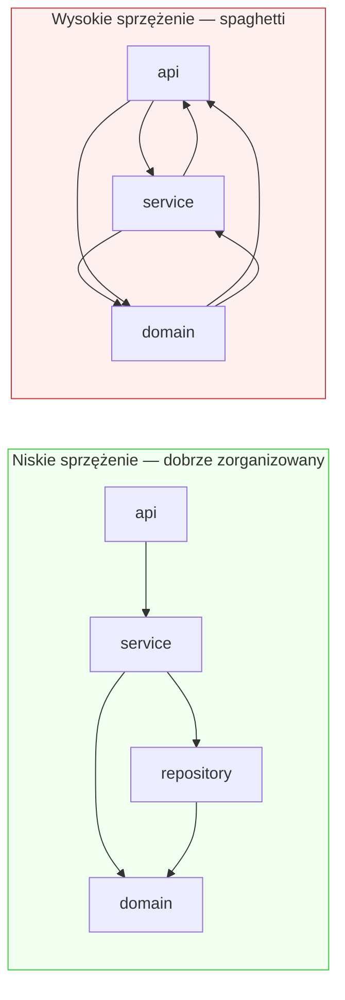

# Sprzężenie (Coupling)

## Prostymi słowami

Sprzężenie to stopień, w jakim moduły "wiedzą" o sobie nawzajem i zależą od siebie. Wyobraź sobie biuro: jeśli każdy pracownik może rozwiązywać swoje zadania bez ciągłego pytania kolegów — niskie sprzężenie. Jeśli zmiana biurka jednej osoby wymaga reorganizacji całego piętra — wysokie sprzężenie. W kodzie: im więcej importów między modułami, tym wyższe sprzężenie i trudniejsza modyfikacja.

## Szczegółowy opis

### Sprzężenie w grafie zależności

QSE modeluje sprzężenie przez **graf importów**: węzły = pliki/klasy, krawędzie = zależności między nimi. Liczba krawędzi na węzeł (edges/nodes ratio) jest najlepszym proxy dla poziomu sprzężenia w projekcie.



### Edges/nodes ratio jako proxy

Metryka **edges/nodes ratio** = liczba krawędzi / liczba węzłów wewnętrznych. Im wyższa, tym więcej zależności na moduł, tym gęstsze sprzężenie.

**Dane empiryczne Java (n=13, sesja Turn 22):**

| Kategoria | Ratio (średnia) | Interpretacja |
|---|---|---|
| **POS (dobra architektura)** | **2.62** | ~2-3 importy na moduł — luźne sprzężenie |
| **NEG (zła architektura)** | **4.25** | ~4-5 importów na moduł — gęste sprzężenie |
| Różnica | −1.63 | Mann-Whitney **p=0.034** \* |

Dla projektów DDD: ratio = 2.62 (średnia), non-DDD pozytywne: 2.32 — brak biasu na DDD (p=0.40 ns).

Uwaga: przy n=5 (wczesny etap) widać było struts z ratio=4.33 vs dddsample z ratio=2.62. Przy n=13 efekt jest statystycznie istotny (p=0.034).

### Coupling Density (CD) — normalizowana metryka

CD to unormowana wersja ratio, używana w formule AGQ:

```
CD = 1 − clip(edges/nodes / 6.0,  0.0,  1.0)
```

Próg 6.0 krawędzi/węzeł to empiryczne maksimum dla "normalnych" projektów. Powyżej tego progu CD=0 (najgorsze). CD → 1 oznacza bardzo luźne sprzężenie.

**Dane Java GT (n=59, kwiecień 2026):**
- POS średnia CD: 0.454
- NEG średnia CD: 0.299
- Mann-Whitney p=0.004 \*\* — drugi najsilniejszy dyskryminator

### Kierunek sygnału per język

Kluczowa obserwacja z sesji Turn 36-37: ratio mierzy **różne zjawiska** w Javie i Pythonie.

| Język | Zła architektura | Efekt na ratio | Sygnał |
|---|---|---|---|
| **Java** | Tangled imports, god classes | Wysoki ratio → NEG | Prawidłowy |
| **Python** | Brak struktury hierarchicznej (flat) | Niski ratio → NEG (!) | **Odwrócony** |

Python: youtube-dl ma 895 modułów w jednym namespace, zero krawędzi między nimi → ratio≈0, AGQ myśli że to dobra architektura. To dlatego flat_score jest potrzebny dla Pythona.

### Związek z Stability

Z macierzy korelacji (n=357): r(A, CD) = 0.267 — CD i Acyclicity są częściowo redundantne (oba mierzą brak silnych powiązań). Jednak CD wnosi osobny sygnał po kontroli rozmiaru (partial r = −0.697 na starszym zbiorze).

## Definicja formalna

**Coupling Density (CD):**

\[\text{CD} = 1 - \min\!\left(1,\ \frac{|E|}{|V| \cdot 6.0}\right)\]

Gdzie \(|E|\) = liczba krawędzi wewnętrznych, \(|V|\) = liczba węzłów wewnętrznych (filtrowane: tylko własne moduły projektu, bez stdlib i bibliotek zewnętrznych).

**Interpretacja CD:**

| Wartość CD | Ratio approx | Znaczenie |
|---|---|---|
| 1.0 | ≈0 | Brak zależności — projekt izolowany lub zbyt mały |
| 0.7–0.9 | 0.6–1.8 | Luźne sprzężenie — dobra architektura |
| 0.4–0.7 | 1.8–3.6 | Umiarkowane sprzężenie |
| 0.1–0.4 | 3.6–5.4 | Gęste sprzężenie — potencjalne problemy |
| 0.0 | ≥6.0 | Krytyczne sprzężenie |

**Walidacja statystyczna** (Java GT n=59):
- MW p=0.004 \*\* (istotne)
- Partial r = +0.508 (po kontroli rozmiaru, p=0.020)
- Drugi najsilniejszy dyskryminator po Cohesion

**Python GT (n=30):** CD nie dyskryminuje (p=0.306 ns, kierunek odwrotny) — dlatego w AGQ v3c Python waga CD=0.15 i uzupełnia flat_score=0.35.

## Zobacz też

- [[CD]] — pełna metryka Coupling Density
- [[Dependency Graph]] — struktura grafu w QSE
- [[Modularity]] — drugi aspekt sprzężenia (grupowanie)
- [[Acyclicity]] — szczególny przypadek sprzężenia (cykle)
- [[Graph Metric]] — metryki grafowe jako klasa
