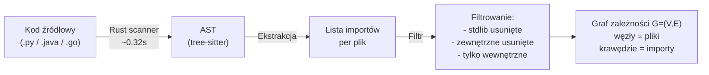
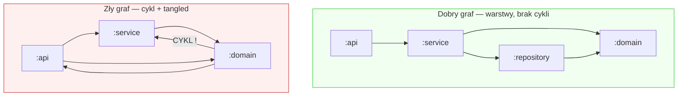

# Graf zależności (Dependency Graph)

## Prostymi słowami

Graf zależności to mapa "kto od kogo zależy" w projekcie. Wyobraź sobie siatkę metra: stacje to moduły, linie między nimi to importy. Jeśli moduł A importuje moduł B — jest strzałka od A do B. QSE rysuje tę mapę automatycznie dla całego projektu i mierzy jej "zdrowość" czterema metrykami. Dobra mapa metra ma wyraźne linie i węzły; dobry graf zależności ma wyraźne klastry i hierarchię bez pętli.

## Szczegółowy opis

### Budowa grafu w QSE

QSE buduje graf zależności w trzech krokach:



**Kluczowe decyzje projektowe:**

1. **Granularność węzła = plik** — jeden plik = jeden węzeł. Poziom pliku (nie klasy, nie pakietu) dopasowuje się do zachowania skanera Rust i standardowej praktyki analizy statycznej.

2. **Filtrowanie zewnętrznych** — biblioteki systemowe (`os`, `java.util`, `numpy`, `spring`) są usuwane z grafu. Cykl przez zewnętrzną bibliotekę to nie Twój problem architektoniczny.

3. **Krawędzie skierowane** — strzałka idzie od importera do importowanego. Zależność `A → B` oznacza "A wie o B", "B nie wie o A".

### Struktura węzłów i krawędzi

**Węzły (V)** — odpowiadają modułom na poziomie pliku:
- `n_internal` = liczba własnych plików projektu (po filtrowaniu)
- `n_graph_nodes` = wszystkie węzły łącznie (wewnętrzne + pośrednie)

**Krawędzie (E)** — odpowiadają importom:
- Krawędź `A → B` jeśli A importuje B
- Brak krawędzi wielokrotnych (każda para jeden raz)

**Przykład (dddsample-core Java, n_internal=94):**
```
n_files: 94
n_graph_nodes: ~300 (z węzłami FQN)
n_graph_edges: ~500
edges_per_node (ratio): 2.62 ← dobra architektura
```

### Diagram: dobry vs zły graf



### Metryki obliczane na grafie

Wszystkie cztery metryki AGQ są funkcjami tego samego grafu \(G = (V, E)\):

| Metryka | Co obliczamy na grafie |
|---|---|
| [[Modularity]] | Podziały Louvain → Newman's Q |
| [[Acyclicity]] | Tarjan SCC → największy cykl |
| [[Stability]] | Stopnie wejściowe/wyjściowe per pakiet → Instability I |
| [[Cohesion]] | Graf metoda↔atrybut per klasa → LCOM4 |
| [[CD]] | edges/nodes ratio → normalizowany |

### Skaner Rust i tree-sitter

QSE używa biblioteki **tree-sitter** do parsowania AST. Ten sam parser działa w edytorach kodu (VS Code, Neovim) do podświetlania składni. Skaner napisany w Rust jest 7–46× szybszy od wcześniejszego skanera Python:

- Mediana: **0.32 sekundy** per projekt
- Maksimum (home-assistant, 17595 węzłów): 815 ms

Obsługiwane języki: Python, Java, Go, TypeScript (i każdy język z grammar tree-sitter).

## Definicja formalna

Graf zależności projektu \(P\) to skierowany graf \(G = (V, E)\), gdzie:

- \(V = \{v_1, \ldots, v_n\}\) — zbiór wewnętrznych modułów projektu (pliki po filtrowaniu zewnętrznych)
- \(E \subseteq V \times V\) — zbiór zależności: \((v_i, v_j) \in E\) iff moduł \(v_i\) importuje moduł \(v_j\) w kodzie źródłowym
- Graf jest skierowany (asymetryczny), może zawierać cykle

**Filtracja:**
\[V = \{v \in \text{all\_files}(P) \mid v \notin \text{stdlib} \cup \text{third\_party}\}\]

**Wewnętrzne węzły:** tylko te \(v \in V\) które mają przynajmniej jedną krawędź wewnętrzną lub są importowane przez co najmniej jeden wewnętrzny moduł.

**Dane z benchmarku** (558 repo, kwiecień 2026):
- Mediana rozmiaru: Python ~300 węzłów, Java ~800 węzłów
- Najlargejszy: home-assistant (17595 węzłów, 815ms)
- Najszybszy: attrs (10 węzłów, 1ms)

## Zobacz też

- [[Scanner]] — szczegóły skanera Rust / tree-sitter
- [[Module]] — co to jest moduł w QSE
- [[Package]] — grupowanie modułów
- [[Modularity]] — algorytm Louvain na grafie
- [[Acyclicity]] — algorytm Tarjan na grafie
- [[Graph Metric]] — klasa metryk grafowych
