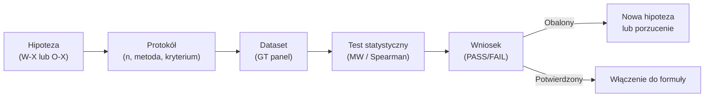

# Eksperyment w QSE

## Prostymi słowami

Eksperyment w QSE to ustrukturyzowane badanie jednej konkretnej hipotezy badawczej — jedna pytanie, jeden pomiar, jeden wniosek. Jak w szkole: nie "sprawdź wszystko", ale "czy woda wrze szybciej przy wyższej temperaturze?". Każdy eksperyment ma protokół (co mierzymy, jak, na jakim zbiorze) i zwraca jednoznaczny wynik: PASS, FAIL, lub NIEROZSTRZYGNIĘTY.

## Szczegółowy opis

### Protokół eksperymentu QSE

Każdy eksperyment w projekcie QSE przestrzega następującej struktury:

```
Eksperyment EX — [Nazwa]
├── Hipoteza: W-X lub O-X (co testujemy)
├── Dataset: n repo, język, źródło
├── Metoda: MW / Spearman / partial r / inne
├── Kryterium sukcesu: p < 0.05, r > prog
├── Wynik: PASS / FAIL / NIEROZSTRZYGNIĘTY
└── Wniosek: co wynika z eksperymentu
```

### Ograniczenia protokołu

**Maksymalnie 5 iteracji** per eksperyment. Zasada ta zapobiega data snooping — iterowaniu aż do uzyskania p<0.05. Każda iteracja musi być zaplanowana *przed* uruchomieniem testu.

**Zakaz brute-force'u**. Nie można testować wszystkich możliwych kombinacji wag aż znajdzie się najlepsza. Optymalizacja wag (np. grid search) jest dozwolona tylko jeśli jest z góry zaplanowana jako metoda kalibracyjna, z cross-validacją (LOO-CV).

**Jeden główny test per eksperyment.** Eksploracja jest dozwolona jako analiza uzupełniająca, ale główny wniosek musi wynikać z wcześniej zdefiniowanego testu.

### Zrealizowane eksperymenty (stan: kwiecień 2026)

| ID | Nazwa | Status | Kluczowy wynik |
|---|---|---|---|
| E1 | [[E1 Stability Hierarchy\|Stability Hierarchy]] | OBALONY | S_hierarchy p=0.762 ns — CRUD=DDD w hierarchii |
| E2 | [[E2 Coupling Density\|Coupling Density]] | PASS | CD Java p=0.034\*, partial r=−0.697 |
| E3 | Sensitivity (syntetyczne) | PASS | 10 profili, metryki rozróżniają jakość |
| E4 | Constraints (forbidden edges) | PASS | 4/4 scenariuszy wykrytych |
| E5 | [[E5 Namespace Metrics\|Namespace Metrics]] | CZĘŚCIOWY | NSdepth Java r=+0.698 p=0.008; Python ns |
| E6 | [[E6 flatscore\|flatscore dla Pythona]] | PASS | flat_score MW p=0.007, partial r=+0.414 |

### Cykl życia eksperymentu



### Dlaczego maksymalnie 5 iteracji?

Przy p=0.05 prawdopodobieństwo fałszywego pozytywu w 5 testach (bez korekcji) wynosi ~23% (1−0.95⁵). Ograniczenie do 5 iteracji i wymaganie wcześniej zdefiniowanego kryterium eliminuje główne źródło bias w badaniach empirycznych w software engineering.

### Podejście empiryczne vs. demonstracyjne

Eksperymenty QSE nie są demonstracjami (gdzie z góry wiemy co wyjdzie). Są próbami falsyfikacji hipotez. Wynik FAIL (jak E1) jest równie wartościowy co PASS — informuje że hipoteza była błędna i chroni przed włączeniem złej metryki do formuły AGQ.

Przykład: Stability Hierarchy (E1) — zakładaliśmy że dobra architektura = poprawna hierarchia instability (domain < app < infra). Eksperyment obalił to: mall (Panel=2.0) ma S_hierarchy=1.0 identycznie jak library (Panel=8.5). CRUD z konwencją model/service/controller/ automatycznie spełnia hierarchię.

## Definicja formalna

Eksperyment \(E_k\) w QSE to krotka:

\[E_k = \langle H_k, D_k, M_k, \alpha_k, R_k \rangle\]

Gdzie:
- \(H_k\) — hipoteza falsyfikowalna (testowalna)
- \(D_k\) — dataset \((n, \text{język}, \text{źródło GT})\)
- \(M_k\) — metoda statystyczna (np. Mann-Whitney U, Spearman ρ, partial r)
- \(\alpha_k = 0.05\) — poziom istotności
- \(R_k \in \{\text{PASS}, \text{FAIL}, \text{NIEROZSTRZYGNIĘTY}\}\)

Eksperyment jest **preregistrowany** — kryterium sukcesu \(\alpha_k\) jest ustalane przed analizą danych.

## Zobacz też

- [[Experiments Index]] — pełny rejestr eksperymentów
- [[Hypotheses Register]] — hipotezy do przetestowania
- [[Ground Truth in Simple Words]] — jak wygląda zbiór danych
- [[Expert Panel]] — skąd pochodzi Ground Truth
