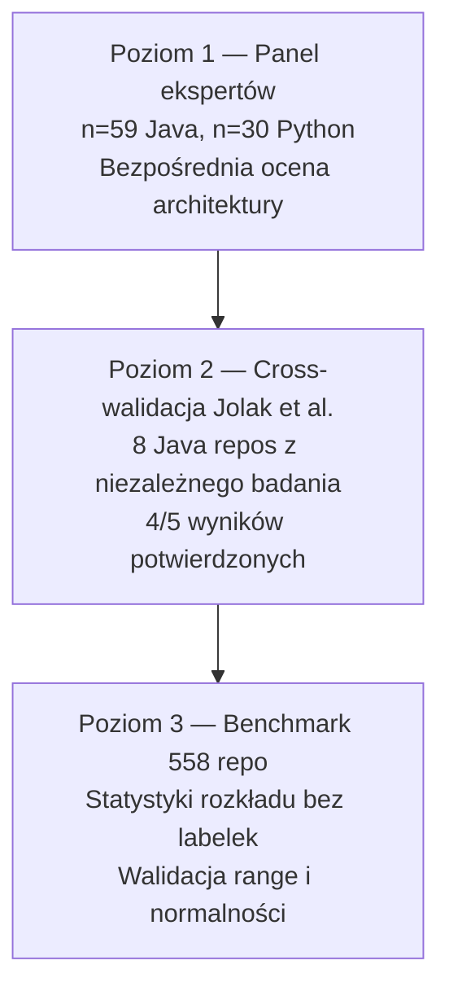

# Ground Truth prostymi słowami

## Prostymi słowami

"Ground truth" to po polsku "punkt odniesienia" — prawda, z którą porównujemy nasze pomiary. Żeby sprawdzić, czy termometr działa poprawnie, potrzebujesz prawdziwej temperatury. Żeby sprawdzić, czy AGQ mierzy jakość architektury, potrzebujesz repozytoriów o *znanych* właściwościach: wiesz z góry, że to dobre lub złe. Bez Ground Truth nie możesz powiedzieć, czy metryki cokolwiek mierzą.

## Szczegółowy opis

### Dlaczego potrzebujemy Ground Truth?

QSE twierdzi, że AGQ mierzy jakość architektury. To twierdzenie wymaga weryfikacji: czy repozytoria z wysokim AGQ są naprawdę lepiej zarchitekturowane? Nie możemy tego sprawdzić "gołym okiem" — potrzebujemy zewnętrznego kryterium.

Kandydaci na Ground Truth i ich problemy:

| Kandydat | Problem |
|---|---|
| Liczba bugów | Zależy od liczby użytkowników, nie tylko architektury |
| Czas naprawy bugów (BLT) | Mierzy kulturę procesu, nie architekturę — **obalony** |
| Ocena SonarQube | Mierzy jakość kodu per plik, nie architekturę — nieskorelowany z AGQ |
| Ocena eksperta | Subiektywna, ale najbliżej prawdy |

### Dlaczego BLT zawiodło (W1)

**Bug Lead Time (BLT)** = czas od zgłoszenia buga do zamknięcia issue. Hipoteza W1: lepsza architektura → łatwiejsze naprawy → krótszy BLT.

Wynik: **r=−0.125 ns** po oczyszczeniu z confounders. BLT nie koreluje z AGQ.

Dlaczego? BLT zależy od:
- Liczby aktywnych maintainerów (przepustowości)
- Priorytetu (krytyczny bug naprawiany szybciej niezależnie od architektury)
- Polityki projektu (czy issue są zamykane automatycznie)
- Kultury organizacyjnej — nie architektury

Dodatkowy problem: AGQ kalibrowane na BLT dawało wzory z S=0.95 (waga Stability=0.95) — kompletnie błędne. Wynikało to z kalibracji na złym GT. To pokazuje jak ważne jest właściwe kryterium walidacji.

### Dlaczego panel ekspertów jest lepszy

Panel ekspertów ocenia **intencję architektoniczną**: czy projekt świadomie stosuje separację warstw, bounded contexts, czyste interfejsy — czy to przypadkowy układ.

Zalety:
- Bezpośrednia ocena tego co mierzy AGQ (struktura)
- Uwzględnia kontekst (framework vs. aplikacja biznesowa)
- Cztery role = różne perspektywy = mniejszy bias

Wady:
- Subiektywność (ale kontrolowana — σ ≤ 2.0)
- Koszt (każde repo = 4 oceny × czas)
- Symulowany, nie prawdziwy panel (ograniczenie metodologiczne)

### Trzy poziomy walidacji

QSE stosuje trójpoziomowe podejście do GT:

**Jolak cross-validation**: 8 repozytoriów Java z niezależnej publikacji Jolak et al. (2025) zeskanowanych bez dostępu do wyników panelu. Mean v3c=0.535 między GT-POS=0.571 a GT-NEG=0.486 — dokładnie gdzie powinny być nieselekcjonowane repo.

### Rozkład Ground Truth Java (n=59)

| Kategoria | n | AGQ v3c (średnia) |
|---|---|---|
| POS (Panel ≥ 6.0) | 31 | 0.571 |
| NEG (Panel < 4.0) | 28 | 0.486 |
| GAP | — | 0.085 |

Gap zmniejszył się z 0.115 (n=29) do 0.085 (n=59) — oczekiwane przy dodaniu bardziej zróżnicowanych repozytoriów. Jednak siła dyskryminacji utrzymała się: MW p=0.000221, AUC=0.767.

### Ograniczenie: AGQ ≠ jedyna metryka jakości

Ground Truth panelowa mierzy jakość *architektoniczną*. Niektóre repozytoria mogą mieć niski AGQ z uzasadnionych powodów:

- **google/guava** (POS, AGQ=0.400): biblioteka utility z flat structurą — CD=0.000, bo to zestaw niezależnych narzędzi, nie system z warstwami
- **spring-security** (POS, Panel=6.5, AGQ wysoki): framework bezpieczeństwa ma strukturalnie inną topologię niż aplikacja biznesowa

To pokazuje że Ground Truth + AGQ to uzupełniające się narzędzia — żadne nie jest absolutną prawdą.

## Definicja formalna

Ground Truth w sensie QSE to zbiór:

\[\text{GT} = \{(r_i, y_i)\}_{i=1}^{n}\]

Gdzie \(r_i\) = repozytorium, \(y_i \in \{\text{POS}, \text{NEG}\}\) = etykieta binarna z panelu ekspertów.

Etykieta jest wyznaczana jako:

\[y_i = \begin{cases} \text{POS} & \text{jeśli Panel}(r_i) \geq 6.0 \text{ i } \sigma_i \leq 2.0 \\ \text{NEG} & \text{jeśli Panel}(r_i) < 4.0 \text{ i } \sigma_i \leq 2.0 \end{cases}\]

Repozytoria z \(4.0 \leq \text{Panel} < 6.0\) lub \(\sigma > 2.0\) są wykluczone z GT (UNCLEAR).

## Zobacz też

- [[Expert Panel]] — jak działa panel ekspertów
- [[Ground Truth]] — techniczne szczegóły pliku GT
- [[W1 BLT Correlation]] — dlaczego BLT zawiodło
- [[Experiment]] — jak GT jest używane do testowania hipotez
