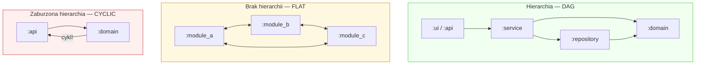

# Hierarchia (Hierarchy)

## Prostymi słowami

Hierarchia w architekturze oprogramowania to jak struktura armii: generałowie wydają rozkazy oficerom, oficerowie żołnierzom — ale nie odwrotnie. W kodzie: warstwa "api" zależy od "service", "service" od "domain" — ale "domain" nie zależy od "api". Jeśli ta zasada jest przestrzegana, zmiana jednej warstwy nie popycha zmian w górę. Brak hierarchii = "wszyscy raportują do wszystkich" = dług architektoniczny.

## Szczegółowy opis

### Hierarchia jako właściwość grafu zależności

W grafie zależności QSE hierarchia oznacza istnienie wyraźnego **porządku topologicznego** — węzły można uszeregować tak, że wszystkie krawędzie idą "w dół" (od wyższych warstw do niższych). Matematycznie: graf jest DAG (Directed Acyclic Graph).



### Trzy typy hierarchii w QSE

| Typ | Opis | AGQ Fingerprint |
|---|---|---|
| **LAYERED** | Wyraźna hierarchia z ewentualnymi drobnymi cyklami | Python (57/68 w benchmarku) |
| **CLEAN** | Idealna hierarchia, zero cykli, wysoka spójność | Go (47/51 w benchmarku) |
| **FLAT** | Brak hierarchii — równe pakiety, podobna instability | Duże projekty platformowe |
| **TANGLED** | Cykle + niska spójność — podwójny dług | Java (9/9 TANGLED) |

### Jak QSE mierzy hierarchię

Dwie komplementarne metryki mierzą hierarchiczność:

1. **Stability (S)** — wariancja Instability \(I = C_e/(C_a+C_e)\) per pakiet. Wysoka wariancja = wyraźna hierarchia. "Jądro" ma I≈0, "obrzeże" ma I≈1. Jeśli wszystkie pakiety mają I≈0.5, brak hierarchii.

2. **Acyclicity (A)** — brak cykli = warunek konieczny hierarchii. Graf z cyklami *nie ma* hierarchii (nie istnieje porządek topologiczny).

3. **NSdepth** — normalizowana głębokość namespace'ów (rozszerzenie). Java: partial r=+0.698, p=0.008 — głęboka hierarchia pakietów koreluje z jakością.

### Paradoks Stability a hierarchia

Eksperyment E1 (Stability Hierarchy) obalił intuicyjne założenie: **dobra architektura DDD ma WYŻSZĄ instability domeny niż anemic model** (nie niższą).

Konkretne dane (sesja Turn 28):
```
mall (Panel=2.0) — CRUD anemic model:
  domain_instability = 0.024  ← POJO sink, zero logiki
  
dddsample (Panel=8.25) — DDD:
  domain_instability = 0.464  ← rich domain, klasy rozmawiają ze sobą
```

Paradoks: klasy domenowe w DDD komunikują się wewnętrznie (fan-out do siebie nawzajem) → wysoka instability. CRUD POJO to "sink" (wszystko do niego importuje, ono nie importuje niczego) → niska instability. Metryka Martina nie odróżni tych przypadków bez semantyki.

### Namespace Depth jako proxy hierarchii

NSdepth = znormalizowana głębokość hierarchii pakietów/namespace'ów. W Javie naturalnie głęboka: `com.company.app.domain.model` = 5 poziomów.

**Java GT (n=14, wczesny zbiór):**
- POS mean NSdepth: 0.682
- NEG mean NSdepth: 0.597  
- partial r = +0.698, p=0.008 — silniejszy sygnał niż CD

**Python GT:** NSdepth partial r=+0.433, p=0.122 ns — Python ma strukturalnie płytszą hierarchię nawet w dobrych projektach (mean depth ~3.7 POS vs ~3.1 NEG; różnica za mała, n_neg=4).

## Definicja formalna

Hierarchia w grafie \(G = (V, E)\) oznacza istnienie **porządku topologicznego**:

\[\exists \text{ perm. } (v_1, \ldots, v_n) \text{ t.że } \forall (v_i, v_j) \in E: i < j\]

Równoważnie: \(G\) jest DAG (nie istnieje ścieżka \(v \to \cdots \to v\)).

**Stability jako proxy hierarchii:**
\[\text{Stab} = \min\!\left(1, \text{Var}(I_1, \ldots, I_k) / 0.25\right)\]

Gdzie \(I_p = C_e^{(p)} / (C_a^{(p)} + C_e^{(p)})\) — Instability pakietu \(p\), \(C_e\) = fan-out, \(C_a\) = fan-in.

**NSdepth:**
\[\text{NSdepth} = \frac{\text{mean\_depth\_namespaces}}{\max\_\text{possible\_depth}}\]

Normalizowane do [0, 1] względem maksymalnej głębokości w danym projekcie.

## Zobacz też

- [[Stability]] — metryka hierarchii (kontrowersje)
- [[Acyclicity]] — warunek konieczny hierarchii
- [[NSdepth]] — metryka głębokości namespace
- [[E1 Stability Hierarchy]] — eksperyment obalający założenia
- [[Package]] — jednostka hierarchii w QSE
