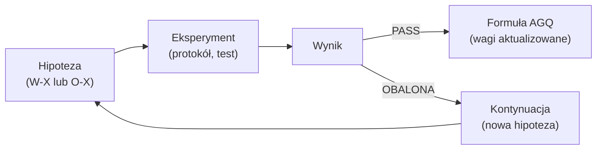

# Hipoteza (Hypothesis)

## Prostymi słowami

Hipoteza w QSE to konkretne twierdzenie, które można obalić eksperymentem. Nie "AGQ jest dobry" — ale "AGQ koreluje z panelem ekspertów z r≥0.5 na zbiorze n≥50 repozytoriów Java". Jeśli wynik eksperymentu okazuje się inny niż oczekiwano — hipoteza jest obalana i system wiedzy się aktualizuje. Kilka hipotez zostało już obalonych — to ważna część procesu badawczego.

## Szczegółowy opis

### Typy hipotez w QSE

QSE stosuje dwa typy oznaczeń:

| Typ | Opis | Przykłady |
|---|---|---|
| **W** (Wniosek) | Hipoteza potwierdzona lub obalona eksperymentem | W1–W10 |
| **O** (Otwarta) | Hipoteza czekająca na eksperyment | O1–O5 |

### Stan hipotez (kwiecień 2026)

| ID | Treść | Status | Kluczowy wynik |
|---|---|---|---|
| **W1** | AGQ koreluje z BLT (Bug Lead Time) | **OBALONY** | r=−0.125 ns po oczyszczeniu |
| **W2** | Stability = dobry predyktor przy n=14 | **BŁĘDNY** | kalibracja na złym GT (BLT) |
| **W3** | E1 S_hierarchy działa | **OBALONY** | CRUD=DDD w hierarchii, p=0.806 ns |
| **W4** | AGQ v2 bije v1 na Java GT | PASS | Potwierdzony na n=29 |
| **W7** | Stability Hierarchy Score | Częściowy | S istotna przy n=29 (p=0.001), nie przy n=14 |
| **W9** | AGQ v3c Python dyskryminuje | Częściowy | flat_score MW p=0.007, AGQ v3c partial r=+0.345 ns |
| **W10** | flatscore predyktuje Python | PASS | partial r=+0.414, p=0.023 |

**Hipotezy badawcze (FENG SMART):**

| ID | Treść | Status |
|---|---|---|
| H1 | AGQ koreluje z defect density silniej niż SonarQube | Do testu (WP3) |
| H2 | AGQ gate redukuje defekty w kodzie LLM | Do testu (WP2) |
| H3 | Ratchet redukuje code review o ≥70% | Do testu (WP4) |
| H4 | AGQ pokrywa ≥80% kategorii defektów Sabry et al. | Wstępnie tak (mapowanie) |
| H5 | Korelacja AGQ z defect density niezależna od wzorca arch. | Do testu (WP1) |

### Obalona hipoteza jako wiedza

Obalenie hipotezy W1 (BLT) było kluczowe dla projektu. Gdyby QSE nadal używało BLT jako Ground Truth:
- Wagi byłyby kalibrowane na złym kryterium (S=0.95 w AGQ)
- Panel ekspertów nie byłby rozwinięty
- Wyniki byłyby niereprodukowalne

Analogicznie obalenie W3 (Stability Hierarchy) pokazało że intuicja o DDD (domain ma niskie I) jest błędna. Bez tego eksperymentu Stability mogłaby być błędnie interpretowana.

### Jak tworzyć nową hipotezę

Dobra hipoteza w QSE powinna być:

1. **Falsyfikowalna** — musi istnieć wynik który ją obali
2. **Konkretna** — określona metryka, konkretny próg, określony dataset
3. **Preregistrowana** — kryterium sukcesu ustalane przed testem
4. **Połączona z eksperymentem** — każda hipoteza trafia do [[Experiments Index]]

Szablon:

```markdown
## W-X / O-X: [Krótka nazwa]

**Twierdzenie:** [Konkretne twierdzenie z liczbami]
**Dataset:** n=..., język=..., źródło GT=...
**Metoda:** Mann-Whitney / Spearman ρ / partial r
**Kryterium sukcesu:** p < 0.05 i r > [próg]
**Status:** OTWARTA / PASS / OBALONA
```

### Związek hipoteza → eksperyment → formuła



## Definicja formalna

Hipoteza w QSE to krotka:

\[H = \langle S, D, M, \alpha, C \rangle\]

Gdzie:
- \(S\) = stwierdzenie falsyfikowalne (np. "Cohesion > 0.5 dla POS, ≤ 0.5 dla NEG")
- \(D = (n, \text{język}, \text{GT})\) — dataset walidacyjny
- \(M\) — test statystyczny (Mann-Whitney U, Spearman ρ, partial Spearman)
- \(\alpha = 0.05\) — poziom istotności
- \(C\) — wynik: PASS, FAIL, NIEROZSTRZYGNIĘTY

Hipoteza jest **obalona** gdy \(p > \alpha\) lub gdy kierunek efektu jest odwrotny od oczekiwanego (nawet przy \(p < \alpha\)).

## Zobacz też

- [[Experiments Index]] — rejestr eksperymentów
- [[Hypotheses Register]] — rejestr hipotez
- [[Open Questions]] — pytania bez odpowiedzi
- [[W1 BLT Correlation]] — przykład obalonej hipotezy
- [[E1 Stability Hierarchy]] — przykład eksperymentu
