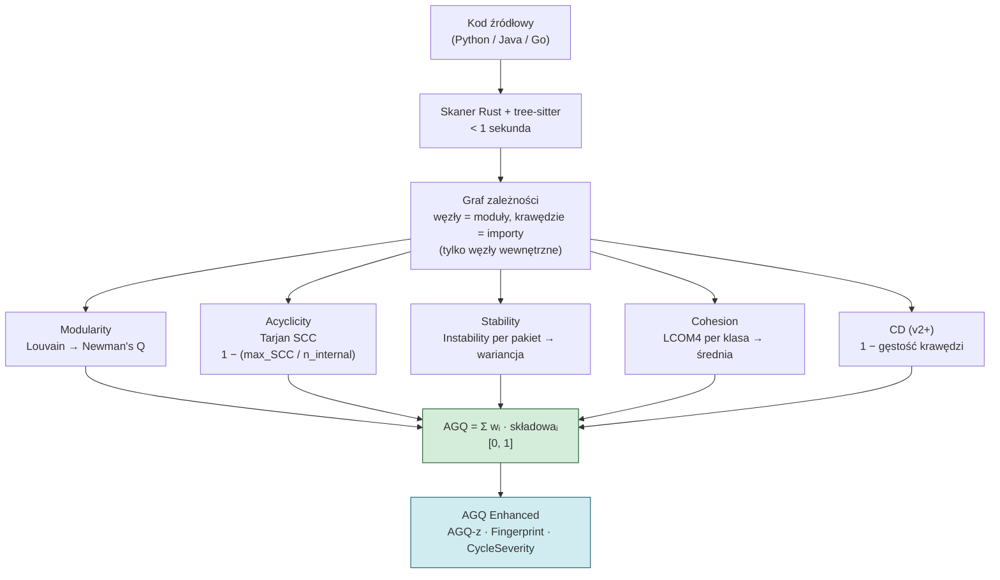

# AGQ Formula

## Prostymi słowami

Wyobraź sobie ocenianie kondycji budynku. Zamiast sprawdzać każdą cegłę osobno, mierzysz cztery właściwości całej konstrukcji: czy pokoje są wyraźnie podzielone, czy nie ma zapętlonych ścian, czy fundamenty są mocniejsze niż dekoracje, i czy każde pomieszczenie pełni jedną funkcję. AGQ Formula to przepis, który łączy te cztery (lub pięć) pomiarów w jeden wynik od 0 do 1.

## Szczegółowy opis

AGQ (*Architecture Graph Quality*) to ważona suma znormalizowanych metryk grafowych obliczanych na grafie zależności projektu. Każda składowa ma wartość z przedziału \([0, 1]\), gdzie **1 oznacza najlepszą jakość**. Formuła przyjmuje postać:

```
AGQ = w₁·M + w₂·A + w₃·S + w₄·C [+ w₅·CD]
```

Gdzie:
- **M** = [[Modularity]] — izolacja modułów (algorytm Louvain, Newman's Q)
- **A** = [[Acyclicity]] — brak cykli (algorytm Tarjan SCC)
- **S** = [[Stability]] — hierarchia warstw (wariancja Instability per pakiet)
- **C** = [[Cohesion]] — spójność klas (LCOM4)
- **CD** = [[CD]] — gęstość powiązań (*Coupling Density*, od wersji v2)

### Pipeline obliczania AGQ



### Trzy poziomy granulacji formuły

| Poziom | Opis | Przykład |
|---|---|---|
| **Surowe składowe** | M, A, S, C, CD każda od 0 do 1 | A=0.850 → 15% modułów w cyklach |
| **AGQ composite** | Ważona suma według wersji | AGQv3c=0.571 (POS Java) vs 0.486 (NEG Java) |
| **AGQ Enhanced** | Z-score, Fingerprint, CycleSeverity | AGQ-z=−1.61 → 5.3%ile Java |

### Wagi empiryczne vs równe

Wagi mogą być wyznaczane empirycznie (kalibracja na danych GT) lub przyjmowane jako równe (podejście PCA):

| Podejście | M | A | S | C | CD | Podstawa |
|---|---|---|---|---|---|---|
| Kalibracja OSS-Python (L-BFGS-B, n=74) | 0.000 | **0.730** | 0.050 | 0.174 | — | Churn jako proxy |
| Równe (PCA, v3c) | 0.20 | 0.20 | 0.20 | 0.20 | 0.20 | Eigenvalues prawie równe |

Kalibracja L-BFGS-B daje wagę 0.730 dla [[Acyclicity]] — zgodne z niezależnymi badaniami Gnoyke et al. (JSS 2024): *cykliczne zależności korelują najsilniej z defektami wśród architektonicznych smellów*.

## Definicja formalna

Dla projektu z \(n\) wewnętrznymi modułami:

\[
\text{AGQ} = \sum_{i=1}^{k} w_i \cdot m_i, \quad \sum w_i = 1, \quad w_i \geq 0, \quad m_i \in [0,1]
\]

gdzie \(m_i\) to znormalizowane metryki grafowe, a wagi \(w_i\) zależą od wersji formuły.

**Kluczowa właściwość:** AGQ jest deterministyczne — ten sam kod zawsze daje ten sam wynik (delta=0.000 na 78 repo w benchmarku).

**Ograniczenia formuły:**
- Wagi kalibrowane na OSS-Python — mogą wymagać kalibracji per język
- Nie porównywać surowego AGQ między językami bez normalizacji (użyj AGQ-z)
- Projekty z < 50 modułami mają strukturalnie zawyżone AGQ

Historia ewolucji: [[AGQv1]] → [[AGQv2]] → [[AGQv3c Java]] / [[AGQv3c Python]]

## Zobacz też

- [[AGQ Formulas]] — tabela porównawcza wszystkich wersji
- [[Modularity]], [[Acyclicity]], [[Stability]], [[Cohesion]], [[CD]] — definicje składowych
- [[flatscore]], [[NSdepth]] — nowe metryki (Python, kierunek badań)
- [[AGQv1]], [[AGQv2]], [[AGQv3c Java]], [[AGQv3c Python]] — pełna historia formuł
