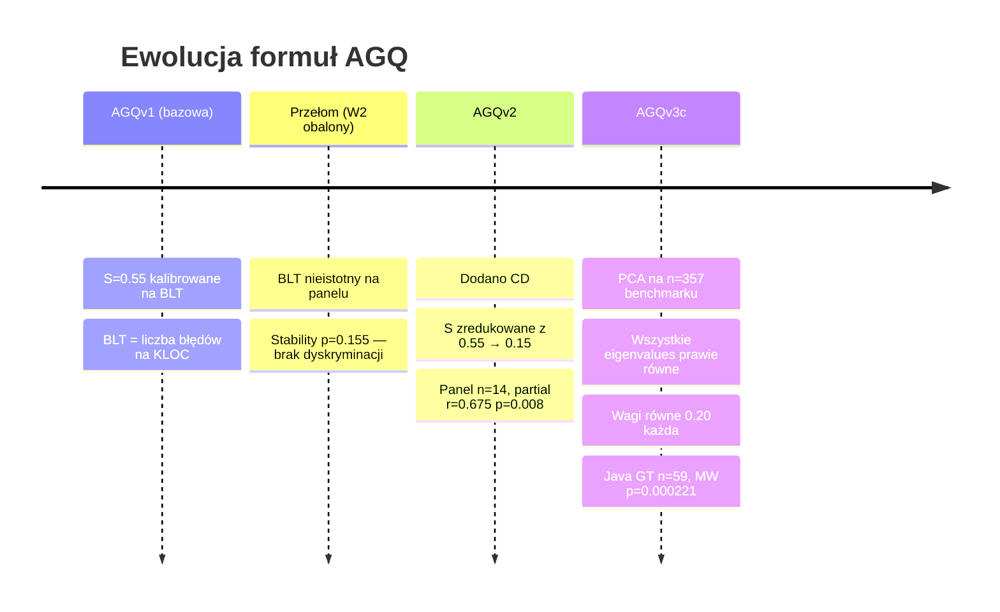

# AGQ Formulas

## Prostymi słowami

Formuła AGQ ewoluowała przez trzy generacje: zaczęła od czterech składowych z intuicyjnymi wagami, dodała piątą metrykę (CD), aż doszła do dzisiejszej wersji wyznaczonej empirycznie przez PCA i panel ekspertów. Każda zmiana była odpowiedzią na konkretne dane empiryczne — nie zmianę gustu.

## Szczegółowy opis

### Tabela porównawcza wszystkich wersji

| Wersja | Wzór | GT (walidacja) | Status | Uwagi |
|---|---|---|---|---|
| [[AGQv1]] | 0.20·M + 0.20·A + **0.55·S** + 0.05·C | BLT (obalony) | **Niezmienny punkt odniesienia** | S=0.55 kalibrowane na BLT; BLT obalony jako Ground Truth (W2) |
| [[AGQv2]] | **0.30·M** + 0.20·A + **0.15·S** + 0.15·C + **0.20·CD** | Panel Java n=14 | Ważna historycznie | Partial r=0.675 p=0.008; pierwszy istotny wynik po kontroli rozmiaru |
| [[AGQv3c Java]] | **0.20·M + 0.20·A + 0.20·S + 0.20·C + 0.20·CD** | Panel Java n=59 | **Aktualna najlepsza (Java)** | PCA: eigenvalues prawie równe → wagi równe; MW p=0.000221, AUC=0.767 |
| [[AGQv3c Python]] | 0.15·M + **0.05·A** + 0.20·S + 0.10·C + 0.15·CD + **0.35·flat_score** | Panel Python n=30 | **Aktualna najlepsza (Python)** | AGQ ma ODWRÓCONY kierunek w Pythonie bez flat_score |

### Historia ewolucji: BLT → Panel → PCA



### Szczegóły per wersja

#### AGQv1 — punkt bazowy (immutable)

```
AGQ = 0.20·M + 0.20·A + 0.55·S + 0.05·C
```

Cztery składowe, bez CD. Wysoka waga S=0.55 oparta na kalibracji wobec BLT (*Bug Linkage Time*). Okazało się, że BLT jest błędną zmienną Ground Truth — [[Stability]] na panelu ekspertów ma p=0.155 (nieistotna). Formuła zachowana jako **niezmienny punkt odniesienia historyczny** — żadna przyszła wersja nie może jej modyfikować.

#### AGQv2 — dodanie CD

```
AGQ = 0.30·M + 0.20·A + 0.15·S + 0.15·C + 0.20·CD
```

Pierwsza wersja z [[CD]] (*Coupling Density*). Waga S drastycznie zredukowana (0.55→0.15) po obaleniu BLT. Partial r=0.675, p=0.008 na panelu n=14 — pierwszy wynik istotny statystycznie po kontroli rozmiaru projektu. Formuła Java-specific.

#### AGQv3c Java — PCA equal weights

```
AGQ = 0.20·M + 0.20·A + 0.20·S + 0.20·C + 0.20·CD
```

Wynik analizy PCA na n=357 repo: wszystkie 5 eigenvalues prawie równe → brak dominującego wymiaru → wagi równe. Walidacja na rozszerzonym GT Java (n=59): MW p=0.000221, Spearman ρ=0.380, AUC=0.767.

#### AGQv3c Python — flat_score jako dominanta

```
AGQ = 0.15·M + 0.05·A + 0.20·S + 0.10·C + 0.15·CD + 0.35·flat_score
```

Python wymaga odrębnej formuły — AGQ bez [[flatscore]] ma **odwrócony kierunek** na panelu Python. Projekty uznane za złe (NEG) mają wyższy surowy AGQ niż projekty uznane za dobre (POS). flat_score z wagą 0.35 koryguje ten problem. Acyclicity ma najniższą wagę (0.05) — prawie wszystkie projekty Python mają A≈1.0, brak zmienności.

### Niezrealizowane kierunki badań

| Kierunek | Status | Opis |
|---|---|---|
| [[NSdepth]] | Obiecujący | Głębokość drzewa przestrzeni nazw — prawidłowy kierunek w obu językach |
| Kalibracja per język (L-BFGS-B) | Planowana | Obecne wagi empiryczne tylko na OSS-Python n=74 |
| AGQv3b (NS_depth zamiast A) | Eksperymentalna | partial_r=0.698 na Java GT n=28 |

## Definicja formalna

Ogólna postać formuły AGQ dla wersji z \(k\) składowymi:

\[
\text{AGQ}_\text{ver} = \sum_{i=1}^{k} w_i^{(\text{ver})} \cdot m_i, \quad \sum_{i=1}^{k} w_i = 1
\]

Wagi \(w_i^{(\text{ver})}\) są specyficzne dla każdej wersji i języka. Nie istnieje jedna „prawdziwa" formuła — każda wersja jest odpowiedzią na dostępne dane walidacyjne.

## Zobacz też

- [[AGQ Formula]] — ogólny opis mechanizmu AGQ
- [[AGQv1]], [[AGQv2]], [[AGQv3c Java]], [[AGQv3c Python]] — szczegóły per wersja
- [[Modularity]], [[Acyclicity]], [[Stability]], [[Cohesion]], [[CD]] — definicje składowych
- [[flatscore]], [[NSdepth]] — nowe metryki
- [[Ground Truth]] — metodologia walidacji formuł
