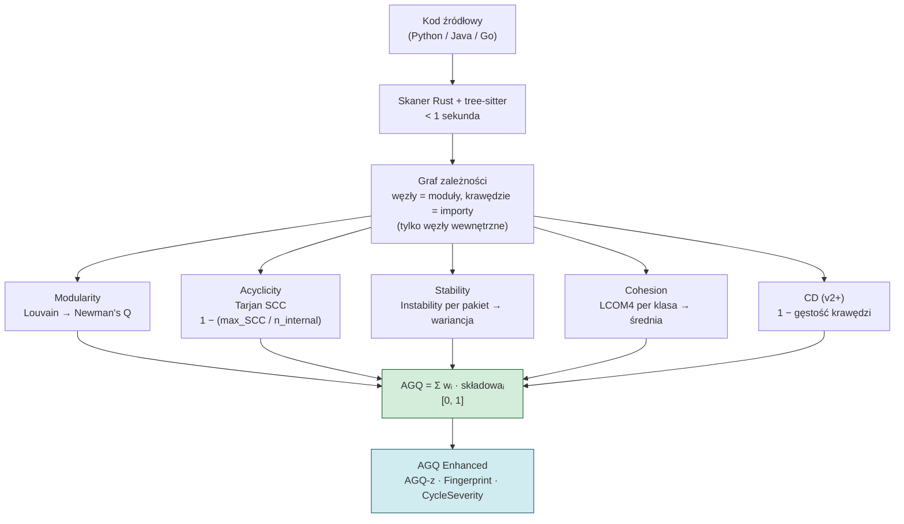
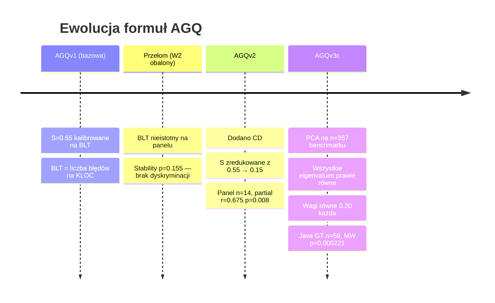

# AGQ Formulas

## Prostymi słowami

Wyobraź sobie ocenianie kondycji budynku. Zamiast sprawdzać każdą cegłę osobno, mierzysz cztery właściwości całej konstrukcji: czy pokoje są wyraźnie podzielone, czy nie ma zapętlonych ścian, czy fundamenty są mocniejsze niż dekoracje, i czy każde pomieszczenie pełni jedną funkcję. AGQ Formula to przepis, który łączy te cztery (lub pięć) pomiarów w jeden wynik od 0 do 1.

Formuła AGQ ewoluowała przez trzy generacje: zaczęła od czterech składowych z intuicyjnymi wagami, dodała piątą metrykę (CD), aż doszła do dzisiejszej wersji wyznaczonej empirycznie przez PCA i panel ekspertów. Każda zmiana była odpowiedzią na konkretne dane empiryczne — nie zmianę gustu.

## Szczegółowy opis

AGQ (*Architecture Graph Quality*) to ważona suma znormalizowanych metryk grafowych obliczanych na grafie zależności projektu. Każda składowa ma wartość z przedziału \([0, 1]\), gdzie **1 oznacza najlepszą jakość**. Formuła przyjmuje postać:

```
AGQ = w₁·M + w₂·A + w₃·S + w₄·C [+ w₅·CD]
```

Gdzie:
- **M** = [[Modularity]] — izolacja modułów (algorytm Louvain, Newman's Q)
- **A** = [[Acyclicity]] — brak cykli (algorytm Tarjan SCC)
- **S** = [[Stability]] — hierarchia warstw (wariancja Instability per pakiet)
- **C** = [[Cohesion]] — spójność klas (LCOM4)
- **CD** = [[CD]] — gęstość powiązań (*Coupling Density*, od wersji v2)

### Pipeline obliczania AGQ



### Trzy poziomy granulacji formuły

| Poziom | Opis | Przykład |
|---|---|---|
| **Surowe składowe** | M, A, S, C, CD każda od 0 do 1 | A=0.850 → 15% modułów w cyklach |
| **AGQ composite** | Ważona suma według wersji | AGQv3c=0.571 (POS Java) vs 0.486 (NEG Java) |
| **AGQ Enhanced** | Z-score, Fingerprint, CycleSeverity | AGQ-z=−1.61 → 5.3%ile Java |

### Wagi empiryczne vs równe

Wagi mogą być wyznaczane empirycznie (kalibracja na danych GT) lub przyjmowane jako równe (podejście PCA):

| Podejście | M | A | S | C | CD | Podstawa |
|---|---|---|---|---|---|---|
| Kalibracja OSS-Python (L-BFGS-B, n=74) | 0.000 | **0.730** | 0.050 | 0.174 | — | Churn jako proxy |
| Równe (PCA, v3c) | 0.20 | 0.20 | 0.20 | 0.20 | 0.20 | Eigenvalues prawie równe |

Kalibracja L-BFGS-B daje wagę 0.730 dla [[Acyclicity]] — zgodne z niezależnymi badaniami Gnoyke et al. (JSS 2024): *cykliczne zależności korelują najsilniej z defektami wśród architektonicznych smellów*.

---

## Tabela porównawcza wszystkich wersji

| Wersja | Wzór | GT (walidacja) | Status | Uwagi |
|---|---|---|---|---|
| [[AGQv1]] | 0.20·M + 0.20·A + **0.55·S** + 0.05·C | BLT (obalony) | **Niezmienny punkt odniesienia** | S=0.55 kalibrowane na BLT; BLT obalony jako Ground Truth (W2) |
| [[AGQv2]] | **0.30·M** + 0.20·A + **0.15·S** + 0.15·C + **0.20·CD** | Panel Java n=14 | Ważna historycznie | Partial r=0.675 p=0.008; pierwszy istotny wynik po kontroli rozmiaru |
| [[AGQv3c Java]] | **0.20·M + 0.20·A + 0.20·S + 0.20·C + 0.20·CD** | Panel Java n=59 | **Aktualna najlepsza (Java)** | PCA: eigenvalues prawie równe → wagi równe; MW p=0.000221, AUC=0.767 |
| [[AGQv3c Python]] | 0.15·M + **0.05·A** + 0.20·S + 0.10·C + 0.15·CD + **0.35·flat_score** | Panel Python n=30 | **Aktualna najlepsza (Python)** | AGQ ma ODWRÓCONY kierunek w Pythonie bez flat_score |

### Historia ewolucji: BLT → Panel → PCA



### Szczegóły per wersja

#### AGQv1 — punkt bazowy (immutable)

```
AGQ = 0.20·M + 0.20·A + 0.55·S + 0.05·C
```

Cztery składowe, bez CD. Wysoka waga S=0.55 oparta na kalibracji wobec BLT (*Bug Linkage Time*). Okazało się, że BLT jest błędną zmienną Ground Truth — [[Stability]] na panelu ekspertów ma p=0.155 (nieistotna). Formuła zachowana jako **niezmienny punkt odniesienia historyczny** — żadna przyszła wersja nie może jej modyfikować.

#### AGQv2 — dodanie CD

```
AGQ = 0.30·M + 0.20·A + 0.15·S + 0.15·C + 0.20·CD
```

Pierwsza wersja z [[CD]] (*Coupling Density*). Waga S drastycznie zredukowana (0.55→0.15) po obaleniu BLT. Partial r=0.675, p=0.008 na panelu n=14 — pierwszy wynik istotny statystycznie po kontroli rozmiaru projektu. Formuła Java-specific.

#### AGQv3c Java — PCA equal weights

```
AGQ = 0.20·M + 0.20·A + 0.20·S + 0.20·C + 0.20·CD
```

Wynik analizy PCA na n=357 repo: wszystkie 5 eigenvalues prawie równe → brak dominującego wymiaru → wagi równe. Walidacja na rozszerzonym GT Java (n=59): MW p=0.000221, Spearman ρ=0.380, AUC=0.767.

#### AGQv3c Python — flat_score jako dominanta

```
AGQ = 0.15·M + 0.05·A + 0.20·S + 0.10·C + 0.15·CD + 0.35·flat_score
```

Python wymaga odrębnej formuły — AGQ bez [[flatscore]] ma **odwrócony kierunek** na panelu Python. Projekty uznane za złe (NEG) mają wyższy surowy AGQ niż projekty uznane za dobre (POS). flat_score z wagą 0.35 koryguje ten problem. Acyclicity ma najniższą wagę (0.05) — prawie wszystkie projekty Python mają A≈1.0, brak zmienności.

### Niezrealizowane kierunki badań

| Kierunek | Status | Opis |
|---|---|---|
| [[NSdepth]] | Obiecujący | Głębokość drzewa przestrzeni nazw — prawidłowy kierunek w obu językach |
| Kalibracja per język (L-BFGS-B) | Planowana | Obecne wagi empiryczne tylko na OSS-Python n=74 |
| AGQv3b (NS_depth zamiast A) | Eksperymentalna | partial_r=0.698 na Java GT n=28 |

---

## Definicja formalna

Dla projektu z \(n\) wewnętrznymi modułami:

\[
\text{AGQ} = \sum_{i=1}^{k} w_i \cdot m_i, \quad \sum w_i = 1, \quad w_i \geq 0, \quad m_i \in [0,1]
\]

Ogólna postać formuły AGQ dla wersji z \(k\) składowymi:

\[
\text{AGQ}_\text{ver} = \sum_{i=1}^{k} w_i^{(\text{ver})} \cdot m_i, \quad \sum_{i=1}^{k} w_i = 1
\]

gdzie \(m_i\) to znormalizowane metryki grafowe, a wagi \(w_i^{(\text{ver})}\) są specyficzne dla każdej wersji i języka. Nie istnieje jedna „prawdziwa" formuła — każda wersja jest odpowiedzią na dostępne dane walidacyjne.

**Kluczowa właściwość:** AGQ jest deterministyczne — ten sam kod zawsze daje ten sam wynik (delta=0.000 na 78 repo w benchmarku).

**Ograniczenia formuły:**
- Wagi kalibrowane na OSS-Python — mogą wymagać kalibracji per język
- Nie porównywać surowego AGQ między językami bez normalizacji (użyj AGQ-z)
- Projekty z < 50 modułami mają strukturalnie zawyżone AGQ

Historia ewolucji: [[AGQv1]] → [[AGQv2]] → [[AGQv3c Java]] / [[AGQv3c Python]]

## Zobacz też

- [[AGQv1]], [[AGQv2]], [[AGQv3c Java]], [[AGQv3c Python]] — szczegóły per wersja
- [[Modularity]], [[Acyclicity]], [[Stability]], [[Cohesion]], [[CD]] — definicje składowych
- [[flatscore]], [[NSdepth]] — nowe metryki (Python, kierunek badań)
- [[Ground Truth]] — metodologia walidacji formuł
