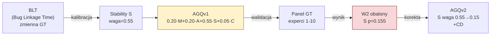

# AGQv1

## Prostymi słowami

AGQv1 to pierwsza formuła AGQ — punkt startowy, od którego wszystko inne się liczy. Wyobraź sobie, że mierzysz zdrowie architektoniczne projektu po raz pierwszy i nie masz jeszcze danych empirycznych — opierasz się na intuicji i dostępnych proxy. AGQv1 powstał dokładnie tak: wysoką wagę dostała [[Stability]], bo wydawała się kluczowa, opierając się na metryce BLT. Okazało się, że BLT był złym wskaźnikiem. AGQv1 pozostaje jednak **niezmiennym punktem odniesienia** — historyczną kotwicą, do której zawsze można wrócić.

## Szczegółowy opis

### Wzór

```
AGQv1 = 0.20·M + 0.20·A + 0.55·S + 0.05·C
```

Cztery składowe bez [[CD]]. Wagi silnie asymetryczne — [[Stability]] dominuje z wagą 0.55.

### Skąd wagi — kalibracja na BLT

Wagi AGQv1 zostały wyznaczone z kalibracji wobec zmiennej **BLT** (*Bug Linkage Time* — czas od wprowadzenia bugfix do zamknięcia ticketu). Hipoteza była intuicyjna: projekty z wyraźną hierarchią warstw (wysoka [[Stability]]) powinny mieć krótszy czas naprawy błędów.

```
Logika kalibracji:
  Wysoka Stability → wyraźne warstwy architektoniczne
  → programista szybko wie "gdzie szukać problemu"
  → krótszy czas naprawy (niski BLT)
  → waga S=0.55 odzwierciedla tę hipotezę
```

Kalibracja dała wynik w oczekiwanym kierunku na zbiorze BLT. Na tej podstawie S=0.55 weszło do formuły bazowej.

### Dlaczego BLT okazał się błędny — Wniosek W2 (obalony)

W eksperymencie panelowym (Ground Truth z ekspertami) [[Stability]] okazała się **nieistotna statystycznie**:

| Składowa | p-value (panel) | Interpretacja |
|---|---|---|
| [[Stability]] (S) | p=0.155 | **Nieistotna** — brak dyskryminacji POS/NEG |
| [[Cohesion]] (C) | p=0.0002 | Silnie istotna |
| [[CD]] | p=0.004 | Bardzo istotna (v2+) |
| [[Acyclicity]] (A) | p=0.030 | Istotna |

BLT jako zmienna GT okazał się zbyt zaszumiony i confoundowany — nie mierzył tego, co miał mierzyć. Korelacja BLT z Stability była artefaktem, nie sygnałem.

**W2 (Wniosek 2, obalony):** *„Stability koreluje z jakością architektury Java."*
Obalony na panelu n=29 → p=0.155. Zaakceptowany: Stability nieistotna jako indywidualny dyskryminator.

### Konsekwencja: dlaczego AGQv1 jest immutable

Mimo obalenia hipotezy leżącej u podstaw AGQv1, formuła jest **zachowana bez zmian** z trzech powodów:

1. **Punkt odniesienia historyczny** — każda nowa wersja może być porównana do v1, co pokazuje postęp
2. **Replikowalność** — zewnętrzni badacze mogą odtworzyć dokładnie AGQv1 bez niejasności
3. **Zasada naukowa** — nie usuwa się danych tylko dlatego, że okazały się złe; zachowuje się je jako dowód drogi jaką przeszedł projekt



### Rozkład AGQv1 na benchmarku

Z benchmarku porównania wersji (n=78 repo Python):

| Statystyka | AGQv1 | AGQv2 | AGQv3 |
|---|---|---|---|
| Min | 0.5577 | 0.6294 | 0.5993 |
| Max | 0.8440 | 0.9667 | 1.0000 |
| Średnia | 0.6688 | 0.7935 | 0.7566 |
| Std | 0.0499 | 0.0572 | 0.0731 |
| Spread | 0.2863 | 0.3373 | 0.4007 |

AGQv1 ma najwęższy spread (0.2863) — najsłabsza dyskryminacja między projektami.

### Wyniki tezy T1–T5 dla AGQv1

| Test | Wynik AGQv1 | Uwaga |
|---|---|---|
| T1 (determinizm) | PASS | delta=0.000 |
| T2 (SonarQube) | PASS | Brak korelacji z SonarQube (p>0.10) |
| T3 (wykrywanie problemów) | PASS | Identyfikuje projekty z niskim AGQ |
| T4 (szybkość) | PASS | < 1 sekunda |
| T5 (dyskryminacja) | PASS | Różnicuje projekty |

AGQv1 spełnia wszystkie tezy — ale to minimum, które każda wersja powinna spełnić. AGQv2 i v3 różnicują lepiej.

## Definicja formalna

\[
\text{AGQv1} = 0.20 \cdot M + 0.20 \cdot A + 0.55 \cdot S + 0.05 \cdot C
\]

Składowe:
- \(M\) = Modularity ∈ [0,1], algorytm Louvain → max(0, Q)/0.75
- \(A\) = Acyclicity ∈ [0,1], Tarjan SCC → 1 − max_SCC/n_internal
- \(S\) = Stability ∈ [0,1], wariancja Instability per pakiet / 0.25
- \(C\) = Cohesion ∈ [0,1], 1 − mean(LCOM4−1)/max_LCOM4

**Status:** IMMUTABLE — nie może być modyfikowana pod żadnym warunkiem.

Kalibracja AGQv1 na BLT odzwierciedla stan wiedzy sprzed panelu GT. Pozostaje jako historyczny punkt zero projektu QSE.

## Zobacz też

- [[AGQ Formulas]] — tabela wszystkich wersji
- [[AGQv2]] — następna wersja: dodanie CD, korekta wagi S
- [[Stability]] — składowa z wagą 0.55, nieistotna na panelu (p=0.155)
- [[Modularity]], [[Acyclicity]], [[Cohesion]] — pozostałe składowe v1
- [[Ground Truth]] — metodologia panelowa, która obaliła BLT
