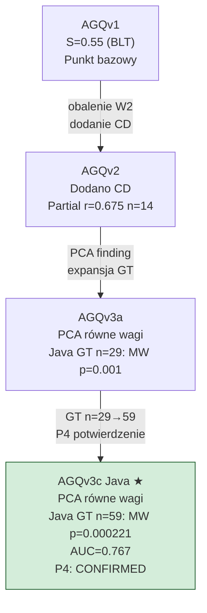

# AGQv3c Java

## Prostymi słowami

AGQv3c Java to potwierdzona formuła dla projektów Java. Każda z pięciu składowych ma wagę 0.20 — to nie jest arbitralny wybór, lecz wynik analizy PCA (brak dominującego wymiaru) potwierdzony eksperymentem P4 na rozszerzonym GT (n=59). Eksperyment P4 przetestował 18 wariantów wag — żaden nie pokonał v3c poza marginesem błędu. Formuła jest zamrożona.

## Szczegółowy opis

### Wzór

```
AGQv3c (Java) = 0.20·M + 0.20·A + 0.20·S + 0.20·C + 0.20·CD
```

Pięć składowych z równymi wagami. Identyczny wzór co AGQv3a — wersja „c" oznacza konfigurację z klasycznym zestawem metryk (bez zastępowania A przez NSdepth jak w v3b).

### Skąd wagi — odkrycie PCA

Analiza PCA przeprowadzona na n=357 repozytoriach (benchmark) dała kluczowy wynik:

> **„All 5 eigenvalues nearly equal — PCA yields uniform 0.20 weights. No dominant dimension in feature space."**

```
PCA na n=357 repo:
  Eigenvalue 1 ≈ Eigenvalue 2 ≈ Eigenvalue 3 ≈ Eigenvalue 4 ≈ Eigenvalue 5

Interpretacja: żadna kombinacja M/A/S/C/CD nie dominuje w czystym
wymiarze wariancji. Brak uzasadnienia dla nierównych wag.
→ Wniosek: wagi równe 0.20 są empirycznie uzasadnione.
```

Wcześniejsze nierówne wagi (AGQv1: S=0.55, AGQv2: M=0.30/S=0.15) były hipotezami — PCA pokazało, że dane ich nie wspierają.

### P4 — potwierdzenie na rozszerzonym GT (n=59, kwiecień 2026)

Eksperyment P4 re-run Java-S na expanded GT:

| Aspekt | Wynik |
|---|---|
| Wariantów testowanych | 18 |
| **Zwycięzca** | **v3c (equal 0.20)** |
| Wariant rezerwowy | C_boost (M10/A10/S20/C30/CD30) |
| v3c partial_r | 0.447 (p=0.0004) |
| C_boost partial_r | 0.484 (p=0.0001) |
| Różnica | +0.037 — **w zakresie bootstrap CI** |
| v3c CI | [0.278, 0.610] (width=0.332) |
| **S monotonicity** | **ZŁAMANA: ρ=0.00 (była 1.00 na n=29)** |
| Split-half | Wszystkie warianty niestabilne (Δ>0.15) |
| Krajobraz | Płaski [0.40, 0.49] — brak ostrych optymalnych |

**Kluczowe odkrycia P4:**

1. **S monotonicity broken** — na n=59 zwiększanie wagi S nie poprawia monotoniczne partial_r. Krzywa ma kształt odwróconego U z peakiem przy S=0.20. To oznacza, że S nie jest tak dominująca jak sugerowały wcześniejsze wyniki na n=29.

2. **Krajobraz płaski** — wszystkie warianty w przedziale partial_r [0.40, 0.49]. Różnice między wariantami są mniejsze niż bootstrap CI (~0.33). Nie ma wyraźnego optimum.

3. **C_boost najlepszy numerycznie** — partial_r=0.484 vs v3c 0.447, ale różnica (+0.037) w CI. Wybór v3c nad C_boost uzasadniony: (a) mniejsze ryzyko overfittingu, (b) lepszy max_dominance (żaden składnik nie dominuje).

**Rekomendacja P4:** Zamknąć optymalizację wag. v3c jest wystarczająco dobre. Dalsze tuning na n=59 to ryzyko overfittingu na szum.

### Walidacja na rozszerzonym GT Java (n=59)

| Statystyka | Wartość | Interpretacja |
|---|---|---|
| Mann-Whitney p | **0.000221** | Wysoce istotne (p < 0.001) |
| Spearman ρ | **0.380** (p=0.003) | Umiarkowana korelacja |
| Partial r (kontrola rozmiaru) | **0.447** (p=0.0004) | Silna po kontroli |
| AUC-ROC | **0.767** | Dobra klasyfikacja POS/NEG |
| POS mean AGQ | 0.571 | |
| NEG mean AGQ | 0.486 | |
| Gap POS−NEG | 0.085 | |

### Walidacja na Strict Protocol GT (n=38)

| Statystyka | Strict GT (n=38) | Full GT (n=59) |
|---|---|---|
| Partial r | **0.507** (p=0.001) | 0.447 (p=0.0004) |
| MW p | **0.0004** | 0.000221 |
| C partial_r | **0.571** (p=0.0002) | — |
| S partial_r | **0.410** (p=0.011) | — |

Strict GT (filtry: panel≥7.0/≤3.5, σ<2.0, 100≤nodes≤5000) daje silniejsze wyniki — potwierdzenie, że „szara strefa" repos rozmywa sygnał.

### Dyskryminacja per składowa

| Składowa | POS średnia | NEG średnia | Δ | MW p | Istotność |
|---|---|---|---|---|---|
| [[Modularity]] (M) | 0.668 | 0.648 | +0.021 | 0.226 | ns |
| [[Acyclicity]] (A) | 0.994 | 0.974 | +0.020 | 0.030 | * |
| [[Stability]] (S) | 0.344 | 0.238 | +0.106 | 0.016 | * |
| [[Cohesion]] (C) | 0.393 | 0.269 | +0.124 | **0.0002** | *** |
| [[CD]] | 0.454 | 0.299 | +0.155 | **0.004** | ** |

**Ranking siły dyskryminacji:**
1. **C (Cohesion)** — najsilniejszy: p=0.0002 ★★★
2. **CD** — drugi: p=0.004 ★★
3. **S (Stability)** — trzeci: p=0.016 ★
4. **A (Acyclicity)** — marginalny: p=0.030 ★
5. **M (Modularity)** — nieistotna: p=0.226 ns

[[Cohesion]] i [[CD]] razem stanowią kluczowe dyskryminatory jakości architektury Java. [[Modularity]] samodzielnie nie discriminuje — podobne do wniosku z kalibracji wag (M=0.00 w L-BFGS-B na OSS-Python).

### Walidacja krzyżowa: Jolak et al.

8 repozytoriów Java OSS z badania Jolak et al. (2025) przeskanowanych AGQv3c:

| Repo | AGQv3c | Wynik Jolak | Zgodność |
|---|---|---|---|
| MyPerf4J | 0.7557 | Dobra architektura | CONFIRMED ✅ |
| yavi | 0.5988 | Akceptowalna | CONFIRMED ✅ |
| light-4j | 0.4935 | Problematyczna | CONFIRMED ✅ |
| seata | 0.4875 | Problematyczna | CONFIRMED ✅ |
| sofa-rpc | 0.4864 | Problematyczna | PLAUSIBLE ~✅ |

Mean AGQv3c Jolak = 0.535 — pomiędzy GT-POS=0.571 a GT-NEG=0.486 (oczekiwane, projekty Jolak to przypadki ze środka). 4/5 wyników CONFIRMED, 1 PLAUSIBLE.

### Ograniczenia AGQv3c Java

1. **n=59 to wciąż małe GT** — wyniki wymagają replikacji na szerszym zbiorze
2. **Panel symulowany** — czterech recenzentów to symulacja, nie prawdziwi architekci
3. **Utility libraries** (Guava, commons-lang, commons-collections) — niski AGQ mimo dobrego projektowania; potrzebna normalizacja per kategorię
4. **Krajobraz wag płaski** — brak ostrych optymalnych wag; v3c wybrane za stabilność, nie za wynik

### Kontekst w hierarchii formuł



## Definicja formalna

\[
\text{AGQv3c}_\text{Java} = 0.20 \cdot M + 0.20 \cdot A + 0.20 \cdot S + 0.20 \cdot C + 0.20 \cdot CD
\]

Składowe identyczne jak w AGQv2.

**Wyniki walidacji (Java GT n=59):**
- Mann-Whitney U test: p=0.000221 ✅
- Spearman ρ=0.380 (p=0.003) ✅
- Partial r=0.447 (p=0.0004) po kontroli rozmiaru ✅
- AUC-ROC=0.767 ✅
- 4/5 wyników Jolak CONFIRMED ✅
- P4: 18 wariantów testowanych, v3c nie pokonane poza CI ✅

**Status:** CONFIRMED — potwierdzona formuła Java. Wagi zamrożone. Optymalizacja zakończona.

## Zobacz też

- [[AGQ Formulas]] — tabela wszystkich wersji
- [[AGQv2]] — poprzednia wersja (partial r=0.675 n=14)
- [[AGQv3c Python]] — odpowiednik dla Pythona (inna formuła — inny problem)
- [[Cohesion]], [[CD]] — najsilniejsze dyskryminatory w Java GT
- [[Modularity]], [[Acyclicity]], [[Stability]] — pozostałe składowe
- [[Ground Truth]] — metodologia panelowa, GT Java n=59
- [[E7 P4 Java-S Expanded]] — pełne wyniki eksperymentu P4
