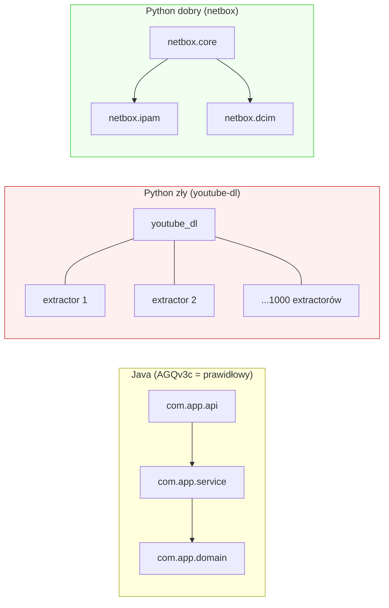

# AGQv3c Python

## Prostymi słowami

AGQv3c Python to obecna najlepsza formuła dla projektów Python. Jej historia zaczyna się od nieprzyjemnego odkrycia: formuła Java (0.20 na wszystko) na Pythonie działa *odwrotnie* — projekty złe dostają wyższy wynik niż projekty dobre. Problem leży w specyfice architektury Python: projekty z tysiącami plików w jednym namespace wyglądają „dobrze" według standardowych metryk grafowych, ale są architektonicznie płaskie jak naleśnik. Rozwiązanie: nowa metryka [[flatscore]] z wagą 0.35.

## Szczegółowy opis

### Wzór

```
AGQv3c (Python) = 0.15·M + 0.05·A + 0.20·S + 0.10·C + 0.15·CD + 0.35·flat_score
```

Sześć składowych. [[flatscore]] z najwyższą wagą (0.35). [[Acyclicity]] z najniższą wagą (0.05).

### Problem: odwrócony kierunek AGQ w Pythonie

Na panelu Python GT (n=30, 13 POS / 17 NEG) surowy AGQv3c (wagi Java) wykazał **odwrócony kierunek**:

```
Przykład z panelu GT (Turn 34-35 sesji badawczej):

  youtube-dl:
    Panel = 2.25 (NEG — zła architektura)
    AGQ surowe = 0.860 (wysokie!)
    Powód: 1003 extractorów w JEDNYM namespace → A≈1.0, brak cykli

  netbox:
    Panel = 8.00 (POS — dobra architektura)
    AGQ surowe = niższe niż youtube-dl
```

youtube-dl ma AGQ wyższe niż netbox, choć panel ocenił go jako architektonicznie gorszy. To fundamentalny problem metodologiczny.

### Dlaczego [[Acyclicity]] ma wagę 0.05

Prawie wszystkie projekty Python mają A≈1.0 — brak cykli to norma w Pythonie (inaczej niż w Javie, gdzie 77% projektów ma cykle). Metryka Acyclicity **nie różnicuje** projektów Python — dlatego waga 0.05 (blisko zera).

| Metryka | Python (n=78) | Java (n=77) | Skuteczność w Pythonie |
|---|---|---|---|
| Acyclicity | 0.999 ± 0.005 | 0.973 ± 0.042 | **Prawie brak zmienności** |
| Cohesion | 0.647 | 0.379 | Niska |
| Stability | 0.806 | 0.486 | Zróżnicowanie |

### [[flatscore]] — nowa metryka dla Pythona

[[flatscore]] mierzy stopień „płaskości" architektury Python:

```
flat_score = 1 − (mediana_głębokości_namespace / max_możliwa_głębokość)

Projekt warstwowy (dobry):
  com.app.domain.model.entity → głębokość 5
  flat_score ≈ niskie (dobry sygnał)

Projekt płaski (zły):
  youtube_dl.extractor.youtube → głębokość 2
  1000 plików w jednym namespace
  flat_score ≈ wysokie (zły sygnał, po inwersji: niskie)
```

W uproszczeniu: projekty Python z hierarchicznym systemem namespace (głębokie pakiety) dostają wysoki flat_score; projekty z tysiącami plików w jednym płaskim namespace dostają niski flat_score.

Przykłady z GT Python (n=30):

| Projekt | Panel | flat_score | Kierunek |
|---|---|---|---|
| netbox (POS) | 8.00 | wyższy | ✅ prawidłowy |
| saleor (POS) | 7.50 | wyższy | ✅ prawidłowy |
| youtube-dl (NEG) | 2.25 | niższy | ✅ po flat_score poprawiony |
| archivebox (NEG) | 3.00 | niższy | ✅ prawidłowy |

### Statystyki GT Python (n=30)

| Statystyka | Wartość |
|---|---|
| n total | 30 |
| POS | 13 |
| NEG | 17 |
| Formuła | AGQv3c Python z flat_score |
| Status | Wiarygodna, wymaga większego GT |

**Uwaga:** Wyniki Python GT są słabsze niż Java GT — częściowo dlatego, że n=30 jest małe, a panel Python był trudniejszy do kalibracji (większa różnorodność wzorców architektonicznych w projektach Python).

### [[NSdepth]] — obiecujący kierunek

Poza [[flatscore]] zbadano metrykę [[NSdepth]] (*Namespace Depth*):

```
NSdepth = znormalizowana głębokość drzewa przestrzeni nazw
```

Wyniki eksperymentalne:
- NSdepth ma **prawidłowy kierunek** w obu językach (Java i Python)
- Słabszy sygnał w Pythonie niż [[flatscore]]
- W AGQv3b (wariant eksperymentalny): partial_r=0.698 na Java GT n=28

[[NSdepth]] jest obiecującym kandydatem do przyszłych wersji formuły, szczególnie jako metryka cross-language (działa w Javie i Pythonie).

### Porównanie AGQv3c Java vs Python

| Właściwość | Java | Python |
|---|---|---|
| [[Modularity]] waga | 0.20 | 0.15 |
| [[Acyclicity]] waga | 0.20 | **0.05** |
| [[Stability]] waga | 0.20 | 0.20 |
| [[Cohesion]] waga | 0.20 | 0.10 |
| [[CD]] waga | 0.20 | 0.15 |
| [[flatscore]] waga | — | **0.35** |
| Klucz różnicy | Brak flat_score | Kluczowy flat_score |
| Kierunek bez flat_score | Prawidłowy | **Odwrócony** |

### Dlaczego te różnice mają sens architektonicznie

**Java:** pakiety są wymuszane przez język (`package com.company.app`). Każdy plik Java należy do pakietu. Hierarchia namespace jest naturalna i informatywna.

**Python:** brak wymuszonej hierarchii. `import youtube_dl` — 1003 extractory w jednym namespace. Metryki grafowe widzą A≈1.0 i CD wysoki (rzadki graf), ale architektura jest „płaska jak naleśnik" według ekspertów.



## Definicja formalna

\[
\text{AGQv3c}_\text{Python} = 0.15 \cdot M + 0.05 \cdot A + 0.20 \cdot S + 0.10 \cdot C + 0.15 \cdot CD + 0.35 \cdot \text{flat\_score}
\]

Składowe M, A, S, C, CD jak w AGQv3c Java.

[[flatscore]]:
\[
\text{flat\_score} = f(\text{głębokość namespace}, \text{rozkład modułów}) \in [0,1]
\]

Wysoki flat_score = hierarchiczna struktura namespace = architektura warstwowa. Niski flat_score = płaska struktura = architektura monolit/spaghetti.

**Status:** CREDIBLE — wiarygodna formuła Python, ale:
- GT n=30 za małe do mocnych wniosków
- flat_score wymaga pełnej specyfikacji (patrz [[flatscore]])
- Należy używać **wyłącznie na projektach Python** — nie stosować do Java/Go

## Zobacz też

- [[AGQ Formulas]] — tabela wszystkich wersji
- [[AGQv3c Java]] — odpowiednik dla Javy (inne wagi, bez flat_score)
- [[flatscore]] — metryka specyficzna dla Pythona, waga 0.35
- [[NSdepth]] — obiecujący kierunek cross-language
- [[Stability]] — składowa z wagą 0.20 (równa Javie)
- [[Acyclicity]] — składowa z wagą 0.05 (zredukowana, brak zmienności w Python)
- [[Ground Truth]] — panel Python n=30
