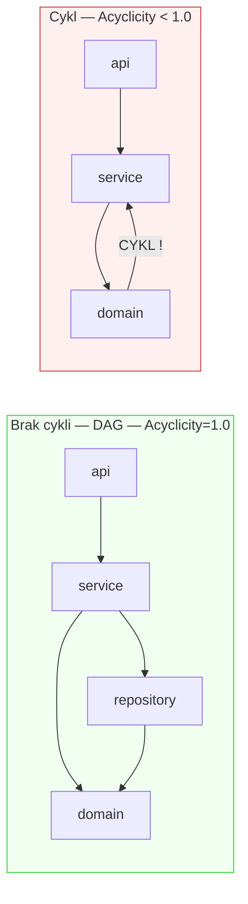

# Acyclicity (A)

## Prostymi słowami

Acyclicity mierzy, ile modułów NIE jest uwikłanych w "kółka zależności". Wyobraź sobie biuro: Kadrowe czekają na decyzję Finansów, Finanse czekają na plan Kadr, plan Kadr wymaga akceptacji Finansów. Nikt nic nie zrobi — deadlock. W kodzie cykl zależności działa tak samo: nie możesz zmienić modułu A bez zmiany B, B bez C, C bez A. Acyclicity=1.0 oznacza zero takich kółek.

## Szczegółowy opis

### Jak działa algorytm Tarjan?

**Algorytm Tarjana** (Tarjan, 1972) wyznacza **Strongly Connected Components (SCC)** — grupy węzłów gdzie każdy jest osiągalny z każdego. SCC o rozmiarze > 1 to cykl.



### Wzór

```
Acyclicity = 1 − (rozmiar_największego_SCC / n_wewnętrznych)
```

**Kluczowa decyzja:** używamy *największego* SCC, nie sumy wszystkich. Jeden cykl obejmujący 100 modułów to katastrofa — nie powinien "rozcieńczać się" przez podział przez duże n.

Przykład: projekt 100 modułów, SCC(max)=15 → Acyclicity = 1 − 15/100 = 0.85.

### Tabela interpretacji

| Wartość A | % modułów w cyklu | Znaczenie |
|---|---|---|
| 1.00 | 0% | Ideał — czysty DAG, wszystkie zależności hierarchiczne |
| 0.95–1.00 | < 5% | Kilka izolowanych cykli — monitor |
| 0.85–0.95 | 5–15% | Uwaga — wymaga przeglądu |
| 0.70–0.85 | 15–30% | Poważny problem — priorytetowa refaktoryzacja |
| < 0.70 | > 30% | Krytyczny — strukturalny problem |

### Dane empiryczne Java GT (n=59)

| Kategoria | Średnia A | Odch. std |
|---|---|---|
| **POS** | **0.994** | niskie |
| **NEG** | **0.974** | wyższe |
| Różnica | +0.020 | — |
| Mann-Whitney p | **0.030 \*** | — |

Acyclicity jest istotna statystycznie (p=0.030) dla Java GT. Różnica wydaje się mała (0.994 vs 0.974), ale w praktyce oznacza:
- POS: prawie idealne DAG, max SCC zwykle 1–2 węzły
- NEG: kilka procent modułów uwikłanych w cykle

### Acyclicity a języki

Dane z benchmarku 240 projektów:

| Język | % projektów z cyklami | Uwagi |
|---|---|---|
| **Go** | 0% | Ekosystem aktywnie wymusza brak cykli (compiler error) |
| **Python** | 4% | Rzadkie cykle — Python nie wymaga deklaracji typów |
| **Java** | **71%** | Bardzo częste — Java nie ma mechanizmu wymuszania |

Go jest szczególnym przypadkiem: brak cykli jest *architektonicznie trywialny* — ekosystem Go to wymusza na poziomie kompilacji. Dlatego Acyclicity nie dyskryminuje jakości dla Go.

### CycleSeverity — uzupełniający kontekst

Samo A=0.85 nie mówi wszystkiego. Dlatego QSE oferuje **CycleSeverity**:

| Poziom | Zakres A | Rekomendacja |
|---|---|---|
| NONE | A=1.0 | Brak problemu |
| LOW | A=0.95–1.0 | Izolowane przypadki, monitor |
| MEDIUM | A=0.85–0.95 | Wymaga uwagi |
| HIGH | A=0.70–0.85 | Pilna refaktoryzacja |
| CRITICAL | A < 0.70 | Strukturalny problem |

### Dlaczego największy SCC, nie średni?

Przykład: projekt 1000 modułów z jednym cyklem 100 i 50 małymi cyklami (2-3 moduły).
- Podejście "suma": (100 + 100) / 1000 = 0.20 → A = 0.80
- Podejście "max": 100 / 1000 = 0.10 → A = 0.90

Podejście "max" lepiej oddaje powagę: 100-modułowy cykl to architektoniczna katastrofa niezależnie od reszty projektu. Nie powinien się "poprawiać" przez to, że reszta jest czysta.

## Definicja formalna

Niech \(\text{SCC}_{\max}(G)\) = rozmiar największej silnie spójnej składowej grafu \(G\), z wyłączeniem trywialnych SCC (rozmiar 1 — węzły bez cykli):

\[\text{Acyclicity} = 1 - \frac{|\text{SCC}_{\max}(G)|}{|V_{\text{internal}}|}\]

Gdzie \(|V_{\text{internal}}|\) = liczba węzłów wewnętrznych projektu.

Algorytm Tarjana: złożoność O(V + E), liniowa względem rozmiaru grafu.

**Kryterium "dobrego" DAG:** \(\text{Acyclicity} = 1.0 \iff\) dla każdej silnie spójnej składowej \(|SCC| = 1\).

**Walidacja statystyczna** (Java GT n=59):
- Mann-Whitney p = 0.030 \*
- POS = 0.994, NEG = 0.974

**Waga w AGQ v3c** (Java i Python): 0.20 (równa z pozostałymi).
W starszym AGQ v1: Acyclicity miała wagę 0.730 (najwyższa) — wynikało to z kalibracji na danych OSS Python gdzie cykle są rzadkie i bardzo charakterystyczne.

## Zobacz też

- [[Tarjan SCC]] — szczegóły algorytmu
- [[Dependency Graph]] — graf na którym Tarjan działa
- [[Conceptual Dimensions]] — cztery wymiary jakości
- [[Metrics Index]] — porównanie wszystkich metryk
- [[E2 Coupling Density]] — eksperyment gdzie CD uzupełnia Acyclicity
