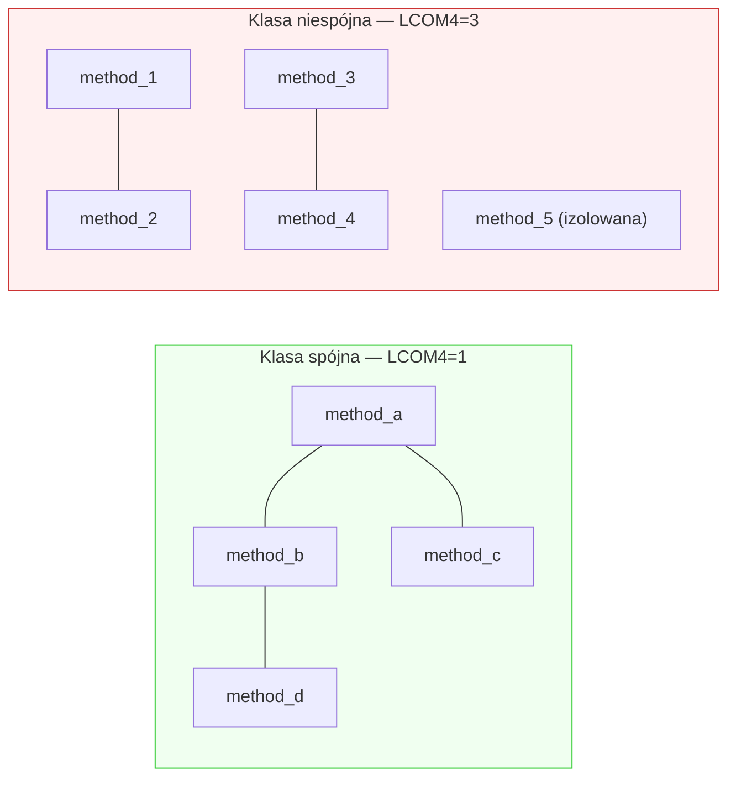

# Cohesion (C)

## Prostymi słowami

Cohesion (spójność) mierzy, czy każda klasa robi *jedną rzecz*. Wyobraź sobie specjalistę: chirurg operuje, księgowy liczy, kierowca prowadzi. To trzy osoby, każda z własnym zestawem narzędzi. "Człowiek-orkiestra" — który robi wszystkie trzy jednocześnie — to antywzorzec. Cohesion wykrywa takich "człowieków-orkiestrę" w kodzie: klasy, których metody nie współpracują ze sobą i powinny być rozbite.

## Szczegółowy opis

### Jak działa LCOM4?

**LCOM4** (Lack of Cohesion of Methods, wersja 4) to podejście grafowe:

1. Stwórz graf dla każdej klasy: metody = węzły, krawędź między dwoma metodami jeśli **dzielą wspólny atrybut** klasy
2. Policz liczbę **spójnych składowych** (connected components) w tym grafie
3. LCOM4 = liczba składowych



W przykładzie "niespójna": trzy niezależne "wyspy" metod = klasa powinna być rozbita na 3 osobne klasy.

### Wzór i normalizacja

```
LCOM4(klasa) = liczba spójnych składowych w grafie metoda↔atrybut

Cohesion = 1 − mean((LCOM4_i − 1) / max_LCOM4) po wszystkich klasach
```

Cohesion → 1: każda klasa jest spójna (LCOM4=1 dla każdej).
Cohesion → 0: klasy to "worki" niezwiązanych metod.

### Tabela interpretacji

| Wartość C | LCOM4 equiv | Znaczenie |
|---|---|---|
| 1.0 | 1.0 | Każda klasa = jeden spójny byt |
| 0.7–1.0 | 1.0–1.4 | Dobra spójność, drobne odchylenia |
| 0.4–0.7 | 1.4–2.0 | Umiarkowana spójność |
| 0.0–0.4 | > 2.0 | Klasy pełnią wiele ról — god classes |

### Dane empiryczne Java GT (n=59)

| Kategoria | Średnia C | p-value |
|---|---|---|
| **POS** | **0.393** | — |
| **NEG** | **0.269** | — |
| Różnica | +0.124 | — |
| Mann-Whitney p | **0.0002 \*\*\*** | najsilniejszy! |

**Cohesion to NAJSILNIEJSZY DYSKRYMINATOR** spośród wszystkich metryk dla Javy (n=59). p=0.0002 to najniższe p-value w całym zestawie metryk. To ma sens: god classes (klasy z setkami metod i atrybutów) są charakterystyczne dla złej architektury Java, i LCOM4 je bezlitośnie wykrywa.

### Language bias — uwaga krytyczna

Cohesion jest **wrażliwa na język programowania** i nie może być porównywana bezpośrednio między językami:

| Język | Typowe C | Powód |
|---|---|---|
| **Go** | 1.0 (zawsze) | Go nie ma dziedziczenia klas z atrybutami; interfejsy → LCOM4=1 z definicji |
| **Java** | ~0.38 | Java pozwala na złożone hierarchie; god classes naturalne |
| **Python** | ~0.65 | Python pozwala na atrybuty dynamiczne; pośrednie |

**Go: zawsze Cohesion=1.0** — nie dlatego że projekty Go są perfekcyjne, ale dlatego że język nie ma klas w sensie Java. To language bias, nie wynik architektoniczny.

Do porównań między językami używaj **AGQ-z** (Z-score względem rozkładu języka).

### Związek z innymi metrykami

Z macierzy korelacji (n=357):

| Para | r | Interpretacja |
|---|---|---|
| C–A | +0.258 | Projekty bez cykli mają spójniejsze klasy |
| C–S | +0.096 | Prawie niezależne |
| C–M | −0.254 | Moduły ze silnymi klastrami często mają god classes |

Cohesion jest **niezależna od Stability** i prawie niezależna od Modularity — wnosi unikalny sygnał do AGQ.

### Cohesion a SonarQube

Dane z benchmarku 78 projektów: cohesion correlates z complexity_per_kloc: Spearman r=−0.333 (p=0.003) — jedyna metryka AGQ z istotną korelacją z SonarQube. Ale SonarQube mierzy złożoność per plik, Cohesion mierzy strukturę relacji wewnątrz klasy. Perspektywy komplementarne.

## Definicja formalna

Dla klasy \(c\) z metodami \(\{m_1, \ldots, m_n\}\) i atrybutami \(\{a_1, \ldots, a_k\}\):

Zbuduj graf \(G_c = (V_c, E_c)\) gdzie \(V_c = \{m_i\}\) i \((m_i, m_j) \in E_c \iff \exists a : m_i, m_j \text{ oba używają } a\).

\[\text{LCOM4}(c) = \text{liczba spójnych składowych}(G_c)\]

Cohesion projektu:

\[C = 1 - \frac{1}{|K|} \sum_{c \in K} \frac{\text{LCOM4}(c) - 1}{\max(\text{LCOM4}(K)) - 1}\]

Gdzie \(K\) = zbiór wszystkich klas projektu (z co najmniej 2 metodami).

**Degenerate cases:**
- Klasa z 0–1 metodą: LCOM4=1 (trywialnie spójna)
- Klasa z metodami ale bez atrybutów: LCOM4=n (każda metoda osobna wyspa)

### ⚠️ LCOM4 penalizuje Java interfejsy (E13g)

Java interfejsy z natury **nie mają pól** (atrybutów) — definiują tylko sygnaturę metod. W grafie LCOM4:
- Brak wspólnych atrybutów → brak krawędzi między metodami
- Każda metoda to izolowana wyspa → LCOM4 = n_methods (**maximum penalty**)

**Konsekwencja:** Dobrze zaprojektowane interfejsy z wieloma metodami (np. `Repository<T>` z 5 metodami CRUD) otrzymują LCOM4=5 — najgorszą możliwą ocenę. To jest **fałszywie negatywne** — interfejs nie jest "niespójny", po prostu nie ma pól.

**Wpływ na C:** Projekty z dużą liczbą interfejsów (DDD, hexagonal) są **penalizowane** przez LCOM4 za cokolwiek, co jest dobrym wzorcem architektonicznym.

**Plan naprawy:** Wykluczyć interfejsy z obliczeń LCOM4 lub traktować je jako LCOM4=1 (trywialnie spójne) — priorytet P1.

**Walidacja statystyczna** (Java GT n=59):
- Mann-Whitney p = 0.0002 \*\*\* (najsilniejszy dyskryminator)
- Partial r = +0.479 (n=29, p=0.009) — na strict GT n=36: partial r = +0.571 (p=0.0002)
- **Znany problem: LCOM4 penalizuje Java interfejsy** — zob. sekcja powyżej

## Zobacz też

- [[LCOM4]] — szczegóły algorytmu
- [[Conceptual Dimensions]] — kontekst czterech wymiarów
- [[Metrics Index]] — porównanie dyskryminatorów
- [[Modularity]] — inna perspektywa struktury
- [[CD]] — Coupling Density (drugi silny dyskryminator)
