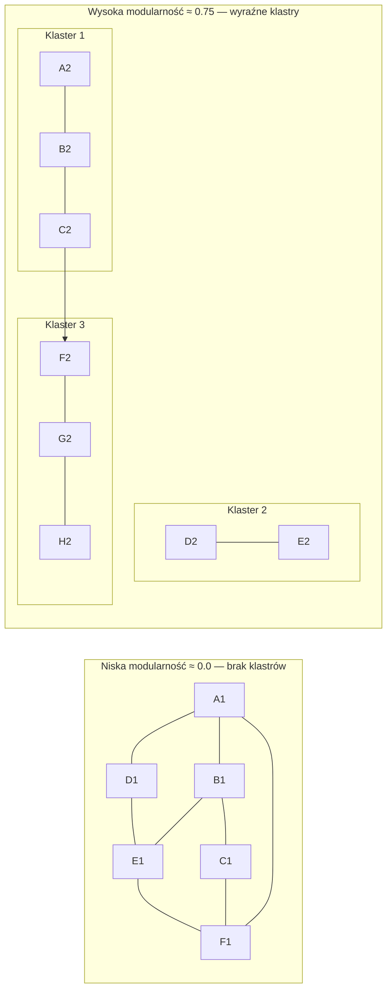

# Modularity (M)

## Prostymi słowami

Modularność mierzy, jak wyraźnie projekt dzieli się na osobne "dzielnice". Wyobraź sobie miasto: dobre miasto ma wyraźną dzielnicę mieszkalną, przemysłową i centrum — z ograniczoną liczbą dróg między nimi. Złe miasto to labirynt bez planu, gdzie każda ulica łączy się z każdą inną. Modularity wykrywa czy Twój kod ma "dzielnice" (klastry modułów), czy jest jedną wielką magmą wzajemnych importów.

## Szczegółowy opis

### Jak działa Louvain?

Algorytm **Louvain** wykrywa "społeczności" w grafie — grupy węzłów gęsto połączonych między sobą, a słabo połączonych z resztą. To ten sam algorytm, który analizuje sieci społeczne (kto jest przyjacielem kogo).



### Wzór i normalizacja

Newman's Q obliczony przez Louvain:

```
Q ∈ [-0.5, 1.0]
   Q > 0: więcej krawędzi wewnątrz klastrów niż oczekiwane losowo
   Q < 0: mniej krawędzi wewnątrz klastrów niż losowo
```

Normalizacja QSE:

```
M = max(0, Q) / 0.75
```

Dlaczego 0.75? To empiryczne maksimum dla projektów open-source w benchmarku. Prawdziwe projekty rzadko osiągają Q>0.75. Normalizacja zapewnia sensowny zakres [0, 1].

**Wyjątek małych projektów:** jeśli n < 10 węzłów, M = 0.5 (wartość domyślna sygnalizująca niską wiarygodność).

### Tabela interpretacji

| Wartość M | Znaczenie |
|---|---|
| 1.0 | Idealna separacja — klastry prawie izolowane |
| 0.7–1.0 | Wyraźna modularna struktura |
| 0.5–0.7 | Umiarkowana struktura lub mały projekt |
| 0.2–0.5 | Słaba struktura, wzajemne przenikanie |
| 0.0–0.2 | Brak struktury — big ball of mud |

### Dane empiryczne Java GT (n=59)

| Kategoria | Średnia M | Mediana M |
|---|---|---|
| **POS** | **0.668** | — |
| **NEG** | **0.648** | — |
| Różnica | +0.020 | — |
| Mann-Whitney p | **0.226 ns** | — |

**Kluczowy wniosek: Modularity SAMODZIELNIE nie jest istotna statystycznie** (p=0.226 ns). Dyskryminuje słabiej niż Cohesion (p=0.0002) czy CD (p=0.004). Mimo to wchodzi do formuły AGQ, bo:
1. Jest ortogonalna względem innych metryk (r(M,A)=0.015, r(M,S)=−0.203)
2. Wnosi unikalny sygnał niewidoczny w kompozycie
3. PCA równe wagi 0.20 — nie ma uzasadnienia do obniżenia jej wagi

### Modularity a inne metryki

Z macierzy korelacji (n=357):

| Para | r | Interpretacja |
|---|---|---|
| M–A | 0.015 | Prawie niezależne |
| M–S | −0.203 | Lekka ujemna — projekty modularne mają niższą wariancję I |
| M–C | −0.254 | Lekka ujemna — "duże klastry" często mają god classes |

### Typowe wartości w benchmarku (558 repo)

Python projekty z wysoką modularność:
- fabric: M=0.855 (wysokie, małe)
- requests: M=0.812 (zaskakująco wysokie dla małego projektu)

Python projekty z niską modularność:
- falcon: M=0.417
- fastapi: M=0.429

### ⚠️ KRYTYCZNE: M jest pompowalna martwymi interfejsami (E13g)

Eksperyment E13g na newbee-mall odkrył że dodanie interfejsów, których **nikt nie implementuje**, podnosi M:
- Dodano 4 martwe interfejsy: `DataAccessObject`, `DomainEntity`, `ApiResponse`, `Pageable`
- Żaden nie ma implementacji w kodzie
- M: +0.02 bez realnej zmiany architektonicznej

**Przyczyna:** `abstract_modules / total_modules` rośnie gdy dodajemy abstrakcje — niezależnie od tego czy są używane.

**Plan naprawy:** Ważyć tylko żywotne abstrakcje (z ≥1 implementacją) — priorytet P0.

### M usunięte z QSE-Track (commit dcfe68e)

W ramach E13e (pilot Shopizer) stwierdzono że M nie reaguje na eliminację cykli pakietowych (ΔM ≈ 0 mimo SCC 17→0). M zostało usunięte z QSE-Track — pozostało tylko w Layer 1 (QSE-Rank / AGQ composite).

QSE-Track zwraca teraz: **PCA, dip_violations, largest_scc** (bez M).

---

## Definicja formalna

Newman's Modularity Q dla podziału \(P = \{c_1, \ldots, c_k\}\) grafu \(G = (V, E)\):

\[Q = \frac{1}{2|E|} \sum_{i,j} \left(A_{ij} - \frac{d_i d_j}{2|E|}\right) \delta(c_i, c_j)\]

Gdzie:
- \(A_{ij} \in \{0, 1\}\) — macierz sąsiedztwa
- \(d_i\) — stopień węzła \(i\)
- \(\delta(c_i, c_j) = 1\) jeśli \(i, j\) w tym samym klastrze

Normalizacja QSE:

\[M = \max(0, Q) / 0.75\]

Alokacja przez Louvain: heurystyczna maksymalizacja Q, złożoność O(n log n).

**Uwaga:** Q jest miarą sieci nieskierowanych. QSE symetryzuje graf przed obliczeniem Q (krawędź skierowana A→B traktowana jako nieskierowana).

- **Ryzyko gamingu: ŚREDNIE** — zob. sekcja "M jest pompowalna martwymi interfejsami"

## Zobacz też

- [[Conceptual Dimensions]] — cztery wymiary QSE
- [[Dependency Graph]] — graf na którym obliczany jest Q
- [[Louvain]] — algorytm community detection
- [[CD]] — Coupling Density (koreluje z Modularity)
- [[Metrics Index]] — porównanie wszystkich metryk
