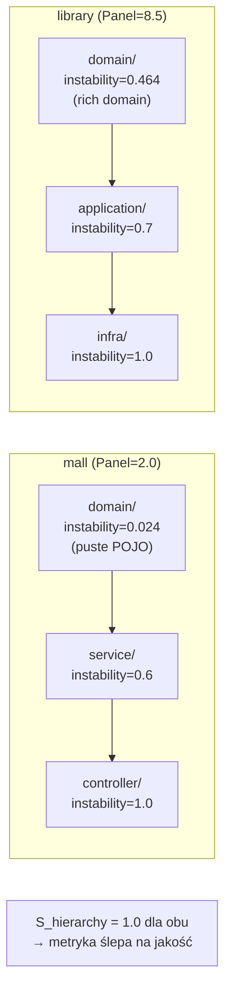

# E1 — Stability Hierarchy

## Prostymi słowami

Pomysł był prosty: dobra architektura powinna mieć hierarchię — klasy domenowe „na dole" (stabilne, zależą od mało rzeczy), klasy infrastrukturalne „na górze" (niestabilne, zależą od wielu). Sprawdzaliśmy, czy projekt naprawdę respektuje tę hierarchię. Wynik: nie działa. Projekt sklepowy (mall, ocena 2.0/10) miał perfekcyjną hierarchię — identycznie jak wzorcowy projekt DDD (library, 8.5/10).

## Hipoteza

> Jeśli projekt ma poprawną hierarchię instability (domain < application < infrastructure), to jest lepszą architekturą niż projekt bez tej hierarchii.

Formalnie: S_hierarchy = odsetek warstw w poprawnej kolejności instability; H₁: r(S_hierarchy, Panel) > 0, p < 0.05.

## Dane wejściowe

- **Dataset:** GT Java, n=13 (4 POS DDD + 3 non-DDD POS + 6 NEG)
- **GT:** panel ekspertów, σ < 2.0
- **Implementacja:** klasyfikacja pakietów według nazwy (`domain/`, `application/`, `infra/`, `controller/`, `service/`), obliczanie instability Martina (fan-out / (fan-in + fan-out)) per warstwa, porównanie kolejności

## Wyniki

| Metryka | Wartość | Istotność |
|---|---|---|
| Spearman r(S_hierarchy, Panel) | **−0.093** | p = 0.762 **ns** |

### Kluczowe obserwacje z danych

| Repo | Panel | S_hierarchy | domain_instability | Typ |
|---|---|---|---|---|
| mall | 2.0 | **1.0** | 0.024 | CRUD (MyBatis POJO sink) |
| ddd-by-examples/library | 8.5 | **1.0** | 0.464 | DDD (rich domain) |

Oba repo mają **identyczny S_hierarchy = 1.0** — ale z zupełnie różnych powodów:
- **mall:** domain jest stabilna bo to puste POJO (gettery/settery) — zero logiki, zero fan-out → instability ≈ 0 → „poprawna hierarchia" przez przypadek
- **library:** domain jest stabilna bo jest właściwie zaprojektowanym centrum domeny — ale klasy domenowe DDD rozmawiają ze sobą intensywnie → wewnętrzny fan-out → instability = 0.464

## Interpretacja

**Paradoks:** dobra domena DDD ma WYŻSZĄ instability niż anemic model — bo klasy domenowe rozmawiają ze sobą (wiele fan-out wewnętrznie). To odwrotność tego, czego oczekiwaliśmy.

Metryka Martina (fan-in/fan-out) nie jest w stanie odróżnić:
- „klasa jest stabilna bo jest dobrze zaprojektowanym centrum domeny"
- „klasa jest stabilna bo jest pustym POJO"

Bez semantyki kodu — tylko topologia grafu — to rozróżnienie jest niemożliwe. Tree-sitter daje dostęp do struktury (jakie klasy/metody), ale nie do treści (czy metody mają logikę czy tylko gettery). Prawdziwy przełom wymagałby parsowania body metod.

## Następny krok

E1 jest definitywnie zamknięty. Problem S jest głębszy niż hierarchia — sama metryka Stability w formule AGQ jest nieistotna na GT Javie (p=0.155 ns, zob. Turn 31/E4). E3 (Package Layer Classifier binarny) był planowany jako prostsze podejście, ale wymaga FQN węzłów (re-skan) i lepszego GT niż BLT.

Prawdziwe rozwiązanie: semantyka kodu (ile klas w domain/ ma metody z logiką vs tylko gettery) — poza zakresem tree-sitter bez parsowania body metod.

## Szczegóły techniczne

**S_hierarchy** obliczany jako:
1. Przypisz każdy pakiet do warstwy: `domain` → warstwa 0, `application` → warstwa 1, `service/controller` → warstwa 2, `infra` → warstwa 3
2. Oblicz instability Martina per warstwa: I = fan-out / (fan-in + fan-out)
3. Sprawdź czy I(warstwa₀) < I(warstwa₁) < I(warstwa₂)
4. S_hierarchy = odsetek spełnionych par sąsiednich warstw

**Obalona hipoteza:** → zob. [[W7 Stability Hierarchy Score]]

## Zobacz też

- [[W7 Stability Hierarchy Score]] — formalna hipoteza (obalona)
- [[Stability]] — metryka Martina (składowa AGQ)
- [[E2 Coupling Density]] — alternatywny sygnał (potwierdzony)
- [[How to Read Experiments]] — protokół eksperymentów QSE
