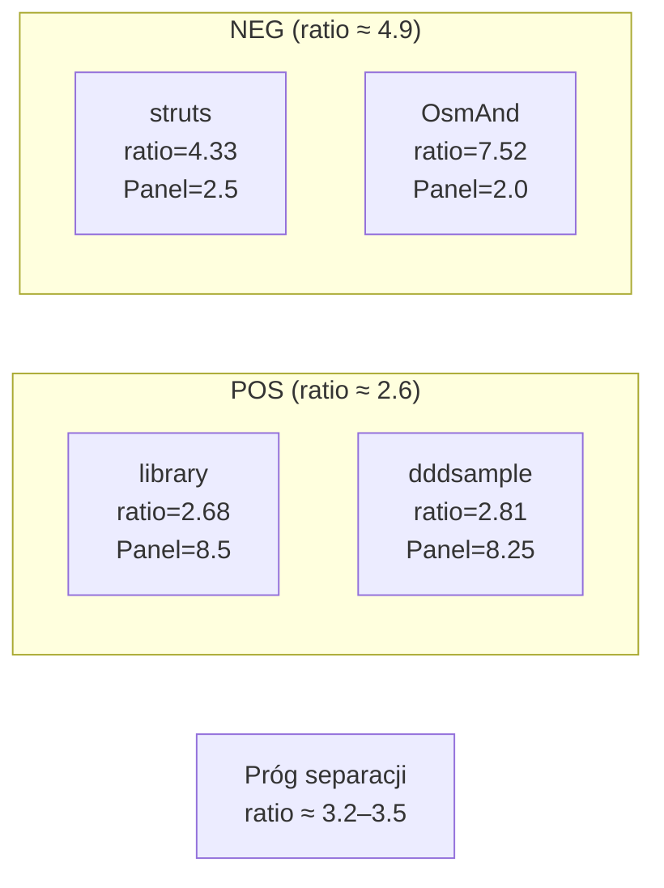

# E2 — Coupling Density

## Prostymi słowami

Wyobraź sobie miasto: jeśli z każdego skrzyżowania wychodzi 10 ulic, to jest chaos (trudno nawigować, trudno zmienić jedną bez zmiany innych). Jeśli z każdego skrzyżowania wychodzą 2–3 ulice, to jest dobrze zaplanowane miasto. Coupling Density mierzy dokładnie to: średnią liczbę „ulic" (krawędzi) przypadającą na jeden „węzeł" (pakiet/klasę) w grafie zależności. Projekty z dobrą architekturą mają ratio ~2.6, projekty złe — ~4.9.

## Hipoteza

> Projekt z niskim stosunkiem krawędzi do węzłów (edges/nodes ratio) ma lepszą architekturę niż projekt z wysokim ratio.

Formalnie: CD = 1 − clip((edges/nodes) / CD_REF, 0, 1), gdzie CD_REF = 6.0; H₁: r(ratio, Panel) < 0, p < 0.05.

## Dane wejściowe

- **Dataset:** GT Java, iteracje n=10 → n=13 → n=14
- **GT:** panel ekspertów, σ < 2.0
- **Implementacja:** edges/nodes z grafu zależności QSE; partial Spearman z kontrolą `nodes`

## Wyniki

### Główne statystyki (n=14, GT Java)

| Metryka | Wartość | Istotność |
|---|---|---|
| r(ratio, Panel) | **−0.787** | p = 0.007 ** |
| partial r (kontrola nodes) | **−0.697** | p < 0.05 * |
| partial r po n=14 | −0.508 | p = 0.064 ns |

### Separacja POS vs NEG

| Kategoria | Średni ratio | Średni CD |
|---|---|---|
| **POS** (dobra arch.) | **2.62** | ~0.56 |
| **NEG** (zła arch.) | **4.25–4.9** | ~0.35 |
| Mann-Whitney p | **0.010–0.034** | * |

### Pełne dane GT Java (Turn 17–24)

| Repo | AGQ v1 | AGQ v2 | ratio | Panel | GT |
|---|---|---|---|---|---|
| ddd-by-examples/library | 0.439 | 0.514 | 2.68 | 8.50 | POS |
| citerus/dddsample-core | 0.494 | 0.543 | 2.81 | 8.25 | POS |
| gothinkster/realworld | 0.430 | 0.509 | 2.71 | 7.50 | POS |
| spring-petclinic-rest | 0.462 | 0.534 | 2.66 | 7.00 | POS |
| spring-petclinic | 0.592 | 0.660 | 1.60 | 6.50 | POS |
| apache/velocity-engine | 0.437 | 0.464 | 3.72 | 3.25 | NEG |
| apache/struts | 0.449 | 0.462 | 4.33 | 2.50 | NEG |
| macrozheng/mall | 0.372 | 0.430 | 3.62 | 2.00 | NEG |

### Porównanie AGQ v1 vs AGQ v2 (po dodaniu CD)

| Test | AGQ v1 | AGQ v2 | Zmiana |
|---|---|---|---|
| Mann-Whitney p (POS vs NEG) | 0.038 * | **0.010 \*\*** | poprawa |
| Spearman r (Panel) | +0.661 * | **+0.746 \*\*** | poprawa |
| Partial r (kontrola nodes) | +0.564 ns | **+0.721 \*\*** | **przełom** |

AGQ v2 jako pierwsza wersja przeżywa kontrolę rozmiaru (partial r istotny). AGQ v1 nie przeżywał (p ns po kontroli).

## Interpretacja

**CD nie jest bias na DDD.** Obawy, że edges/nodes ratio wykrywa tylko DDD (luźne warstwy = niskie ratio), zostały obalone empirycznie:

```
Mann-Whitney DDD vs non-DDD: p=0.40 ns → brak biasu
Mann-Whitney non-DDD vs NEG: p=0.024 * → CD odróżnia różne wzorce od złych
```

Hexagonal, CQRS-lite i layered z interfejsami mają podobny ratio do DDD — bo **dobrze zrobiona architektura w każdym wzorcu utrzymuje luźne sprzężenia**.

**Kontrprzykład:** spring-security (Panel=6.50) ma ratio=6.03 (wysokie) — ale to framework bezpieczeństwa, który z natury ma wiele przychodzących połączeń. CD nie jest idealny dla frameworków security (biblioteki/frameworki ≠ aplikacje domenowe).

**Petclinic anomalia:** spring-petclinic-rest i spring-petclinic-microservices mają ratio=1.6–2.7 (niskie jak POS) i AGQ v2=0.534–0.460 — ale Panel=6.5–7.0 (nie 8+). To uczciwy wynik — layered CRUD z interfejsami to nie ta sama jakość co DDD.



## Ograniczenia

1. **Frameworki security:** spring-security z natury ma wysokie ratio (wiele połączeń przychodzących) — CD zaniża ich ocenę
2. **Bardzo małe projekty:** spring-petclinic (112 nodes, ratio=1.60) — mały projekt zawsze będzie miał niskie ratio, to nie świadczy o jakości
3. **Python:** CD ma **odwrócony kierunek** dla Pythona — zob. [[W9 AGQv3c Python Discriminates Quality]] i [[E6 flatscore]]

## Formuła

CD wchodzi do AGQ v2 z wagą 0.20:

```
AGQ v2 = 0.20·M + 0.20·A + 0.35·S + 0.05·C + 0.20·CD
CD = 1 − clip((edges/nodes) / 6.0, 0, 1)
```

W AGQ v3c (wagi PCA, equal):
```
AGQ v3c Java = 0.20·M + 0.20·A + 0.20·S + 0.20·C + 0.20·CD
```

## Szczegóły techniczne

**Wykluczenia z datasetu (FIX 1-3, Turn 19):**
- OsmAnd (6831 nodes) — size outlier 10× > mediana
- OpenMetadata (5017 nodes) — size outlier
- spring-boot-examples — multi-module (87 submodułów, błąd metodologiczny)

**Częściowy Spearman:** scipy.stats.spearmanr na resztach regresji liniowej X~nodes, Y~nodes.

## Zobacz też

- [[W4 AGQv2 Beats AGQv1 on Java GT]] — hipoteza potwierdzona przez E2
- [[AGQv2]] — formuła po dodaniu CD
- [[CD]] — metryka Coupling Density (definicja formalna)
- [[E5 Namespace Metrics]] — rozszerzenie E2 (NSdepth)
- [[How to Read Experiments]] — protokół
