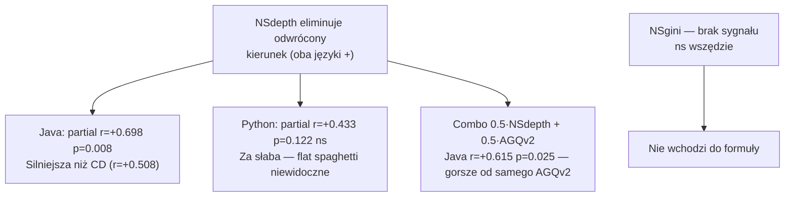

# E5 — Namespace Metrics (NSdepth i NSgini)

## Prostymi słowami

Problem Pythona: youtube-dl ma 1000 extractorów wszystkich w jednym folderze — `youtube_dl/` bez żadnej hierarchii podfolderów. AGQ widzi „rzadkie zależności" i myśli, że to dobra architektura. Żeby to naprawić, sprawdziliśmy dwie metryki: jak głęboka jest hierarchia folderów (NSdepth) i czy klasy są równomiernie rozłożone po folderach (NSgini). NSdepth częściowo pomaga — ale głównie dla Javy.

## Hipoteza

> Metryki przestrzeni nazw (Namespace Depth, Namespace Gini) eliminują odwrócony kierunek sygnału między Javą a Pythonem i poprawiają dyskryminację jakości.

Formalnie: H₁: r(NSdepth, Panel) > 0 zarówno dla Javy jak i Pythona, p < 0.05.

## Dane wejściowe

- **Dataset Java:** GT Java n=14
- **Dataset Python:** GT Python n=7 (5 POS + 2 NEG — za mało dla pełnej analizy)
- **Implementacja:** NSdepth = max(len(fqn.split('.')) for fqn in nodes); NSgini = Gini klas per namespace
- **Koszt implementacji:** NSdepth — 1 linia kodu; NSgini — ~10 linii

## Wyniki

### Tabela porównawcza (Turn 36)

| Metryka | Java Δ (pos−neg) | Java istotność | Python Δ (pos−neg) | Python istotność | Zgodność kierunku |
|---|---|---|---|---|---|
| AGQ v2 | +0.107 | ** | −0.087 | ns | **ODWROTNY ✗** |
| **NSdepth** | **+0.085** | **\*** | **+0.065** | ns | **ZGODNY ✓** |
| NSgini | −0.073 | ns | 0.000 | ns | zgodny (oboje ns) |
| n_namespaces | +31 | ns | +120 | ns | zgodny |

### Partial Spearman NSdepth

| Język | partial r | p | Interpretacja |
|---|---|---|---|
| **Java** | **+0.698** | **0.008 \*\*** | silny — NSdepth najsilniejsza metryka dla Javy |
| Python | +0.433 | 0.122 ns | słaby — nieistotny |
| ALL | +0.303 | 0.124 ns | rozcieńcza się w połączonej próbie |

### Dlaczego NSdepth działa dla Javy

Java stosuje konwencję głębokich pakietów z definicji:
- `com.company.app.domain.model` → depth = 5
- `com.company.app.infrastructure.db` → depth = 5
- Dobre projekty Java mają głębię 4–6, złe (monolith, CRUD) — 2–3

Przykłady z GT:
- library (Panel=8.5) → NSdepth ≈ 5
- struts (Panel=2.5) → NSdepth ≈ 3

### Dlaczego NSdepth **nie** naprawia Pythona

Python ma strukturalnie płytszą hierarchię nawet w dobrych projektach:
- netbox (Panel=8.0) → mean_depth = **3.7**
- youtube-dl (Panel=2.25) → mean_depth = **3.1**

Różnica Δ=0.6 jest zbyt mała i n_neg_Python=4 jest za małe. NSdepth nie rozróżnia flat spaghetti od modularnej struktury w Pythonie — bo folder `youtube_dl/extractors/` (1 poziom) vs `netbox/dcim/migrations/` (3 poziomy) to w obu przypadkach depth≈3.

### NSgini — brak sygnału

NSgini mierzy nierówność rozkładu klas per namespace (wysoki Gini = kilka namespaceów ma dużo klas, inne mało). Nie koreluje z jakością w żadnym języku (ns wszędzie). Hipoteza, że nierówność rozkładu klas sygnalizuje złą architekturę, jest fałszywa — dobre projekty też mają moduły różnej wielkości.

## Interpretacja



**Kluczowy wniosek:** NSdepth jest lepszą metryką niż CD dla Javy (r=+0.698 vs r=+0.508) ale gorszy jako składowa AGQ v2 w kombinacji. Problem Pythona wymaga metryki specjalnie zaprojektowanej dla flat namespace — co prowadzi do [[E6 flatscore]].

## Multikolinearność (Turn 37)

Macierz korelacji Spearman dla całego benchmarku n=357:

| | M | A | S | C | CD | AGQ v2 |
|---|---|---|---|---|---|---|
| **M** | 1.00 | +0.02 | −0.20*** | −0.25*** | +0.18*** | +0.09 |
| **A** | +0.02 | 1.00 | +0.09 | +0.26*** | +0.27*** | +0.31*** |
| **S** | −0.20*** | +0.09 | 1.00 | +0.10 | +0.13* | **+0.85*** |
| **C** | −0.25*** | +0.26*** | +0.10 | 1.00 | −0.08 | +0.14** |
| **CD** | +0.18*** | +0.27** | +0.13* | −0.08 | 1.00 | +0.57*** |

Kluczowe obserwacje:
1. **S i AGQ v2: r=+0.852** — tautologia, bo S ma wagę 0.35 w AGQ v2
2. **A i CD: r=+0.333** — częściowo redundantne (oba mierzą brak silnych powiązań)
3. **M niezależna od wszystkiego** — wnosi osobny sygnał
4. **C niezależna od M i S** — też osobny sygnał

Wniosek z multikolinearności: zastąpienie A przez NSdepth (AGQ v3b) poprawiłoby ortogonalność — NSdepth nie koreluje z CD tak silnie jak A.

## Następny krok

E5 prowadzi bezpośrednio do [[E6 flatscore]]. NSdepth trafia do AGQ v3b (A zastąpione przez NSdepth) i do macierzy PCA w eksperymencie [[PCA Weights]]. Dla Pythona potrzeba nowej metryki — `flat_score` zdefiniowany w E6.

## Definicja formalna

**NSdepth:**
```
NSdepth = max(len(fqn.split('.')) for fqn in nodes)
```
Dla Javy FQN to `com.example.app.domain.Order` → depth=5.
Dla Pythona FQN to `youtube_dl.extractor.youtube.YoutubeIE` → depth=4 (ale mediany są niższe).

**NSgini:**
```
counts = {ns: len(nodes_in_ns) for ns in namespaces}
gini = oblicz_gini(list(counts.values()))
```

## Zobacz też

- [[E6 flatscore]] — rozwiązanie dla Pythona (wynika z E5)
- [[O4 Namespace Metrics for Python]] — otwarta hipoteza
- [[E2 Coupling Density]] — poprzedni eksperyment (CD)
- [[PCA Weights]] — macierz korelacji i wagi
- [[W9 AGQv3c Python Discriminates Quality]] — problem odwróconego kierunku
