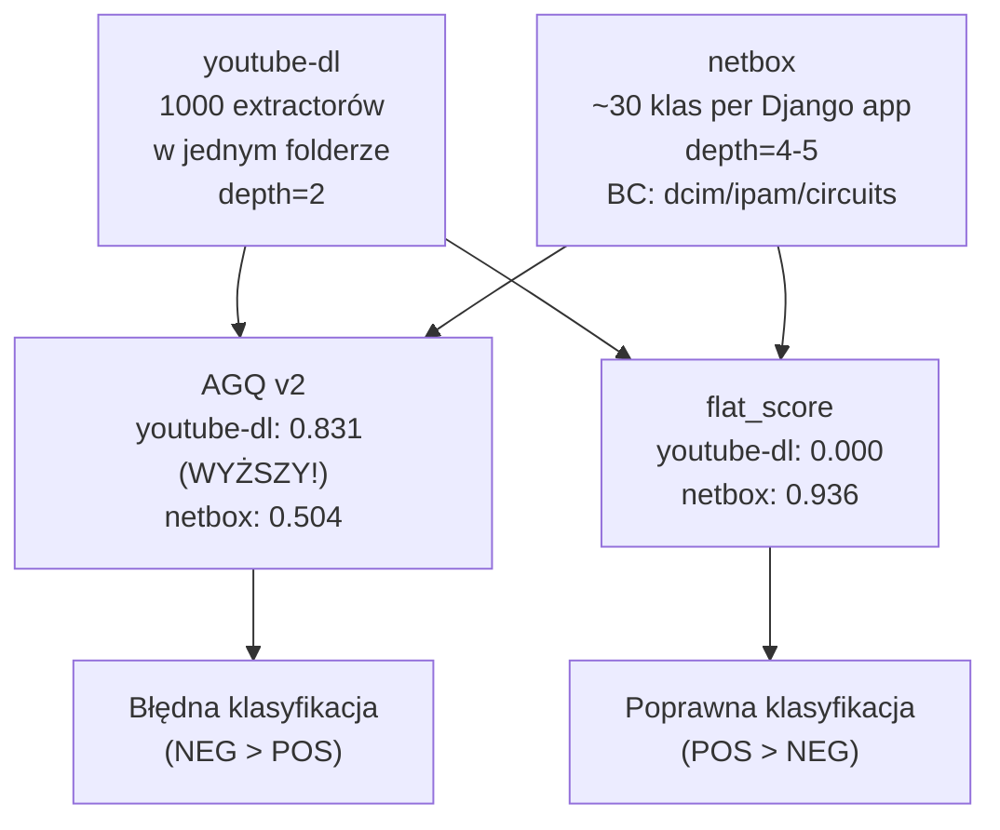

# E6 — flatscore (dla Pythona)

## Prostymi słowami

youtube-dl to projekt z 1000 extractorami — każdy w tym samym folderze, na tym samym poziomie zagnieżdżenia. Brak hierarchii. AGQ myśli, że to dobra architektura (mało krawędzi = niski ratio). flatscore mówi wprost: projekt jest płaski jak step. netbox ma tysiące klas rozłożonych w 4-poziomowej hierarchii `netbox/dcim/models/` — wysoki flatscore. youtube-dl ma 895/895 klas na depth≤2 — flatscore=0.000. To jedyna metryka która rozróżniła te projekty w Pythonie.

## Hipoteza

> flatscore (odsetek węzłów zagnieżdżonych głębiej niż 2 poziomy FQN) predykuje jakość architektury Python.

Formalnie: flat_score = 1 − (nodes z depth≤2) / total_nodes; H₁: r(flat_score, Panel_Python) > 0, p < 0.05.

## Dane wejściowe

- **Dataset Python:** GT Python n=11 (5 POS + 6 NEG — po rozszerzeniu Turn 39)
- **GT:** panel ekspertów, σ < 2.0
- **Implementacja:** flat_score = 1 − (liczba węzłów depth≤2) / n_total; depth mierzony w FQN

## Wyniki

### Główne statystyki (Turn 39)

| Metryka | pos_mean | neg_mean | Δ | MW p | partial r |
|---|---|---|---|---|---|
| **flat_score** | **0.665** | **0.200** | **+0.465** | **0.004 \*\*** | **+0.670 \*\*** |
| AGQ v2 | 0.553 | 0.643 | −0.090 | 0.066 ns | −0.309 ns |
| AGQ v3c | 0.565 | 0.453 | +0.112 | 0.045 * | +0.460 * |

### Przykłady z GT Python

| Repo | flat_score | AGQ v2 | Panel | GT |
|---|---|---|---|---|
| netbox-community/netbox | **0.936** | 0.504 | 8.00 | POS |
| saleor/saleor | 0.871 | 0.624 | 7.50 | POS |
| Kiwi TCMS | 0.803 | 0.706 | 7.00 | POS |
| healthchecks | 0.754 | 0.586 | 6.75 | POS |
| sentry | 0.612 | 0.522 | 6.00 | POS |
| **youtube-dl** | **0.000** | 0.831 | 2.25 | NEG |
| taiga-back | 0.312 | 0.610 | 4.25 | NEG |

**youtube-dl:** 895/895 węzłów w depth≤2 → flat_score=0.000.
**saleor:** 239/3763 → flat_score=0.936 (3524 klasy głębiej niż depth=2).

### Porównanie kierunków AGQ v2 vs AGQ v3c (Turn 39)

| Metryka | Java Δ | Java p | Python Δ | Python p | Zgodność |
|---|---|---|---|---|---|
| **AGQ v3c** | **+0.107** | **0.001** | **+0.112** | **0.045 \*** | **ZGODNY ✓** |
| AGQ v2 | +0.107 | 0.001 | −0.090 | 0.066 ns | ODWROTNY ✗ |
| flat_score | +0.000 | ns | +0.465 | 0.004 ** | — |

AGQ v3c jako pierwsza metryka kompozytowa ma **zgodny kierunek i istotność statystyczną w obu językach jednocześnie**.

## Interpretacja

### Dlaczego flat spaghetti jest niewidoczne dla AGQ v2

Python flat spaghetti: 1000 extractorów w jednym namespace → każdy jest izolowanym leaf node. Topologia: gwiazda (lub rozłączne punkty). ratio=1.35 (najniższe w datasecie!), S=0.867. AGQ v2 interpretuje: „rzadkie, stabilne zależności = dobra architektura". Rzeczywistość: brak struktury hierarchicznej, ale AGQ nie ma jak tego zmierzyć bez metryki płaskości.

### Dlaczego flatscore rozwiązuje problem



### Mechanizm odkrycia

flat_score powstał z bezpośredniej obserwacji youtube-dl: „youtube-dl depth=2, netbox depth=4". Intuicja: jeśli NSdepth jest za słabe (mediany zbyt podobne), może kryterium binarne (głębiej vs płycej niż 2) zadziała? Zadziałało — pos_mean=0.665 vs neg_mean=0.200, Δ=+0.465.

## Formuła AGQ v3c Python

flat_score wchodzi do AGQ v3c Python z wagą 0.35 — największą wagą ze wszystkich składowych:

```
AGQ v3c (Python) = 0.15·M + 0.05·A + 0.20·S + 0.10·C + 0.15·CD + 0.35·flat_score
```

Dla porównania, wersja Java (bez flat_score, equal weights PCA):
```
AGQ v3c (Java) = 0.20·M + 0.20·A + 0.20·S + 0.20·C + 0.20·CD
```

## Ograniczenia i otwarte pytania

1. **n_neg_Python = 6** — za mało do pełnej walidacji; potrzeba n_neg≥15
2. **Django framework daje modularność za darmo** — każda Django app to oddzielny pakiet. taiga-back i modoboa mają wysoki M przez Django, nie przez świadomą architekturę. flat_score częściowo to naprawia (Django apps mają depth≥3), ale efekt nie jest w pełni zbadany
3. **W9 pozostaje otwarta** — AGQ v3c Python ma zgodny kierunek, ale W9 formalnie potrzebuje potwierdzenia na n≥30

→ Zob. [[W9 AGQv3c Python Discriminates Quality]] (otwarta), [[O4 Namespace Metrics for Python]] (otwarta)

## Definicja formalna

```python
def flat_score(nodes: list[str]) -> float:
    """
    nodes: lista FQN węzłów (np. ['youtube_dl.extractor.youtube.YoutubeIE', ...])
    Zwraca: odsetek węzłów zagnieżdżonych głębiej niż depth=2
    """
    if not nodes:
        return 0.5  # neutralna wartość dla pustego grafu
    depths = [len(fqn.split('.')) for fqn in nodes]
    deep = sum(1 for d in depths if d > 2)
    return deep / len(nodes)
```

**Interpretacja:**
- flat_score = 0.0 → wszystkie klasy w depth≤2 (flat spaghetti)
- flat_score = 1.0 → wszystkie klasy głębiej niż depth=2 (hierarchiczna struktura)
- flat_score = 0.5 → neutralny (nie penalizuj, nie nagradzaj)

## Zobacz też

- [[W10 flatscore Predicts Python Quality]] — hipoteza potwierdzona
- [[W9 AGQv3c Python Discriminates Quality]] — otwarta — potrzeba n≥30
- [[E5 Namespace Metrics]] — poprzedni eksperyment (NSdepth/NSgini)
- [[AGQv3c Python]] — formuła z flat_score
- [[O4 Namespace Metrics for Python]] — otwarte pytanie o rozszerzenia
