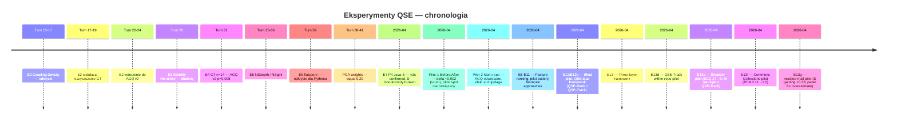
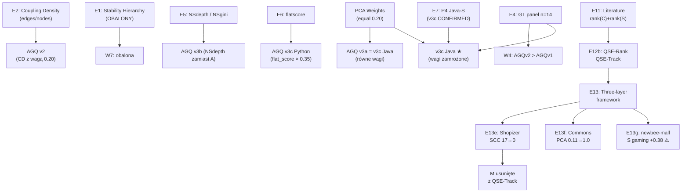

# Indeks Eksperymentów

## Prostymi słowami

Każdy eksperyment to jedna konkretna próba odpowiedzi na pytanie: „czy ta metryka faktycznie odróżnia dobrą architekturę od złej?" Eksperymenty prowadzono na zbiorach danych Java i Python z ocenami ekspertów jako punktem odniesienia.

## Szczegółowy opis

Eksperymenty QSE mają ściśle określony protokół: maksymalnie 5 iteracji, stop po 2 iteracjach bez poprawy, bez modeli nieliniowych, bez brute-force, każda zmiana musi przeżyć falsyfikację. Pełny opis protokołu: [[How to Read Experiments]].

### Tabela eksperymentów

| ID | Tytuł | Status | Kluczowy wynik | Hipotezy |
|---|---|---|---|---|
| [[E1 Stability Hierarchy\|E1]] | Stability Hierarchy | **obalony** | r=−0.093 p=0.762 ns — S_hierarchy nie odróżnia DDD od CRUD | [[W7 Stability Hierarchy Score\|W7]] |
| [[E2 Coupling Density\|E2]] | Coupling Density (edges/nodes) | **potwierdzony** | r=−0.787 p=0.007, partial r=−0.697 — najsilniejszy pojedynczy predyktor; wchodzi do AGQ v2 jako CD | [[W4 AGQv2 Beats AGQv1 on Java GT\|W4]] |
| [[E3 Package Layer Classifier\|E3]] | Package Layer Classifier | **wstrzymany** | Wymaga FQN węzłów (re-skan); GT=BLT zepsuty; ścieżka A (GT n=13) możliwa, ale nie przeprowadzona | — |
| [[E4 GT Expansion\|E4]] | Rozszerzenie GT panelu do n≥30 | **zakończony** | n=14 Java, AGQ v2 partial r=+0.675 p=0.008 — pierwsza liczba oparta na solidnych danych | [[W4 AGQv2 Beats AGQv1 on Java GT\|W4]] |
| [[E5 Namespace Metrics\|E5]] | NSdepth i NSgini | **częściowy** | NSdepth partial r=+0.698 p=0.008 dla Javy (silny), dla Pythona r=+0.433 ns (słaby); NSgini = brak sygnału | [[O4 Namespace Metrics for Python\|O4]] |
| [[E6 flatscore\|E6]] | flatscore dla Pythona | **potwierdzony** | partial r=+0.670 p<0.01, MW p=0.004; wchodzi do AGQ v3c Python z wagą 0.35 | [[W10 flatscore Predicts Python Quality\|W10]] |
| [[PCA Weights\|PCA]] | Wagi PCA (równe eigenvalues) | **zakończony** | Wszystkie eigenvalues prawie równe → uniform 0.20; brak naturalnej hierarchii wymiarów | — |
| [[E7 P4 Java-S Expanded\|E7]] | **P4 Java-S na expanded GT** | **zakończony** | v3c POTWIERDZONE na n=59. S monotonicity ZŁAMANA (ρ=0.00). Krajobraz płaski. Zamknięta optymalizacja wag. | — |
| [[Pilot OSS\|Pilot-1]] | **Pilot Before/After refactoring** | **zakończony** | AGQ delta=+0.002 (szum). S=0.19 niezmienione. Blind spot (GREEN vs NEG) nierozwiązany. CI/CD działa. | — |
| [[Pilot Multi-Repo Scan\|Pilot-2]] | **Multi-repo scan (15 repos)** | **zakończony** | **KRYTYCZNE**: AGQ odwrócone — BAD repos (kolekcje) dostały wyższe AGQ niż GOOD repos (frameworki). 5/5 blind spots. "Efekt archipelagu." | — |
| [[E8 LFR\|E8]] | LFR (Large-scale Feature Ranking) | **zakończony** | Ranking cech na n=29 Java GT: S dominuje, C drugie, M/A marginalne | — |
| [[E9 Pilot Battery\|E9]] | Pilot Battery | **zakończony** | Iteracyjne testowanie formuł na GT. AGQ_v2 lepsze od v3 na GT Java | — |
| [[E10 GT Scan\|E10]] | GT Scan + Within-repo pilots | **zakończony** | Pełny skan GT z nowymi metrykami. 5 repo × 19 iteracji (sztuczne perturbacje) | — |
| [[E11 Literature Approaches\|E11]] | Literature approaches (A-D) | **zakończony** | **PRZEŁOM**: rank(C) + rank(S) — prosta suma rang lepiej dyskryminuje niż kompozyt. Behavioral metrics słaba korelacja | — |
| [[E12 Blind Pilot\|E12]] | Blind pilot on 14 new repos | **zakończony** | LOOCV na GT. 14 repo spoza GT — walidacja "na ślepo" | — |
| [[E12b QSE Dual Framework\|E12b]] | QSE dual framework | **zakończony** | **QSE-Rank**: 2×rank(C) + rank(S). **QSE-Track**: PCA, dip_violations, largest_scc | — |
| [[E13 Three-Layer Framework\|E13]] | Three-layer QSE framework | **zakończony** | Ostateczna architektura: Layer 1 (QSE-Rank), Layer 2 (QSE-Track), Layer 3 (QSE-Diagnostic) | — |
| [[E13d QSE-Track Within-Repo\|E13d]] | QSE-Track within-repo pilot | **zakończony** | 5 repo × 19 iteracji — QSE-Track reaguje na zmiany | — |
| [[E13e Shopizer Pilot\|E13e]] | Shopizer pilot — cykle pakietowe | **zakończony** | SCC 17→0, PCA 0.95→1.0, Panel +0.8. Layer 1 NIE zareagował. **M usunięte z QSE-Track** (commit dcfe68e) | — |
| [[E13f Commons Collections Pilot\|E13f]] | Apache Commons Collections pilot | **zakończony** | PCA 0.11→1.0, SCC 16→0, Panel +0.4. Layer 1 nadal nieczuły. Potwierdza E13e | — |
| [[E13g newbee-mall Pilot\|E13g]] | newbee-mall — Layer 1 validation ⭐ | **zakończony** | S: +0.38 (gaming namespace!), C: +0.07, Panel formuła zawyża 8×. **Krytyczne odkrycia: S gamingowalny, M pompowalna, LCOM4 penalizuje interfejsy** | — |

### Chronologia

### Związki między eksperymentami

## Definicja formalna

Protokół falsyfikacji eksperymentów QSE:
- **Maksimum iteracji:** 5 per eksperyment
- **Kryterium stopu:** 2 kolejne iteracje bez poprawy partial r lub MW p-value
- **Wymagane minimum próby:** n≥10 (statystyki minimalne), n≥30 (wiarygodne wnioski)
- **GT:** panel ekspertów (σ<2.0), nie BLT (obalony jako GT — zob. [[W1 BLT Correlation]])
- **Testy:** Mann-Whitney U (separacja kategorii), Spearman partial (kontrola rozmiaru)

## Zobacz też

- [[How to Read Experiments]] — protokół badawczy QSE
- [[W1 BLT Correlation]] — dlaczego BLT jest złym GT
- [[W4 AGQv2 Beats AGQv1 on Java GT]] — główny wynik potwierdzony
- [[Hypotheses Register]] — powiązane hipotezy
- [[E7 P4 Java-S Expanded]] — najnowszy eksperyment
- [[Pilot OSS]] — pilotaż before/after refactoring
- [[Pilot Multi-Repo Scan]] — multi-repo scan (15 repos, krytyczne wyniki)

### S Sensitivity Investigation (kwiecień 2026)
- **Pytanie:** Dlaczego S=0.19 nie zmieniło się po naprawieniu DIP violations?
- **Odpowiedź:** Dwa powody: (1) var(I) jest symetryczne wobec odwrócenia krawędzi, (2) grupowanie na poziomie 2 ukrywa wewnętrzne refaktoryzacje
- **Wniosek:** S mierzy zróżnicowanie warstw, nie poprawność kierunku zależności
- **Status:** ZAKOŃCZONE — udokumentowane ograniczenie, nie wymaga zmiany kodu
- **Szczegóły:** [[S Sensitivity Investigation]]
