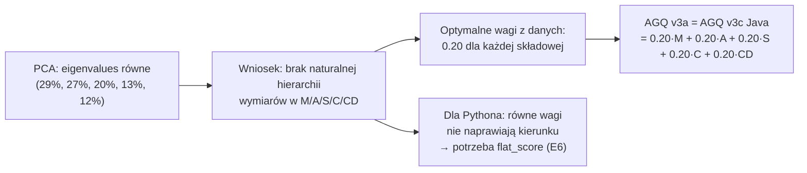

# PCA Weights — Wagi metodą PCA

## Prostymi słowami

PCA to technika, która szuka w danych „najważniejszych kierunków" — jak znaleźć główne osie obrotu kuli bilardowej. Gdyby jedna metryka (np. Stability) dominowała w danych, PCA dałoby jej największą wagę. Wynik nas zaskoczył: wszystkie eigenvalues były prawie równe. Żaden wymiar nie dominuje. PCA mówi: użyj równych wag 0.20 dla każdej składowej — i to dokładnie to, co zrobiliśmy w AGQ v3c Java.

## Hipoteza

> PCA na składowych AGQ (M, S, C, CD, NSdepth) ujawni optymalne wagi, które poprawią AGQ v2 na benchmarku.

Formalnie: PC1 powinno wyjaśniać >40% wariancji, co wskazałoby na dominującą składową wartą zwiększenia wagi.

## Dane wejściowe

- **Dataset:** benchmark 357 repo (Java + Python)
- **Składowe:** M, A, S, C, CD (wersja v3a); M, NSdepth, S, C, CD (wersja v3b — NSdepth zamiast A)
- **Metoda:** PCA sklearn, standardyzacja przed obliczeniami

## Wyniki

### Rozkład wariancji (5 składowych)

| PC | % wariancji |
|---|---|
| PC1 | 29.3% |
| PC2 | 26.7% |
| PC3 | 19.7% |
| PC4 | 12.8% |
| PC5 | 11.5% |
| **Suma** | **100%** |

**Eigenvalues są prawie równe.** Różnica między PC1 (29.3%) a PC5 (11.5%) jest umiarkowana i nie wskazuje na żaden dominujący wymiar.

### Porównanie AGQ v2 vs AGQ v3a (PCA equal)

| Test | AGQ v2 | AGQ v3a | Zmiana |
|---|---|---|---|
| Java MW p | 0.001 ** | **0.001 \*\*** | = identyczne |
| Java partial r | +0.675 | **+0.675** | = identyczne |
| Python MW p | 0.304 ns | 0.240 ns | nieistotna poprawa |
| Python partial r | −0.147 ns | −0.007 ns | nieco bliżej 0 |

r(v2, v3a) = **+0.874** — obie wersje są 76% tożsame. Zmiana wagi S z 0.35 na 0.20 nie zmienia wyniku końcowego dla Javy.

### Kluczowy wynik: S_dominance_reduction

Zmiana wagi S z 0.35 (v2) na 0.20 (v3a):
- r²(S, AGQ v2) = **72.6%** — S dominuje AGQ v2 (niemal tautologia)
- r²(S, AGQ v3a) = **38.8%** — S tylko część formuły

Redukcja S_dominance: 72.6% → 38.8% = **−33.8 pp**

To ważne: AGQ v2 jest zdominowany przez S (r=0.852 — prawie tautologia). Równe wagi 0.20 usuwają tę dominację bez utraty moc predykcyjnej na Javie.

## Interpretacja



**Co PCA oznacza w kontekście QSE:**

PCA nie znalazło „ukrytej hierarchii" ważności metryk. Każda składowa (M, A, S, C, CD) wnosi podobny wkład do łącznej wariancji. To znaczy, że żadna z metryk nie jest radykalnie lepsza od pozostałych — każda mierzy coś innego i wszystkie razem są potrzebne.

**Dlaczego wagi PCA nie poprawiają Javy:**

AGQ v2 (S=0.35) i AGQ v3a (S=0.20) dają identyczny wynik dla Javy bo S i AGQ korelują z panelem w tym samym kierunku dla Javy. Zmiana wagi S nie zmienia rankinku — tylko skaluje wartości numeryczne (stąd r(v2,v3a)=0.874).

## Wnioski z PCA

1. **Nie ma lepszych wag z danych.** Równe wagi 0.20 to jedyne co PCA sugeruje — żadna kombinacja M/A/S/C/CD naturalnie nie dominuje w przestrzeni wariancji.

2. **Problem Pythona NIE jest w wagach.** Żadna kombinacja M/A/S/C/CD nie naprawia odwróconego kierunku dla Pythona, dopóki nie ma metryki odróżniającej flat spaghetti → prowadzi do [[E6 flatscore]].

3. **S_dominance_reduction:** AGQ v3a jest lepiej skalibrowany strukturalnie (S nie dominuje), mimo identycznych wyników empirycznych na Javie. To ważne dla przyszłych eksperymentów — mniejsza kolinearność.

4. **AGQ v3b (NSdepth zamiast A):** jedyna metryka z zgodnym kierunkiem Java i Python, ale przy n_neg_Python=4 nie można potwierdzić statystycznie. NSdepth częściowo zastępuje A w celu lepszej ortogonalności.

## Formuły wynikające z PCA

```
AGQ v3c Java   = 0.20·M + 0.20·A + 0.20·S + 0.20·C + 0.20·CD
AGQ v3c Python = 0.15·M + 0.05·A + 0.20·S + 0.10·C + 0.15·CD + 0.35·flat_score
```

Wagi Python kalibrowane osobno — partial r(flat_score, Panel_Python) = +0.670 uzasadnia wagę 0.35. Pozostałe wagi zmniejszone proporcjonalnie.

## Szczegóły techniczne

```python
from sklearn.preprocessing import StandardScaler
from sklearn.decomposition import PCA

X = df[['M', 'A', 'S', 'C', 'CD']].values
X_scaled = StandardScaler().fit_transform(X)
pca = PCA(n_components=5)
pca.fit(X_scaled)
# explained_variance_ratio_ = [0.293, 0.267, 0.197, 0.128, 0.115]
```

n=357 (benchmark pełny po oczyszczeniu), bez repos z nodes<10.

## Zobacz też

- [[E5 Namespace Metrics]] — macierz korelacji składowych (multikolinearność)
- [[E6 flatscore]] — rozwiązanie problemu Pythona
- [[AGQv3c Java]] — formuła z equal weights
- [[AGQv3c Python]] — formuła z flat_score
- [[W4 AGQv2 Beats AGQv1 on Java GT]] — wynik potwierdzony niezależnie od wag
