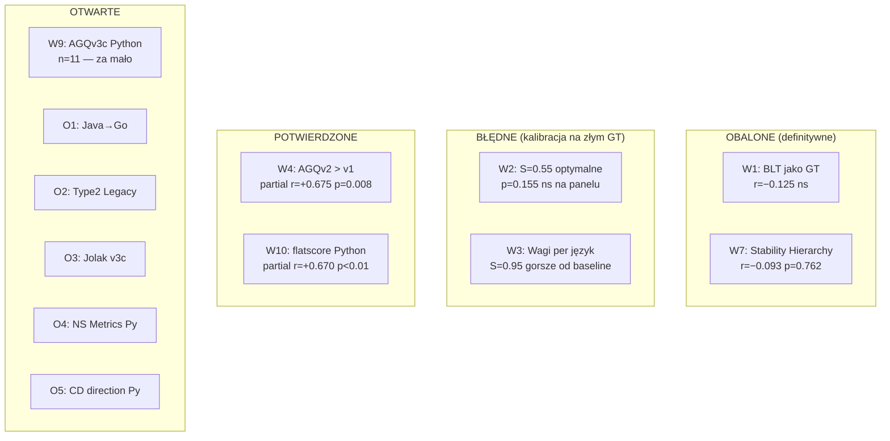

# Rejestr Hipotez

## Prostymi słowami

Ten rejestr to mapa decyzji badawczych: które założenia projektowe okazały się prawdą, które fałszem, a które czekają jeszcze na sprawdzenie. Każda hipoteza to konkretne twierdzenie z konkretnym wynikiem — nie opinia, lecz wynik testu.

## Pełna tabela hipotez

| ID | Twierdzenie | Status | Dane | Eksperyment |
|---|---|---|---|---|
| [[W1 BLT Correlation\|W1]] | BLT jest prawidłowym proxy dla GT architektury | **OBALONA** | r=−0.125 ns po oczyszczeniu | GT kalibracja |
| W2 | Stability (S=0.55) jest optymalną wagą dla Javy | **BŁĘDNA** | S p=0.155 ns na GT panelu; kalibracja na złym GT | E4 |
| W3 | Wagi per język z iter6 są optymalne | **BŁĘDNA** | Java S=0.95 gorsze od baseline na panelu; GT=BLT zepsuty | E4 |
| [[W4 AGQv2 Beats AGQv1 on Java GT\|W4]] | AGQ v2 > AGQ v1 na Java GT | **POTWIERDZONA** | partial r=+0.675 p=0.008; v1 p=0.051 ns | E2, E4 |
| W5 | AGQ koreluje z PC/DL (Jolak et al.) | **WIARYGODNA** | Zewnętrzny, niezależny GT; 4/5 potwierdzonych | Jolak walidacja |
| W6 | FLAT fingerprint = projekt AI-generated | **CIRCULAR** | GT własny (fingerprint = definicja) — potrzeba zewnętrznego GT | — |
| [[W7 Stability Hierarchy Score\|W7]] | Stability Hierarchy Score odróżnia jakość arch. | **OBALONA** | r=−0.093 p=0.762 ns; S_h(mall)=S_h(library)=1.0 | E1 |
| W8 | dAGQ/dt predykuje przyszłą jakość | **NULL** | Jolak 533 snapshots — brak predykcji; wniosek zamknięty | Jolak |
| [[W9 AGQv3c Python Discriminates Quality\|W9]] | AGQ v3c Python dyskryminuje jakość Pythona | **OTWARTA** | Kierunek zgodny (+0.460*), ale n=11 — za mało do zamknięcia | E6 |
| [[W10 flatscore Predicts Python Quality\|W10]] | flatscore predykuje jakość architektury Python | **POTWIERDZONA** | partial r=+0.670 p<0.01, MW p=0.004; waga 0.35 w v3c | E6 |

### Otwarte hipotezy (seria O)

| ID | Twierdzenie | Status | Opis |
|---|---|---|---|
| [[O1 AGQv3c Java to Go\|O1]] | AGQ v3c Java przenosi się na Go | **OTWARTA** | Czy formuła Java działa na innych językach statycznie typowanych? |
| [[O2 Type 2 Legacy Monolith Detection\|O2]] | AGQ wykrywa Type 2 Legacy Monolith | **OTWARTA** | Wzorzec: A=1.0, S niskie, CD niskie — ale Panel≈2.0 |
| [[O3 AGQv3c vs AGQv2 on Jolak\|O3]] | AGQ v3c bije AGQ v2 na benchmarku Jolak | **OTWARTA** | Potrzeba re-walidacji na 8 repo Jolak z nową formułą |
| [[O4 Namespace Metrics for Python\|O4]] | NSdepth/NSgini poprawiają wyniki Pythona | **OTWARTA** | NSdepth silny dla Javy; Python potrzeba n_neg≥15 |
| [[O5 Python CD Direction\|O5]] | Dlaczego CD odwraca kierunek dla Pythona | **OTWARTA** | Mechanizm znany (flat spaghetti), ale bez formalnego testu |

## Szczegółowy widok statusów

## Uzasadnienie statusów

### Dlaczego W1 i W7 są definitywnie OBALONE

- **W1 (BLT):** r(AGQ→BLT≤7d) = −0.125 ns po oczyszczeniu z confoundów (popularne repozytoria mają długi BLT bo mają duże kolejki bugów, nie dlatego że mają złą architekturę). BLT nie wolno ponownie używać jako GT.
- **W7 (S_hierarchy):** S_hierarchy ma tautologię — zarówno puste POJO jak i bogata domena DDD spełniają hierarchię instability z zupełnie różnych powodów. Bez semantyki (czy klasy domenowe mają logikę?) metryka jest ślepa na jakość.

### Dlaczego W2 i W3 są BŁĘDNE (nie tylko obalone)

Błędne = kalibrowane na złym GT (BLT). Grid search z iter6 dał S=0.95 dla Javy — ale BLT nie mierzy architektury. Na GT panelu S=0.95 jest gorszy od baseline (S=0.55). Błąd metodologiczny, nie błąd metryki.

### Dlaczego W4 jest POTWIERDZONA

AGQ v2 (z CD z E2) przeżywa kontrolę rozmiaru (partial r=+0.675 p=0.008). AGQ v1 nie przeżywa (p=0.051 ns). Wynik potwierdzony na n=14 (E4). Pierwsza liczba w projekcie oparta na solidnych danych.

### Dlaczego W9 pozostaje OTWARTA

AGQ v3c Python ma zgodny kierunek (+0.460*) i p=0.045 na n=11. Ale n_neg=6 — za mało do zamknięcia hipotezy (min. n_neg=15 dla wiarygodnych wniosków). Hipoteza jest obiecująca, lecz niezamknięta.

## Protokół zamykania hipotez

Hipoteza może być zamknięta (POTWIERDZONA lub OBALONA) gdy:
- n ≥ 30 per język
- partial Spearman r > 0.50 lub p < 0.01 (POTWIERDZONA)
- partial Spearman p > 0.20 przez ≥ 3 niezależne testy (OBALONA)
- wynik potwierdzony na niezależnym datasecie (np. Jolak lub nowy GT panel)

## Zobacz też

- [[W1 BLT Correlation]] — dlaczego BLT to zły GT
- [[W4 AGQv2 Beats AGQv1 on Java GT]] — kluczowy wynik projektu
- [[W7 Stability Hierarchy Score]] — klasyczny null result
- [[W9 AGQv3c Python Discriminates Quality]] — otwarta, obiecująca
- [[W10 flatscore Predicts Python Quality]] — flat_score wchodzi do formuły
- [[Experiments Index]] — eksperymenty powiązane z hipotezami
