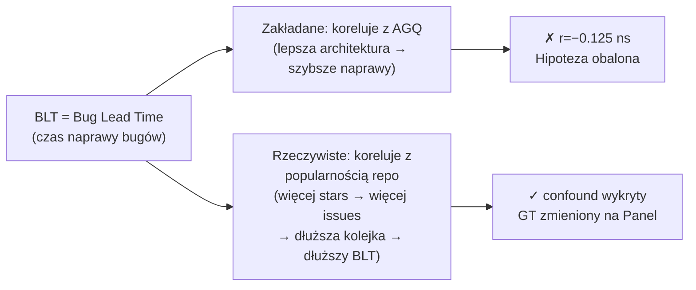

# W1 — Korelacja BLT

## Prostymi słowami

Zakładaliśmy, że projekty z dobrą architekturą naprawiają błędy szybciej — bo zmiany w jednym miejscu nie rozlewają się po całym kodzie. BLT (Bug Lead Time) miał to mierzyć: ile dni mija od zgłoszenia błędu do jego zamknięcia. Okazało się, że BLT mierzy kulturę procesu, nie architekturę. Najpopularniejsze repozytoria mają długi BLT bo mają ogromne kolejki błędów — nie dlatego, że mają złą architekturę.

## Co badano

> **H₁:** r(AGQ, BLT) < 0 — projekt z lepszym AGQ naprawia błędy szybciej (niższy BLT), p < 0.05.

BLT = mediana czasu (w dniach) od otwarcia issue z labelą `bug` do jego zamknięcia, per repo.

## Wynik

| Test | Wartość | Istotność |
|---|---|---|
| r(AGQ, BLT) po oczyszczeniu | **−0.125** | **ns** (nieistotne) |
| Kierunek surowy (n=37 Java) | +0.244 | ns — odwrotny od intuicji |
| r(AGQ, BLT) po kontroli stars | −0.127 | ns |

**Hipoteza obalona.** BLT nie koreluje z AGQ po oczyszczeniu z confoundów.

## Dane

### Pierwsze objawy problemu (Turn 3)

Java (n=37) — odwrócony sygnał (wyższy AGQ → dłuższy BLT) zniknął po kontroli za stars. Confound: popularne repozytoria Java mają długi BLT bo mają bardzo duże kolejki bugów, nie dlatego że mają złą architekturę:
- `core` — 86k stars, długi BLT (duże kolejki)
- `sherlock` — 80k stars, długi BLT (duże kolejki)

### Ocena GT z Turn 8 (ranking proxy jakości)

| Proxy | Ocena | Problem |
|---|---|---|
| blast_radius | 3.8/5 | Najlepsza dostępna, r=0.31 (n=25) |
| PR merge time | 3.1/5 | Confound: rozmiar zespołu, boty |
| defect density | 2.8/5 | Wymaga Defects4J lub podobnego |
| **BLT (obecny)** | **2.45/5** | Niestandaryzowane labele, ~40% coverage |

BLT był na dole rankingu proxy jeszcze przed oczyszczeniem danych.

### Diagnoza błędu (Turn 27)

```
r(AGQ→BLT≤7d) = −0.125 ns   ← po oczyszczeniu

Trzy efekty confoundu:
1. Popularność repo (stars) → długie kolejki bugów → długi BLT
2. Niestandaryzowane labele: "bug" vs "defect" vs "fix" vs "issue"
3. Coverage: ~40% repozytoriów ma ≥1 issue z labelą "bug"
```

## Dlaczego to ważne

**BLT wymusił przejście na panel ekspertów.** Odkrycie, że BLT nie mierzy architektury, było kluczowym momentem projektu — bez niego kalibracja wag AGQ (W2, W3) opierałaby się na błędnym GT. Wagi z iter6 (Java S=0.95) zostały oficjalnie oznaczone jako BŁĘDNE.

**BLT nie wolno ponownie używać jako GT** — ta zasada jest zapisana w protokole eksperymentów QSE (zob. [[How to Read Experiments]]).



## Konsekwencje

| Hipoteza | Wpływ obalenia W1 |
|---|---|
| W2 (S=0.55 optymalne) | BŁĘDNA — kalibracja na BLT |
| W3 (Wagi per język) | BŁĘDNA — kalibracja na BLT |
| W4 (AGQ v2 > v1) | NIEZALEŻNA — walidowana na panelu |
| Iter7 (300+ repo z BLT) | WSTRZYMANY — zbieranie danych bez sensu |

## Szczegóły techniczne

**Filtr BLT stosowany w iter6:** BLT > 0, BLT ≤ 365 dni, nodes ≥ 10. Filtr usunął ~60% repo.

**Oczyszczenie z confoundu stars:**
```python
# Partial Spearman: r(AGQ, BLT | stars)
partial = spearmanr(residuals(AGQ ~ log(stars)), residuals(BLT ~ log(stars)))
# Wynik: −0.127 ns
```

**Porównanie z blast_radius (Turn 11):**
blast_radius = pct_cross_package_fixes; r(AGQ, blast_radius) = +0.31, n=25 — najlepszy z testowanych proxy, ale za mało danych.

## Definicja formalna

**BLT (Bug Lead Time):**
```
BLT = median({close_date - open_date : issue.labels ∋ "bug", close_date ≠ null})
```
Jednostka: dni. Zakres po filtrze: (0, 365].

## Zobacz też

- [[Ground Truth]] — panel ekspertów jako właściwy GT
- [[How to Read Experiments]] — protokół (BLT zakazany jako GT)
- [[W4 AGQv2 Beats AGQv1 on Java GT]] — wynik niezależny od BLT
- [[Hypotheses Register]] — pełna lista hipotez
