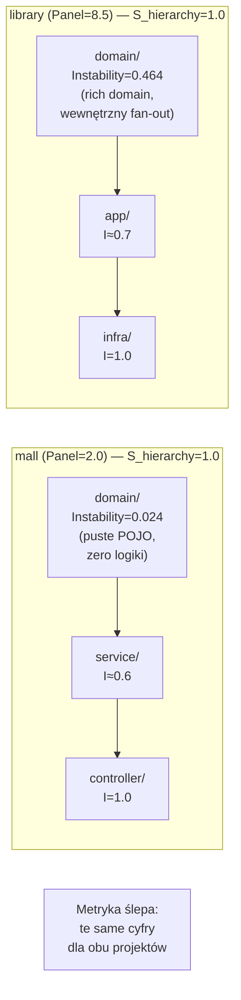

# W7 — Stability Hierarchy Score

## Prostymi słowami

Wyobraź sobie budynek: fundamenty powinny być stabilne (dużo na nich stoi), a dach może być niestabilny (nic na nim nie stoi). W architekturze oprogramowania „domena" powinna być jak fundamenty — stabilna, bo wiele rzeczy od niej zależy. Sprawdzaliśmy, czy projekty które tę zasadę respektują, mają lepszą architekturę. Okazało się, że zarówno projekt wzorcowy jak i projekt-śmieć mają „perfekcyjne fundamenty" — z zupełnie różnych powodów.

## Co badano

> **H₁:** r(S_hierarchy, Panel) > 0, p < 0.05. Projekty z poprawną hierarchią instability (domain < app < infra) mają wyższe oceny panelu.

S_hierarchy = odsetek warstw w poprawnej kolejności instability (Martin's Stability Index = fan-out / (fan-in + fan-out)).

## Wynik

| Test | Wartość | Istotność |
|---|---|---|
| Spearman r(S_hierarchy, Panel) | **−0.093** | **p = 0.762 ns** |

**Hipoteza obalona.** S_hierarchy nie koreluje z jakością architektoniczną.

## Dane — kluczowy paradoks

| Repo | Panel | S_hierarchy | domain_instability | Typ architektury |
|---|---|---|---|---|
| macrozheng/mall | 2.0 (NEG) | **1.0** | **0.024** | CRUD (MyBatis POJO sink) |
| ddd-by-examples/library | 8.5 (POS) | **1.0** | **0.464** | DDD (rich domain model) |

**Oba projekty mają identyczny S_hierarchy = 1.0.**

### Dlaczego mall ma S_hierarchy = 1.0

`mall/domain/` to głównie klasy POJO (gettery, settery, adnotacje MyBatis). Klasy te nie wywołują niczego — zero logiki, zero fan-out. Instability ≈ 0 → warstwa domain jest „stabilna". Hierarchia: domain (I≈0) < service (I≈0.6) < controller (I≈1.0). Perfekcyjna hierarchia — ale przez przypadek, nie przez świadomą architekturę.

### Dlaczego library ma S_hierarchy = 1.0

`library/domain/` to bogata domena DDD z logiką biznesową. Klasy domenowe rozmawiają ze sobą — wewnętrzny fan-out. Instability = 0.464 (nie 0!). Hierarchia: domain (I=0.464) < app (I=0.7) < infra (I=1.0). Perfekcyjna hierarchia — przez świadomą architekturę.

## Dlaczego to ważne

### Problem jest głębszy niż hierarchia

Sama metryka Stability Martina (fan-in/fan-out) nie rozróżnia:
- „klasa jest stabilna bo jest dobrze zaprojektowanym centrum domeny"
- „klasa jest stabilna bo jest pustym POJO"

To nie jest problem z E1 — to fundamentalne ograniczenie topologicznej analizy grafu. **Bez semantyki kodu** (co robią metody, czy są to gettery czy logika) topologia jest ślepa na ten rodzaj jakości.

### Implikacja dla metryki S w formule AGQ

Metryka S (Stability) jest nieistotna statystycznie na GT Java: p=0.155 ns (Turn 31, E4). To ten sam problem — S nie odróżnia dobrego i złego projektu dla Javy. AGQ v2 działa mimo S (bo M, C, CD wyrównują), nie dzięki S.

## Warunki konieczne do naprawienia

Żeby hierarchia warstw była diagnostycznie przydatna, potrzeba jednego z:

1. **Semantyki kodu:** ile klas w `domain/` ma metody z logiką vs tylko gettery. Wymaga parsowania body metod — poza zakresem tree-sitter.

2. **Zewnętrznego sygnału:** np. % klas z adnotacją `@Entity` (POJO/JPA) vs klas z metodami domenowymi. Możliwe przez tree-sitter w specyficznym zakresie.

3. **E3 (Package Layer Classifier binarny):** prostszy test — czy projekt ma w ogóle warstwy domenowe. Wymaga FQN węzłów (re-skan). Nie przeprowadzony.

## Szczegóły techniczne

**Implementacja S_hierarchy:**
1. Klasyfikuj każdy pakiet do warstwy na podstawie nazwy: `domain/` → L0, `application/` → L1, `service/controller/` → L2, `infra/repository/` → L3
2. Oblicz instability Martina per warstwa: I(L) = Σfan_out / (Σfan_in + Σfan_out)
3. Sprawdź spełnienie zasady: I(L_i) ≤ I(L_{i+1}) dla każdej pary sąsiednich warstw
4. S_hierarchy = (liczba spełnionych par) / (liczba par)

**Dlaczego r = −0.093 (lekko ujemne):** Kilka projektów NEG ma S_hierarchy < 1.0 (brak warstwowej struktury → negatywny wynik), ale kilka POS też ma S_hierarchy < 1.0 (np. projekty hexagonal bez nazw domain/app/infra). Sygnał szumowy.

## Definicja formalna

Metryki Martina: I(c) = Ce / (Ca + Ce), gdzie Ca = afferent coupling (fan-in), Ce = efferent coupling (fan-out).

Dla stabilnego komponentu I ≈ 0 (nic nie zależy od zewnątrz), dla niestabilnego I ≈ 1 (dużo zależy od zewnątrz, mało przychodzi).

## Zobacz też

- [[E1 Stability Hierarchy]] — eksperyment który obalił tę hipotezę
- [[Stability]] — metryka Martina (składowa AGQ)
- [[W4 AGQv2 Beats AGQv1 on Java GT]] — AGQ działa mimo nieistotności S
- [[Hypotheses Register]] — pełna lista hipotez
