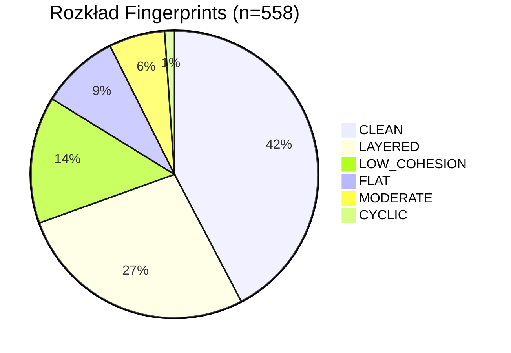

# Benchmark 558 — Iteracja 6

> **Appendix** — surowe dane benchmarkowe. Iteracja 6, wygenerowana 2026-04-10.

## Metadane

| Parametr | Wartość |
|---|---|
| Iteracja | 6 |
| Data generacji | 2026-04-10T13:14:30 |
| Repozytoria ogółem (ok) | **558** |
| Z danymi bug lead time | 391 |
| AGQ mean (wszystkie) | **0.7535** |
| AGQ std | **0.145** |

---

## AGQ per język

| Język | n | Średnia | Std | Min | Max |
|---|---:|---:|---:|---:|---:|
| Python | 351 | 0.7478 | 0.1390 | 0.4395 | 0.9433 |
| Java | 147 | 0.7345 | 0.1639 | 0.4019 | 0.9375 |
| Go | 30 | 0.7832 | 0.0764 | 0.6588 | 0.9375 |
| TypeScript | 30 | 0.8828 | 0.0993 | 0.6126 | 0.9375 |
| **RAZEM** | **558** | **0.7535** | **0.145** | 0.4019 | 0.9433 |

**Uwaga:** TypeScript ma wysoki mean (0.8828), ale 73% repozytoriów TypeScript ma nodes=0 — wynik jest artefaktem skanera, nie rzeczywistą oceną architektury. Dane TypeScript wymagają ostrożnej interpretacji.

---

## Rozkład wzorców architektonicznych (Fingerprints)

Fingerprint = klasyfikacja architektoniczna na podstawie kombinacji metryk AGQ.

| Wzorzec | Udział | Opis |
|---|---:|---|
| CLEAN | 42.3% | Dobra modularność + brak cykli + dobra spójność |
| LAYERED | 27.2% | Wyraźna hierarchia warstw, wysoka Stability |
| LOW_COHESION | 14.3% | Klasy wielofunkcyjne (niska C/LCOM4) |
| FLAT | 8.8% | Brak hierarchii, płaska struktura |
| MODERATE | 6.3% | Mieszane właściwości |
| CYCLIC | 1.1% | Cykliczne zależności jako dominujący problem |

---

## Skład benchmarku

| Język | n | % benchmarku |
|---|---:|---:|
| Python | 351 | 62.9% |
| Java | 147 | 26.3% |
| Go | 30 | 5.4% |
| TypeScript | 30 | 5.4% |

Repozytoria Python to głównie popularny OSS: django, flask, fastapi, pandas, scikit-learn, airflow i inne. Repozytoria Java obejmują projekty Spring, Apache, JUnit, Hibernate i inne.

---

## Korelacje AGQ z metrykami SonarQube (n=78, podzbiór)

| Para | Pearson | p | Spearman | p | Siła |
|---|---:|---:|---:|---:|---|
| AGQ vs bugfix_ratio | -0.1659 | 0.147 | -0.1535 | 0.180 | bardzo słaba |
| AGQ vs bugs_per_kloc | +0.1050 | 0.360 | -0.0480 | 0.676 | ns |
| AGQ vs smells_per_kloc | +0.0328 | 0.776 | +0.2362 | 0.037 | słaba |
| AGQ vs complexity_per_kloc | -0.1409 | 0.219 | -0.0310 | 0.788 | ns |
| Cohesion vs complexity_per_kloc | -0.2600 | 0.022 | -0.3333 | 0.003 | słaba |

**Wniosek:** AGQ i SonarQube mierzą ortogonalne wymiary jakości — brak istotnej korelacji potwierdza, że narzędzia się uzupełniają, a nie powielają.

---

## Korelacje AGQ z danymi git (churn, n=74)

| Para | n | Pearson | p | Spearman | p |
|---|---:|---:|---:|---:|---:|
| AGQ vs mean_churn | 74 | -0.0369 | 0.755 | -0.0809 | 0.493 |
| AGQ vs median_churn | 74 | -0.0448 | 0.705 | -0.1342 | 0.254 |
| AGQ vs churn_gini | 74 | +0.0683 | 0.563 | +0.0116 | 0.913 |
| AGQ vs hotspot_ratio | 74 | +0.0048 | 0.779 | +0.0014 | 0.313 |

**Wniosek:** Brak istotnej korelacji AGQ z miarami churnu na surowymm benchmarku. Korelacja pojawia się po normalizacji na rozmiar projektu (AGQ-adj).

---

## Znane problemy i zastrzeżenia

### TypeScript nodes=0 (73% repo)
Skaner TypeScript nie wykrywa modułów w 73% przypadków, co prowadzi do inflacji AGQ (brak węzłów = brak cykli = wysoka Acyclicity). Dane TypeScript w tej iteracji nie są wiarygodne.

### Stars bias (GitHub)
Repozytoria dobierane są z popularnych repozytoriów GitHub (mierzone gwiazdkami). Może to systematycznie faworyzować dobrze utrzymane projekty i zaniżać reprezentację „prawdziwego" długu architektonicznego.

### Python vs Java wagi
Formuła AGQ dla Pythona różni się od Javy (zawiera `flat_score`). Porównania między językami powinny uwzględniać różne formuły.

### Brak walidacji na projektach zamkniętych
Cały benchmark oparty jest na publicznych repozytoriach open-source. Wyniki na kodzie korporacyjnym (closed-source) mogą się różnić.

---

## Porównanie wersji AGQ (podzbiór n=78, Python)

| Wersja | n | Min | Max | Średnia | Std | Spread |
|---|---:|---:|---:|---:|---:|---:|
| v1 | 78 | 0.5577 | 0.8440 | 0.6688 | 0.0499 | 0.2863 |
| v2 | 78 | 0.6294 | 0.9667 | 0.7935 | 0.0572 | 0.3373 |
| v3 | 78 | 0.5993 | 1.0000 | 0.7566 | 0.0731 | 0.4007 |
| v4 | 78 | 0.4520 | 1.0000 | 0.7450 | 0.0932 | 0.5480 |

v3/v4 mają większy spread (lepiej różnicują projekty) przy zachowaniu zbliżonej średniej.

---

## Zobacz też

- [[Benchmark Index]] — przegląd wszystkich zbiorów danych
- [[Java GT Dataset]] — dedykowany zbiór walidacyjny Java
- [[Python GT Dataset]] — dedykowany zbiór walidacyjny Python
- [[08 Glossary/AGQ|AGQ]] — definicja metryki
- [[08 Glossary/Repository Types|Typy repozytoriów]] — klasyfikacja architektury
