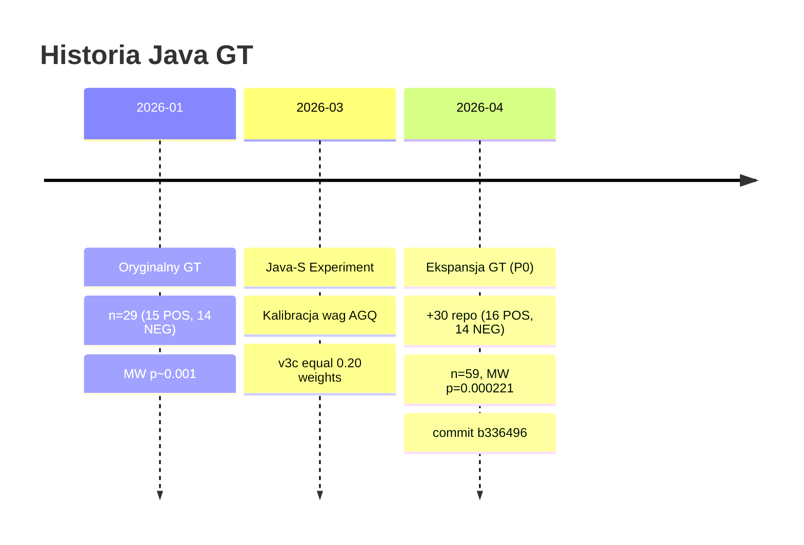

# Java GT Dataset — Zbiór walidacyjny Java

> **Appendix** — pełne dane zbioru walidacyjnego Java GT (Ground Truth). Opis metodologii panelowej w [[08 Glossary/Panel Score|Panel Score]].

## Parametry ogólne (rozszerzony GT, kwiecień 2026)

| Parametr | Wartość |
|---|---|
| Plik źródłowy | `gt_java_expanded.json` |
| Łączna liczba repo | **59** |
| POS (dobra architektura) | **31** |
| NEG (słaba architektura) | **28** |
| POS mean AGQ | 0.571 |
| NEG mean AGQ | 0.486 |
| Gap POS-NEG | 0.085 |
| MW p-value | **0.000221** |
| Spearman ρ | **0.380** (p=0.003) |
| Partial r | **0.447** (p=0.0004) |
| AUC-ROC | **0.767** |

Zbiór składa się z:
- **Oryginalny GT (n=29):** 15 POS, 14 NEG — plik `gt_java_final_fixed.json`
- **Partia rozszerzająca (n=30):** 16 POS, 14 NEG — dodane kwiecień 2026 (commit b336496)

---

## Dyskryminacja per komponent

| Komponent | Średnia POS | Średnia NEG | Δ | MW p | Istotność |
|---|---:|---:|---:|---:|---|
| Modularity (M) | 0.668 | 0.648 | +0.021 | 0.226 | ns |
| Acyclicity (A) | 0.994 | 0.974 | +0.020 | 0.030 | * |
| Stability (S) | 0.344 | 0.238 | +0.106 | 0.016 | * |
| Cohesion (C) | 0.393 | 0.269 | +0.124 | 0.0002 | *** |
| Coupling Density (CD) | 0.454 | 0.299 | +0.155 | 0.004 | ** |

**Kluczowy wniosek:** C i CD są najsilniejszymi indywidualnymi dyskryminatorami. M (Modularity) samodzielnie nie jest istotna statystycznie.

---

## Metodologia panelu

Panel złożony z 4 symulowanych recenzentów o różnych profilach:
1. **Puryst architektoniczny** — ocenia pod kątem wzorców DDD, hexagonal, clean architecture
2. **Pragmatyk** — ocenia możliwość utrzymania i rozwoju bez idealizowania
3. **Metrykolog** — skupia się na obserwowalnych metrykach strukturalnych
4. **Praktyk przemysłowy** — ocenia z perspektywy realnych projektów

Każdy recenzent wystawia ocenę **1–10**. Reguły akceptacji:
- Panel Score = średnia 4 ocen
- σ (niezgodność) musi być ≤ 2.0 — przy większej niezgodności repo jest wykluczane lub powtarzane
- **POS:** Panel Score ≥ 6.0
- **NEG:** Panel Score < 6.0

---

## Przykładowe repozytoria z GT (podzbiór)

### POS — pozytywna architektura (panel ≥ 6.0)

| Repozytorium | Panel Score | AGQ v3c | Uwagi |
|---|---:|---:|---|
| citerus/dddsample-core | 8.25 | wysoki | Przykład DDD, clean layers |
| VaughnVernon/IDDD_Samples | 7.75 | wysoki | DDD Vaughna Vernona |
| microservices-patterns/ftgo | 7.75 | wysoki | Microservices w Java |
| ddd-by-examples/library | 8.50 | wysoki | Wzorcowa aplikacja DDD |
| gothinkster/realworld | 7.50 | średni | REST API, czysta architektura |
| spring-petclinic/petclinic-rest | 7.00 | średni | Dobrze ustrukturyzowany Spring |
| spring-projects/spring-petclinic | 6.50 | średni | Klasyczna aplikacja Spring |
| spring-projects/spring-security | 6.50 | wysoki | Dobrze warstwowy framework |

### NEG — słaba architektura (panel < 6.0)

| Repozytorium | Panel Score | AGQ v3c | Uwagi |
|---|---:|---:|---|
| apache/struts | 2.50 | niski | Legacy, splątane zależności |
| macrozheng/mall | 2.00 | niski | God classes, płaska struktura |
| apache/velocity-engine | 3.25 | niski | Legacy template engine |
| elunez/eladmin | 2.00 | niski | CRUD monolith |
| newbee-ltd/newbee-mall | 2.50 | niski | Monolith bez warstw |

---

## Znane problemy (caveats)

### Biblioteki utility (np. Guava, commons-lang)
Biblioteki narzędziowe uzyskują niski AGQ pomimo dobrego projektu. Przyczyna: płaska struktura pakietów → niskie CD. Potrzebna normalizacja uwzględniająca kategorię repozytorium (category-aware normalization).

### Małe NEG (np. shopping-cart, training-monolith)
Małe repozytoria NEG mają prostą strukturę, co sztucznie zawyża M i CD. Eksperci panelowi korygują tę anomalię — same metryki by jej nie wykryły.

### Django false-negative (P3)
Django uzyskuje klasyfikację NEG pomimo dobrej architektonicznie reputacji. Przyczyna: skaner nie wykrywa wystarczająco precyzyjnie struktury wewnątrz paczki. Problem odnotowany, nie blokuje głównej linii badań.

---

## Ewolucja GT



Gap zmniejszył się z 0.115 do 0.085 przy rozszerzeniu GT (oczekiwane — większa różnorodność corpus). Wszystkie testy istotności pozostają p<0.01.

---

## Formuła użyta do walidacji

```
AGQ_v3c (Java) = 0.20·M + 0.20·A + 0.20·S + 0.20·C + 0.20·CD
```

Wagi v3c (equal 0.20) wyłonione jako najlepszy wynik eksperymentu Java-S (3 iteracje, 13 wariantów). Wariant rezerwowy: v2 (0.30/0.20/0.15/0.15/0.20).

---

## Zobacz też

- [[Benchmark Index]] — przegląd wszystkich zbiorów
- [[Python GT Dataset]] — odpowiedni zbiór dla Pythona
- [[Jolak Validation]] — niezależna walidacja krzyżowa
- [[08 Glossary/GT|GT]] — metodologia ground truth
- [[08 Glossary/Panel Score|Panel Score]] — jak działa ocena panelowa
- [[08 Glossary/Mann-Whitney|Mann-Whitney]] — użyty test statystyczny
- [[05 Experiments/E1 Stability Hierarchy|E1 Stability Hierarchy]] — eksperymenty na GT Java
