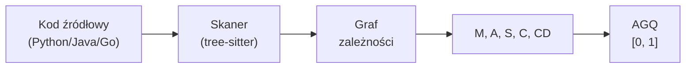

# AGQ — Architecture Graph Quality

## Prostymi słowami

AGQ to jedna liczba od 0 do 1, która mówi, jak dobrze zaprojektowany jest projekt jako całość. Wyobraź sobie ocenę „zdrowia budynku" — nie sprawdzamy każdej cegły z osobna, tylko czy cały budynek jest sensownie skonstruowany: czy piętro stoi na fundamencie, a nie odwrotnie, czy pomieszczenia są logicznie pogrupowane i czy nie ma ścian trzymających sufity poprzez przypadkowe sznurki.

## Szczegółowy opis

AGQ (*Architecture Graph Quality* — Jakość Architektury Grafowej) to główna metryka projektu QSE. Jest obliczana jako **ważona suma pięciu komponentów grafowych**, każdy w przedziale [0, 1], gdzie 1 oznacza idealną jakość.

```
AGQ = w₁·M + w₂·A + w₃·S + w₄·C + w₅·CD
```

Komponenty:
| Symbol | Nazwa | Co mierzy |
|---|---|---|
| M | [[Modularity\|Modularność]] | Izolacja modułów — czy rzeczy pasujące do siebie są razem |
| A | [[Acyclicity\|Acykliczność]] | Brak cykli zależności między modułami |
| S | [[Stability\|Stabilność]] | Hierarchia warstw — fundamenty vs. dekoracje |
| C | [[Cohesion\|Spójność]] (LCOM4) | Jednorodność klas — czy każda klasa robi jedną rzecz |
| CD | Coupling Density | Gęstość powiązań — rzadsze = lepsze |

AGQ jest **deterministyczne** — wielokrotne uruchomienie na tych samych danych daje identyczny wynik (delta=0.000 na 80 repo w testach). To warunek konieczny dla narzędzia klasy produkcyjnej.



### Wersje formuły

| Wersja | Formuła | Zastosowanie |
|---|---|---|
| v3c Java | 0.20·M + 0.20·A + 0.20·S + 0.20·C + 0.20·CD | Java GT, Jolak |
| v3c Python | 0.15·M + 0.05·A + 0.20·S + 0.10·C + 0.15·CD + 0.35·flat_score | Python GT |
| v1 | 0.35·M + 0.25·A + 0.20·S + 0.20·C | Historyczna |
| v2 | 0.30·M + 0.20·A + 0.15·S + 0.15·C + 0.20·CD | Historyczna |

### Jak interpretować wynik

| AGQ | Interpretacja | Fingerprint |
|---|---|---|
| ≥ 0.85 | Doskonała architektura | CLEAN/LAYERED |
| 0.70 – 0.85 | Dobra architektura | LAYERED/MODERATE |
| 0.55 – 0.70 | Przeciętna, wymagająca uwagi | FLAT/LOW_COHESION |
| < 0.55 | Poważne problemy architektoniczne | CYCLIC/TANGLED |

Wartości referencyjne z benchmarku (iter6, n=558):
- Mean ogółem: 0.7535, Std: 0.145
- Python (n=351): mean=0.7478
- Java (n=147): mean=0.7345
- Go (n=30): mean=0.7832

## Definicja formalna

Niech G = (V, E) będzie grafem zależności modułów projektu, gdzie V = zbiór węzłów (modułów/plików), E = zbiór krawędzi (importów/zależności). Wewnętrzne węzły V_int ⊆ V to moduły projektu (bez stdlib i zewnętrznych bibliotek).

AGQ definiujemy jako:

$$\text{AGQ}(G) = \sum_{i} w_i \cdot f_i(G), \quad \sum_i w_i = 1, \quad f_i(G) \in [0,1]$$

gdzie $f_i$ to znormalizowane funkcje metryk grafowych: Modularity (Newman's Q), Acyclicity (Tarjan SCC), Stability (Martin's Instability), Cohesion (LCOM4), Coupling Density.

**Walidacja empiryczna (Java GT, n=59):**
- Mann-Whitney p = 0.000221
- Spearman ρ = 0.380 (p=0.003)
- Partial r = 0.447 (p=0.0004)
- AUC-ROC = 0.767

## Zobacz też

- [[AGQ Formula|Wzór AGQ]] — pełna dokumentacja formuły
- [[Benchmark 558]] — dane benchmarkowe
- [[Java GT Dataset]] — dane walidacyjne
- [[BLT|BLT]] — cel: zastąpić architektoniczny aspekt code review
- [[Louvain|Louvain]] — algorytm dla Modularity
- [[Tarjan SCC|Tarjan SCC]] — algorytm dla Acyclicity
- [[LCOM4|LCOM4]] — metryka dla Cohesion
