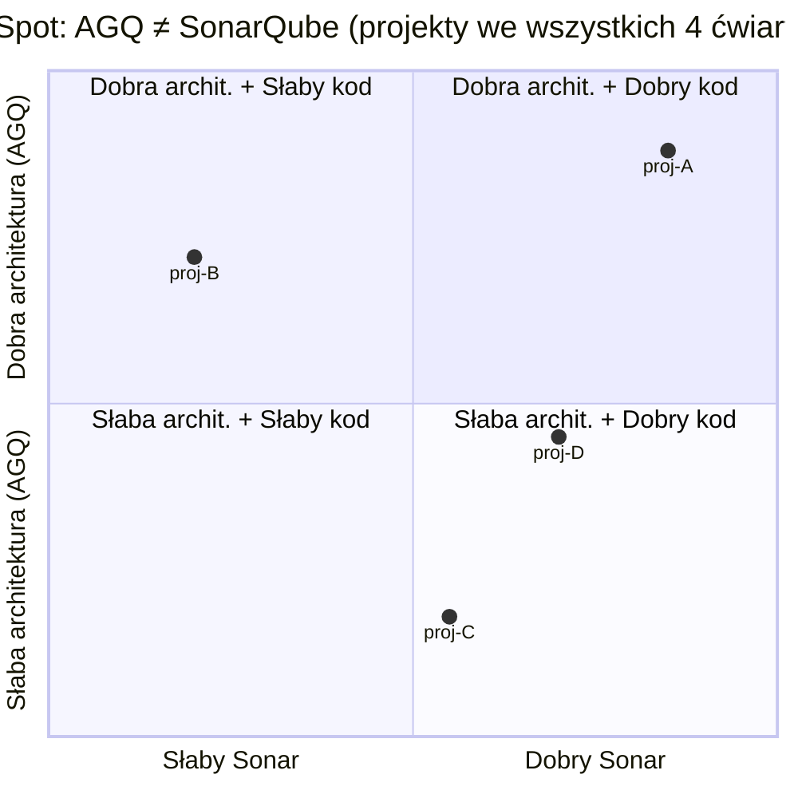

# Blind Spot — Martwy punkt narzędzia

## Prostymi słowami

Blind spot to rzecz, której narzędzie nie widzi, choć problem istnieje. SonarQube to jak kontroler drogowy sprawdzający prędkość i pasy — nie zauważy, że drogowskazy prowadzą donikąd. QSE sprawdza „plan miasta" (architekturę), a nie „przestrzeganie przepisów" (styl kodu). Razem eliminują więcej blind spotów niż każde z osobna.

## Szczegółowy opis

W kontekście QSE termin „blind spot" odnosi się do klasy problemów jakościowych, które **nie są wykrywane przez dane narzędzie**, mimo że faktycznie degradują jakość oprogramowania.

### Blind spoty SonarQube (niewidoczne dla narzędzi plikowych)

SonarQube analizuje każdy plik osobno. Jego blind spots to wszystko, co wynika z **relacji między modułami**:

| Klasa problemu | Przykład | Dlaczego SQ nie widzi |
|---|---|---|
| Cykliczne zależności | moduł A importuje B, B importuje A | Poza plikiem — nie analizuje grafów |
| Brak hierarchii warstw | business logic importuje UI | Import legalny syntaktycznie |
| Architektoniczne spaghetti | każdy moduł połączony z każdym | Brak modelu grafu |
| God packages | jeden pakiet ze 200 klasami | Metryka na poziomie klasy, nie pakietu |
| Ukryty dług strukturalny | wysoka ocena A przy niskim AGQ | Ortogonalne wymiary |

Empiryczne potwierdzenie: n=78, wszystkie korelacje AGQ vs metryki SonarQube p>0.10. AGQ i SonarQube mierzą **ortogonalne** wymiary jakości.

### Blind spoty QSE (niewidoczne dla QSE)

QSE nie jest pozbawiony własnych blind spotów:

| Klasa problemu | Opis |
|---|---|
| Jakość kodu (styl, czytelność) | Nie analizuje treści pliku |
| Błędy logiczne | Analiza statyczna, nie wykonuje kodu |
| Luki bezpieczeństwa | POZA ZAKRESEM (SAST narzędzia) |
| Małe projekty (<10 węzłów) | Metryki grafowe degenerują się |
| Semantyka zależności | Wie, że A importuje B, ale nie co z tego robi |

### Blind spot ery AI

Szczególnie istotny kontekst: generatory kodu AI (GitHub Copilot, Claude Code, Cursor) widzą lokalny kontekst pliku, ale nie widzą całego grafu zależności. Każdy `import` dodany przez AI może:
- zamknąć cykl zależności niewidoczny lokalnie,
- przekroczyć granicę warstwy architektonicznej,
- zwiększyć blast radius przyszłych zmian.

QSE jako „guardrail" w CI/CD wykrywa te problemy **po** generacji, zanim trafią do produkcji.

## Definicja formalna

Niech P będzie zbiorem właściwości jakościowych oprogramowania, a D(T) ⊆ P zbiorem właściwości wykrywalnych przez narzędzie T. **Blind spot** narzędzia T to:

$$\text{BlindSpot}(T) = P \setminus D(T)$$

W praktyce: SonarQube pokrywa D(SQ) — właściwości per-plik. QSE pokrywa D(AGQ) — właściwości struktury grafu. Idealny system jakości minimalizuje D(SQ) ∪ D(AGQ) ∩ D(T_n).

## Zobacz też

- [[AGQ|AGQ]] — co QSE mierzy
- [[11 Research/Market Analysis|Analiza rynku]] — gdzie QSE vs SonarQube
- [[11 Research/Research Thesis|Teza badawcza]] — uzasadnienie dla nowego wymiaru
- [[CRUD|CRUD]] — typowy blind spot narzędzi plikowych
