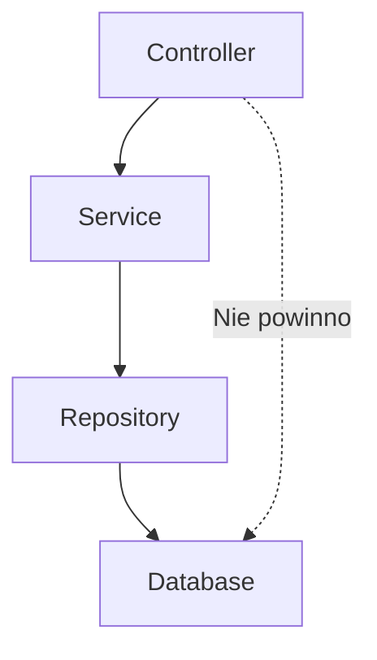

# CRUD — Create, Read, Update, Delete

## Prostymi słowami

CRUD to cztery podstawowe operacje na danych: tworzenie, odczyt, aktualizacja, usunięcie. Aplikacja CRUD to taka, która w kółko robi to samo — wyświetla listy rekordów, pozwala je edytować i kasować. To jak formularz w excelu przerodzony w aplikację webową.

## Szczegółowy opis

**CRUD** (*Create, Read, Update, Delete*) to paradygmat aplikacji, w którym główna logika biznesowa sprowadza się do operacji na bazie danych. Aplikacje CRUD dominują w enterprise development: panele administracyjne, systemy CRM, sklepy internetowe, systemy HR.

### Znaczenie dla QSE

Aplikacje CRUD mają specyficzny profil metryczny, który może mylić narzędzia jakości:

| Właściwość CRUD | Efekt na AGQ |
|---|---|
| Mała liczba warstw (controller → service → repo) | Stability S może być wysoka — wygląda dobrze |
| Brak skomplikowanej logiki domenowej | Cohesion C wysoka — klasy proste, ale puste |
| Brak cykli (prosta hierarchia) | Acyclicity A = 1.0 |
| Niski coupling | CD wysoki — mało importów |
| **Wynik:** wysoki AGQ | ⚠️ Może być mylące — brak złożoności ≠ dobra architektura |

### Problem: AGQ bez kontekstu kategorii

Aplikacja CRUD z AGQ=0.80 i dobrze zaprojektowana aplikacja domenowa z AGQ=0.80 wyglądają tak samo w benchmarku — ale mają zupełnie inną złożoność. To motywuje potrzebę **category-aware normalization** (normalizacji względem kategorii projektu).

Kategoryzacja projektów:
- **CRUD** — thin layer nad bazą danych, mała logika domenowa
- **Library/Framework** — API publiczne, brak warstwy UI
- **Domain-rich** — złożona logika biznesowa, wiele encji
- **Tool/CLI** — narzędzie, brak domeny

### Benchmark QSE: CRUD vs mainstream

Z badania spaghetti vs mainstream OSS (n=9 spaghetti, n=15 mainstream):

| Metryka | Mainstream (n=15) | Spaghetti/CRUD (n=9) | Δ |
|---|---:|---:|---:|
| AGQ mean | 0.634 | **0.694** | +0.060 |
| Code smells/KLOC mean | 12.20 | **43.04** | +30.85 |
| Bugs/KLOC mean | 0.81 | 1.25 | +0.44 |
| Mediana węzłów | 97 | **7** | -90 |

Wniosek: projekty spaghetti/CRUD (małe, proste) mogą mieć **wyższy AGQ** niż mainstream OSS — bo mała struktura = brak problemów grafowych. To znane ograniczenie benchmarku.

### Typowe wzorce w architekturze CRUD

CRUD = prosta hierarchia 3 warstw. Dobra praktyka CRUD:
- Controller nie wie o Repository
- Service zawiera logikę walidacji
- Repository hermetyzuje dostęp do danych

Nawet taka prosta architektura może się zdegradować: controller bezpośrednio wywołujący zapytania SQL to **CRUD spaghetti**.

## Definicja formalna

W kontekście QSE: repozytorium klasyfikowane jako CRUD gdy spełnia kryteria:
1. n_layers ≤ 3 (controller/service/repository lub podobne)
2. Brak skomplikowanej logiki domenowej (mała liczba encji domenowych)
3. Struktura pakietów odpowiada operacjom (controllers/, services/, repositories/)

Kategoryzacja jest planowaną funkcją QSE (category-aware normalization), obecnie nie jest automatyczna.

## Zobacz też

- [[AGQ|AGQ]] — metryka zbiorcza
- [[DDD|DDD]] — podejście do architektury dla bogatych domen
- [[Repository Types|Typy repozytoriów]] — klasyfikacja projektów
- [[Limitations|Ograniczenia]] — mały projekt bias
- [[Blind Spot|Blind Spot]] — co narzędzia pomijają
