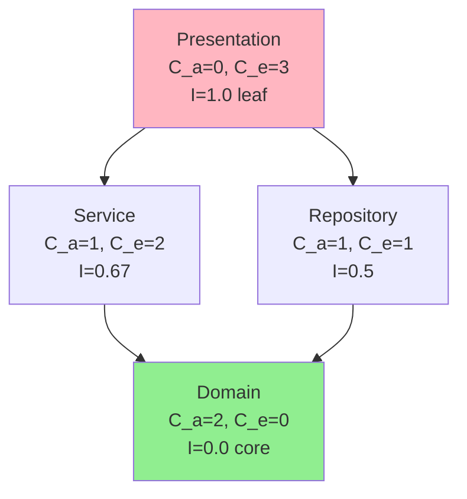

# Layer — Warstwa architektoniczna

## Prostymi słowami

Warstwa (layer) to poziom w hierarchii systemu. Jak w torcie: biszkopt na spodzie, krem w środku, polewa na górze. Każda warstwa wie tylko o warstwach poniżej, nigdy powyżej. Jeśli polewa zacznie zależeć od biszkoptu, który zależy od polewy — mamy problem (cykl). Dobra architektura = tort z wyraźnymi warstwami.

## Szczegółowy opis

**Warstwa architektoniczna** (*architectural layer*) to logiczna grupka modułów/pakietów realizujących podobny poziom abstrakcji i mających podobne zależności. Wzorzec warstwowy (*layered architecture*) zakłada, że:

1. Zależności płyną **w jednym kierunku** (z góry w dół)
2. Wyższe warstwy znają niższe, ale nie odwrotnie
3. Każda warstwa jest wymieniana niezależnie od innych

### Typowe układy warstw

**Klasyczna aplikacja webowa (3 warstwy):**
```
┌──────────────────────┐
│   Presentation       │  ← HTTP, UI, kontrolery
├──────────────────────┤
│   Business Logic     │  ← serwisy, logika domenowa
├──────────────────────┤
│   Data Access        │  ← repozytoria, ORM, SQL
└──────────────────────┘
Zależności: Presentation → Business → Data
```

**Clean Architecture (4 warstwy):**
```
┌──────────────────────┐
│   Frameworks & UI    │
├──────────────────────┤
│   Interface Adapters │
├──────────────────────┤
│   Use Cases          │
├──────────────────────┤
│   Entities/Domain    │  ← nie zależy od niczego
└──────────────────────┘
```

### Jak QSE mierzy warstwowość

Metryka **Stability (S)** w AGQ operacjonalizuje warstwowość przez Martin's Instability Index:

$$S = 1 - \text{mean}\left(\left|\frac{C_e}{C_a + C_e} + A - 1\right|\right)$$

gdzie:
- \(C_e\) = efferent coupling (zależności wychodzące z modułu)
- \(C_a\) = afferent coupling (zależności wchodzące do modułu)
- \(A\) = abstractness (udział abstrakcyjnych klas/interfejsów)

**Interpretacja:** moduł w centrum zależności (dużo \(C_a\), mało \(C_e\)) powinien być abstrakcyjny (interfejsy/klasy abstrakcyjne) — to „fundamenty". Moduł na peryferiach (dużo \(C_e\), mało \(C_a\)) może być konkretny — to „liście".



Zielony = niski Instability = stabilne fundamenty. Różowy = wysoki Instability = liście (powinny zależeć od wszystkiego, nic od nich).

### Wyniki empiryczne Stability (S) w GT Java

| Zbiór | Stability S (mean) |
|---|---:|
| POS (n=31) | **0.344** |
| NEG (n=28) | **0.238** |
| Δ | +0.106 |
| Mann-Whitney p | 0.016 (*) |

Projekty POS mają bardziej wyraźną hierarchię warstw (wyższe S).

### Naruszenia warstwowości (Layer Violations)

Naruszenie = zależność skierowana „w górę" (wyższa warstwa zależy od niższej, ale błędnie):
- `domain` importuje `infrastructure` → naruszenie DDD
- `service` importuje `controller` → naruszenie 3-warstwowej architektury
- `model` importuje `view` → naruszenie MVC

QSE Level 2 (constraints) pozwala deklarować forbidden edges dla wykrywania naruszeń:
```yaml
constraints:
  - from: "domain/**"
    to: "infrastructure/**"
    type: forbidden
```

## Definicja formalna

Niech G = (V, E) będzie DAG-iem idealnej architektury warstwowej. Warstwę L_k definiujemy rekurencyjnie:

$$L_0 = \{v \in V : \text{in-degree}(v) = 0\}$$
$$L_{k+1} = \{v \in V : \forall_{u \in \text{pred}(v)}, u \in \bigcup_{i \leq k} L_i\}$$

Architektura jest k-warstwowa gdy graf G jest DAG-iem (A=1) i L_k jest niepusty dla każdego k ≤ k_max.

## Zobacz też

- [[AGQ|AGQ]] — S jako komponent AGQ
- [[DDD|DDD]] — warstwowość w Domain-Driven Design
- [[Tarjan SCC|Tarjan SCC]] — wykrywa naruszenia (cykle)
- [[Repository Types|Typy repozytoriów]] — LAYERED jako fingerprint
- [[Java GT Dataset]] — dane S w GT
