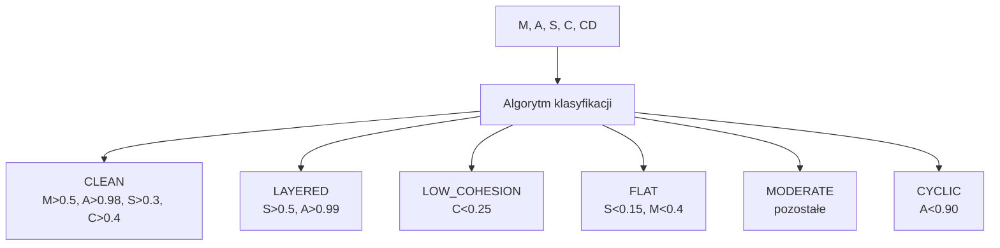

# Typy repozytoriów (Repository Types)

## Prostymi słowami

Repozytoria różnią się charakterem: biblioteka (jak requests) to coś zupełnie innego niż aplikacja webowa (jak django). QSE nadaje każdemu projektowi „odcisk palca" (Fingerprint) opisujący wzorzec architektoniczny. Fingerprint to skrótowy opis: ta architektura jest czysta, ta jest płaska, ta ma cykle.

## Szczegółowy opis

**Typy repozytoriów** w kontekście QSE odnoszą się do dwóch powiązanych klasyfikacji:

### 1. Klasyfikacja funkcjonalna (Category)

| Kategoria | Opis | Przykłady |
|---|---|---|
| **Application** | Aplikacja webowa/serwerowa z logiką domenową | Django, FastAPI, Airflow |
| **Library/Framework** | Biblioteka narzędziowa bez domeny | Requests, Click, Attrs |
| **Tool/CLI** | Narzędzie wiersza poleceń | Black, Nox, Tox |
| **Domain-Rich** | Aplikacja z bogatą logiką domenową (często DDD) | DDD samples, enterprise |
| **CRUD** | Prosta aplikacja CRUD bez złożonej logiki | Shopping-cart, mall |

Klasyfikacja kategorii jest **kluczowa** dla prawidłowej interpretacji AGQ — biblioteka z płaską strukturą może mieć niski AGQ bez żadnych problemów architektonicznych (patrz: [[CRUD|CRUD]]).

### 2. Fingerprint (wzorzec architektoniczny)

Fingerprint to automatyczna klasyfikacja oparta na kombinacji metryk AGQ:

| Fingerprint | Opis | Typowe metryki |
|---|---|---|
| **CLEAN** | Czysta, modularna architektura | M↑, A↑, S↑, C↑, CD↑ |
| **LAYERED** | Wyraźna hierarchia warstw | S↑↑, M↑, A↑ |
| **LOW_COHESION** | Klasy wielofunkcyjne (niskie C) | C↓, A↑, M↑ |
| **FLAT** | Brak hierarchii warstw | S↓, M↓ |
| **MODERATE** | Mieszane właściwości, żadna nie dominuje | Wszystkie średnie |
| **CYCLIC** | Dominujące cykliczne zależności | A↓↓ |

Rozkład w benchmarku 558 (iter6):
- CLEAN: 42.3%
- LAYERED: 27.2%
- LOW_COHESION: 14.3%
- FLAT: 8.8%
- MODERATE: 6.3%
- CYCLIC: 1.1%

### Walidacja face validity

W benchmarku (n=10 known-good vs n=10 known-bad):
- 80% dobrze znanych projektów = Fingerprint LAYERED lub CLEAN
- 60% znanych jako problematycznych = Fingerprint FLAT lub LOW_COHESION

Test Cohena: **d = 3.22, p<0.001** — bardzo silna różnica.

### Szczegóły Fingerprint per język

### Wpływ kategorii na AGQ

Różne kategorie projektów mają różne baseline AGQ:

| Kategoria | Typowy AGQ Python | Uwaga |
|---|---|---|
| Library (mała) | 0.75 – 0.90 | Prosta struktura → łatwo osiągnąć wysoki AGQ |
| Framework (duży) | 0.65 – 0.80 | Złożoność = niższy AGQ |
| Application (medium) | 0.70 – 0.80 | Zależy od jakości architektury |
| Monolith (duży) | 0.55 – 0.70 | Typowo niższy przez rozmiar |

Dlatego AGQ-z (z-score normalizowany per język i kategoria) jest bardziej sprawiedliwą metryką porównawczą niż surowy AGQ.

## Definicja formalna

Fingerprint F(r) definiowany jako funkcja progu:

$$F(r) = \begin{cases}
\text{CYCLIC} & \text{jeśli } A(r) < 0.90 \\
\text{LAYERED} & \text{jeśli } S(r) \geq 0.50 \text{ i } A(r) \geq 0.99 \\
\text{CLEAN} & \text{jeśli } M > 0.5 \text{ i } S > 0.3 \text{ i } C > 0.4 \\
\text{LOW\_COHESION} & \text{jeśli } C < 0.25 \\
\text{FLAT} & \text{jeśli } S < 0.15 \text{ i } M < 0.4 \\
\text{MODERATE} & \text{pozostałe}
\end{cases}$$

Progi mogą się różnić między wersjami QSE — powyższe są przybliżeniem.

## Zobacz też

- [[AGQ|AGQ]] — główna metryka
- [[Layer|Warstwa]] — co mierzy warstwowość
- [[LCOM4|LCOM4]] — co mierzy spójność
- [[CRUD|CRUD]] — typ bez złożonej architektury
- [[DDD|DDD]] — typ z bogatą domeną
- [[07 Benchmarks/Benchmark 558|Benchmark 558]] — rozkład Fingerprints
- [[Type 1 Flat Spaghetti|Typ 1 Flat Spaghetti]] — negatywny wzorzec
- [[Type 2 Legacy Monolith|Typ 2 Legacy Monolith]] — negatywny wzorzec
