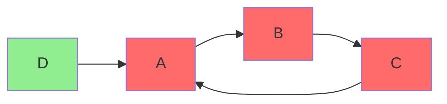

# Tarjan SCC — Silnie spójne składowe (algorytm Tarjana)

## Prostymi słowami

Tarjan SCC to algorytm wykrywający „pętle" w grafie zależności. Wyobraź sobie mapę dróg jednokierunkowych: algorytm Tarjana znajdzie wszystkie miejsca, skąd możesz wyjechać i wrócić do siebie. Każde takie miejsce to problem — moduł A zależy od B, które zależy od C, które zależy od A. Nie można przetestować ani zmienić żadnego bez dotykania pozostałych.

## Szczegółowy opis

**Algorytm Tarjana** (Robert Tarjan, 1972) to algorytm liniowy O(V+E) do znajdowania **Silnie Spójnych Składowych** (*Strongly Connected Components, SCC*) w grafie skierowanym.

**SCC** to maksymalny podzbiór węzłów, w którym z każdego węzła można dotrzeć do każdego innego (idąc krawędziami w ich kierunku).

### Znaczenie dla QSE

W grafie zależności modułów: SCC o rozmiarze > 1 = **cykl zależności**. Moduły w cyklu tworzą „grupę trzymającą" — żadnego nie można zmienić bez potencjalnego wpływu na pozostałe.



Czerwone węzły (A, B, C) tworzą SCC — są w cyklu. D jest poza cyklem (zielone) — jest bezpieczne.

### Jak Tarjan oblicza SCC

```
Inicjalizacja: stos S, licznik index=0
Dla każdego węzła v (nieodwiedzonego):
  1. Przypisz v.index = v.lowlink = index++
  2. Push v na stos S
  3. Dla każdego sąsiada w (krawędź v→w):
     a. Jeśli w nieodwiedzony: rekurencja na w, v.lowlink = min(v.lowlink, w.lowlink)
     b. Jeśli w na stosie: v.lowlink = min(v.lowlink, w.index)
  4. Jeśli v.lowlink == v.index:
     → Pop ze stosu aż do v → to jest SCC
```

Złożoność: O(V + E) — liniowa względem rozmiaru grafu.

### Przekształcenie do metryki Acyclicity

$$\text{Acyclicity}_{AGQ} = 1 - \frac{|V_{\text{cycle}}|}{|V_{\text{internal}}|}$$

gdzie $V_{\text{cycle}}$ to węzły należące do SCC o rozmiarze > 1, a $V_{\text{internal}}$ to wszystkie wewnętrzne węzły projektu (bez stdlib i zewnętrznych bibliotek).

**Acyclicity = 1.0** → brak cykli, idealne DAG
**Acyclicity = 0.0** → wszystkie węzły w cyklach

### Wyniki empiryczne

Acyclicity jest zwykle wysoka w dobrych projektach:

| Zbiór | Acyclicity mean |
|---|---:|
| GT-POS (n=31) | **0.994** |
| GT-NEG (n=28) | **0.974** |
| Δ | +0.020 |
| MW p | 0.030 (*) |

Wnioski:
- Nawet NEG projekty mają średnio Acyclicity=0.974 — cykle są rzadkie w dobrych OSS projektach
- Różnica POS-NEG = 0.020 — najmniejsza ze wszystkich komponentów
- Mimo to statystycznie istotna (p=0.030)

Benchmark Python (n=80): większość projeków ma Acyclicity ≈ 1.000 — brak cykli jest normą w Python OSS.

### CycleSeverity — rozszerzona metryka

Oprócz binarnego Acyclicity, QSE oblicza **CycleSeverity** — ocenę powagi cykli:

```
AGQ = 0.471  [TANGLED]  z=-1.61 (5%ile Java)
  CycleSeverity=HIGH (15% modułów w cyklach)
  → 15% modułów uwięzionych w cyklach - priorytetowa naprawa
```

CycleSeverity uwzględnia:
- Rozmiar największego SCC (relative to V)
- Liczbę SCC > 1
- Centrality węzłów w cyklach

## Definicja formalna

Niech G = (V, E) będzie grafem skierowanym. SCC C ⊆ V to maksymalny zbiór węzłów taki, że:

$$\forall u, v \in C: \exists \text{ ścieżka } u \to v \text{ i } v \to u$$

Acyclicity:

$$A = 1 - \frac{|\{v \in V_{\text{int}} : v \in \text{SCC} \text{ o rozmiarze} > 1\}|}{|V_{\text{int}}|}$$

Jeśli G jest DAG (skierowanym grafem acyklicznym): A = 1 (każdy węzeł tworzy singleton SCC).

## Zobacz też

- [[AGQ|AGQ]] — Acyclicity (A) jako komponent AGQ
- [[Louvain|Louvain]] — analogiczny algorytm dla Modularity
- [[Layer|Warstwa]] — architektura bez cykli = możliwość warstwowania
- [[Type 2 Legacy Monolith|Typ 2 Legacy Monolith]] — wzorzec z wysokim Acyclicity ale innymi problemami
- [[Java GT Dataset]] — dane A w GT
