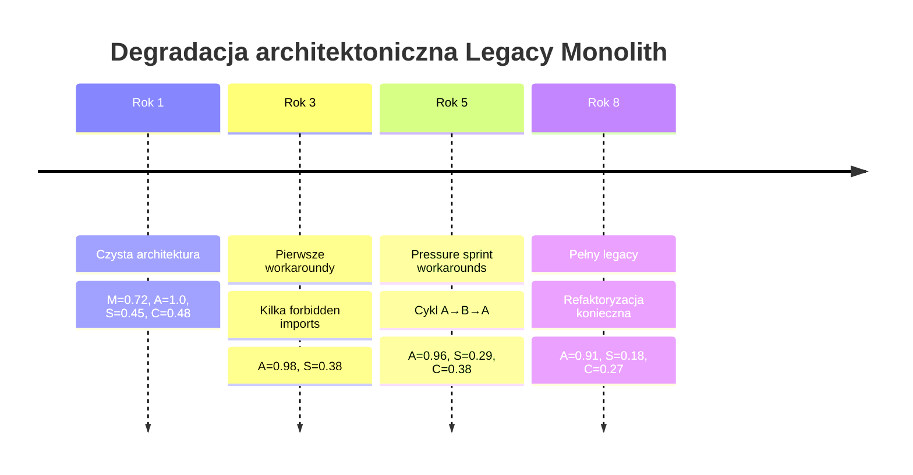

# Typ 2 — Legacy Monolith

## Prostymi słowami

Legacy Monolith to kiedyś zdrowy projekt, który przez lata rósł bez kontroli. Jak stare miasto: zaczęło od centrum z placem rynkowym, ale przez 50 lat dobudowywano uliczki, zaułki i skróty we wszystkich kierunkach. Teraz nikt nie zna już pełnej mapy, a zmiana jednej uliczki blokuje pół miasta.

## Szczegółowy opis

**Typ 2 — Legacy Monolith** to anty-wzorzec architektoniczny dużych, historycznych projektów, w których architektura zdegradowała się stopniowo przez lata developmentu:

1. **Duży rozmiar** — setki lub tysiące klas/modułów
2. **Cykliczne zależności** — narosłe przez lata przypadkowych importów
3. **Niska Stability** — brak czytelnych warstw, hierarchia zatarta
4. **Historyczny dług techniczny** — każda zmiana jest ryzykowna

### Różnica od Typ 1

| Właściwość | [[Type 1 Flat Spaghetti\|Typ 1 Flat Spaghetti]] | Typ 2 Legacy Monolith |
|---|---|---|
| Wiek | Nowy-średni | Stary (5+ lat) |
| Rozmiar | Mały-średni | Duży (500+ klas) |
| Historia | Zawsze płaski | Degradacja w czasie |
| Acyclicity | Może być wysoka | Często niska |
| Visibility | Widoczny od razu | Ujawnia się przy zmianach |
| Naprawalność | Łatwiejsza | Trudna (legacy entanglement) |

### Profil metryk AGQ

| Metryka | Wartość typowa | Uwagi |
|---|---|---|
| Modularity (M) | Umiarkowana (0.4–0.6) | Grupy widoczne historycznie |
| Acyclicity (A) | Niska–średnia (0.85–0.97) | Cykle narosłe w czasie |
| Stability (S) | Niska (0.1–0.25) | Hierarchy zatarta |
| Cohesion (C) | Niska (0.2–0.35) | God classes typowe |
| Coupling Density (CD) | Niska (gęsty) | Wiele historycznych powiązań |
| **AGQ** | **0.45 – 0.55** | Może maskować problemy |
| Fingerprint | **CYCLIC** lub **FLAT** | |

### Przykłady z GT Java (NEG)

| Repozytorium | AGQ | A | S | C | Uwagi |
|---|---:|---:|---:|---:|---|
| apache/struts | niski | < 0.98 | niska | niska | Klasyczny legacy Java, cykle |
| apache/velocity-engine | niski | < 0.98 | niska | niska | Template engine, legacy |
| hibernate-orm (benchmark) | 0.5276 | 0.840 | 0.211 | 0.302 | Duży ORM, niska S |
| jackson-databind (benchmark) | 0.4680 | 0.850 | 0.263 | 0.161 | Serializacja, niska C i A |

Hibernated ORM i jackson-databind to projekty w benchmarku, nie w GT, ale pokazują typowy profil legacy monolith: Acyclicity < 1, Stability niska, Cohesion niska.

### Mechanizm degradacji w czasie



### Jak QSE wykrywa Legacy Monolith

```
AGQ = 0.493  [CYCLIC]  z=-1.8 (4%ile Java)
  Modularity=0.62  Acyclicity=0.912  Stability=0.15  Cohesion=0.28
  CycleSeverity=HIGH (22% modułów w cyklach)
  → Wzorzec CYCLIC: znaczące cykle zależności + degradacja hierarchii
  → Priorytet: rozbicie SCC (5 grup po 20+ klas)
```

### Strategie naprawy

**Mikrotaktyki:**
- Identyfikuj największy SCC → zdecyduj co wymaga wydzielenia do osobnego pakietu
- Wprowadź ACL (Anticorruption Layer) między zdegradowanymi modułami
- Jeden refactoring na sprint — nie całościowa przebudowa

**Strategia długoterminowa:**
- Strangler Fig Pattern — stopniowe wydzielanie modułów do mikroserwisów
- Deklaratywne constraints w QSE dla nowego kodu
- Ratchet mechanism — AGQ nie może spaść (nowy kod nie pogarsza)

## Definicja formalna

Repozytorium r klasyfikowane jako Legacy Monolith gdy spełnione:

$$|V_{\text{int}}| > 500 \text{ (duży)} \land A(r) < 0.97 \text{ (cykle)} \land S(r) < 0.25 \text{ (brak hierarchii)}$$

W praktyce QSE: Fingerprint CYCLIC lub FLAT dla dużych projektów (n_nodes > 500).

## Zobacz też

- [[AGQ|AGQ]] — metryka główna
- [[Tarjan SCC|Tarjan SCC]] — wykrywa cykle
- [[Layer|Warstwa]] — brakująca hierarchia w Legacy Monolith
- [[Type 1 Flat Spaghetti|Typ 1 Flat Spaghetti]] — pokrewny anty-wzorzec
- [[Repository Types|Typy repozytoriów]] — Fingerprint
- [[07 Benchmarks/Java GT Dataset|Java GT Dataset]] — przykłady legacy w NEG
