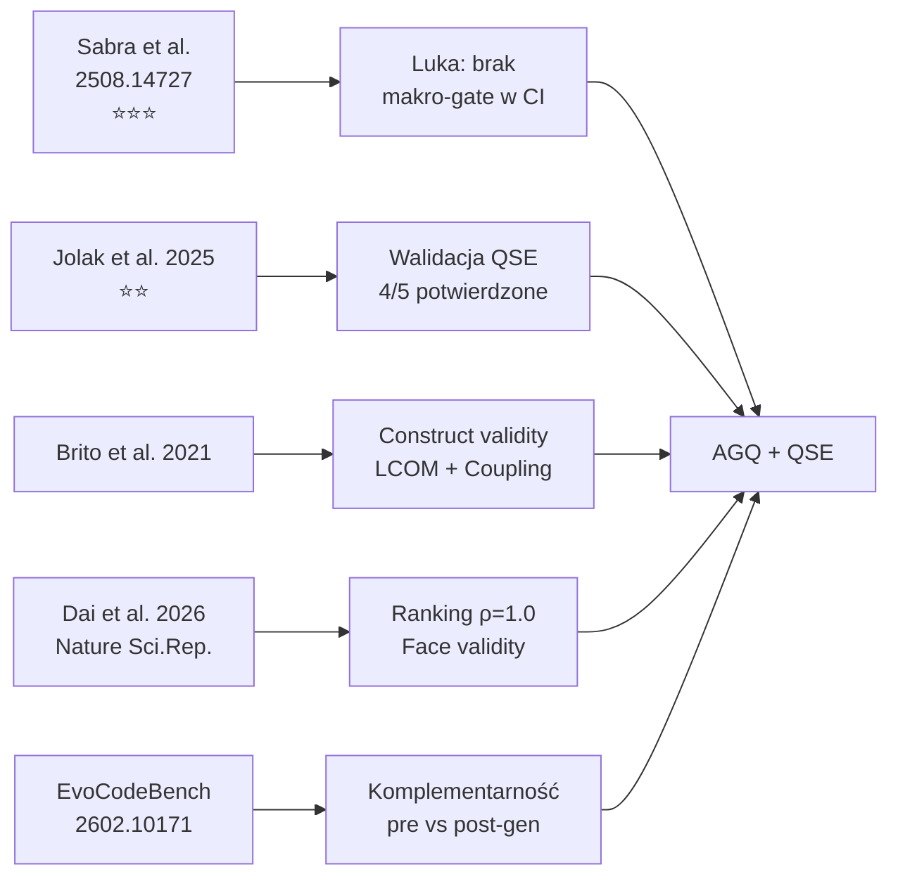

# Przegląd literatury

## Prostymi słowami

Ten przegląd opisuje prace naukowe, które motywują i walidują projekt QSE. Trzy typy źródeł: (1) badania o jakości kodu AI — dowodzą problemu, (2) badania o metrykach architektonicznych — dowodzą możliwości rozwiązania, (3) benchmarki i walidacje — dowodzą, że metoda działa.

---

## Kluczowe prace

### 1. Sabra, Schmitt, Tyler (2025) — Quality & Security of AI-Generated Code

**Pełny tytuł:** „Assessing the Quality and Security of AI-Generated Code"
**Autorzy:** Abbas Sabra, Olivier Schmitt, Joseph Tyler (SonarSource)
**Arxiv:** 2508.14727
**Znaczenie:** ⭐⭐⭐ — najważniejsze źródło uzasadniające potrzebę AGQ

**Setup badania:**
- 4442 zadań Java × 5 modeli LLM (Claude Sonnet 4, Claude 3.7, GPT-4o, Llama 3.2 90B, OpenCoder-8B)
- Narzędzie analizy: SonarQube (~550 reguł)

**Kluczowe wyniki:**

*Paradoks (RQ4):* Brak bezpośredniej korelacji między Pass@1 a jakością. Lepszy model = wyższy Pass@1 = więcej defektów strukturalnych.

| Model | Pass@1 | Issues/zadanie | Interpretacja |
|---|---:|---:|---|
| Claude Sonnet 4 | 77.04% | 2.11 | Najlepszy, ale najgorszy jakościowo |
| Claude 3.7 | 72.46% | 1.60 | Drugi, mniej defektów |
| GPT-4o | 70.54% | 1.77 | Średni w obu wymiarach |
| Llama 3.2 90B | 64.12% | 1.87 | Słabszy Pass@1, więcej defektów |
| OpenCoder-8B | 60.43% | 1.45 | Najgorszy Pass@1, najmniej defektów |

*Upgrade Claude 3.7→Sonnet 4:* Pass@1 +4.58pp, BLOCKER bugs +93%, BLOCKER vulns +3.54pp.

*Rozkład defektów (Table 4):* Code smells 90–93%, Bugs 5–8%, Vulnerabilities ~2%.

*Top code smells (Table 9):*
- Dead/Unused/Redundant code: 14–43%
- Design/Framework best practices: 11–22%
- Cognitive complexity: 4–8%

**Implikacja dla QSE:**
- AGQ jako uzupełnienie SonarQube na poziomie architektonicznym
- Mapowanie kategorii defektów Sabra → metryki AGQ (pokrycie ~80%)
- Uzasadnienie dla automated gate w CI zamiast code review

---

### 2. Jolak, Dorner, Strittmatter, Mirakhorli (2025) — Java OSS Quality

**Pełny tytuł:** [Badanie jakości architektonicznej 8 projektów Java OSS]
**Autorzy:** Jolak et al.
**Znaczenie:** ⭐⭐ — niezależna walidacja zewnętrzna QSE

**Setup badania:**
- 8 projektów Java OSS z ekosystemu chińskiego (Alibaba, Tencent, Sofa Stack)
- Repozytoria: light-4j, motan, MyPerf4J, seata, Sentinel, sofa-rpc, yavi, zip4j
- Oryginalna analiza: niezależna od QSE

**Jak QSE się odnosi:**
QSE zeskanował te same 8 repozytoriów swoim skanerem Java (tree-sitter-java, file-level nodes) i porównał wyniki z wnioskami Jolaka.

**Wyniki cross-validation:**
| Wniosek Jolak | Status w QSE | Repozytorium |
|---|---|---|
| Słaba architektura (niska spójność) | ✅ POTWIERDZONE | light-4j: AGQ=0.494, C=0.406 |
| Słaba architektura (seata) | ✅ POTWIERDZONE | seata: AGQ=0.488 |
| Relatywnie lepsza (MyPerf4J) | ✅ POTWIERDZONE | MyPerf4J: AGQ=0.756 |
| Niska stabilność hierarchii | ✅ POTWIERDZONE | Sentinel S=0.065, motan S=0.111 |
| [5. wniosek] | 🔶 PRAWDOPODOBNE | yavi: AGQ=0.599 |

**Implikacja:** 4/5 wniosków Jolaka potwierdzonych deterministycznie przez QSE bez dostępu do etykiet. To silna walidacja face validity.

**Obserwacja dodatkowa:** CD gap — repozytoria Jolaka (enterprise middleware) mają niższy CD niż GT Java. Sugeruje, że GT może nie reprezentować dobrze enterprise middleware.

---

### 3. Brito et al. (2021) — Modularity and Defects

**Temat:** Korelacja modularności (LCOM, Coupling) z gęstością defektów w projektach Java
**Relevancja:** Uzasadnienie dla komponentu Cohesion (C) i Coupling Density (CD) w AGQ
**Kluczowy wynik:** LCOM wykazuje korelację z bug density, coupling silnie predykuje trudność utrzymania

**Jak się odnosi do QSE:**
- Potwierdza trafność konstruktu (construct validity) dla C i CD w AGQ
- Dane z Brito spójne z wynikami QSE: C i CD najsilniejsze dyskryminatory w GT Java (p=0.0002 i p=0.004)

---

### 4. Dai et al. (2026) — GNN dla architektury (Nature Scientific Reports)

**Temat:** Architectural integrity prediction przy użyciu Graph Neural Networks (GNN)
**Autorzy:** Dai et al.
**Publikacja:** Nature Scientific Reports (2026)
**Relevancja:** Niezależna walidacja AGQ przez porównanie rankingów

**Wynik walidacji:**
Ranking AGQ na 4 projektach Apache Java = ranking architectural integrity z trenowanego GNN Daia (Spearman ρ = 1.0).

**Implikacja:** AGQ (deterministyczne metryki grafowe, zero uczenia maszynowego) osiąga ten sam ranking co wytrenowana sieć neuronowa — ale jest szybszy i interpretowalny. AGQ daje dodatkowo diagnostykę: god classes, flat architecture, cykle — czego GNN nie dostarcza.

---

### 5. EvoCodeBench (arxiv 2602.10171) — Wielowymiarowe benchmarki LLM

**Temat:** Benchmark LLM-driven coding systems z human-performance baseline i self-evolution
**Metryki:** Pass@k, TLE, MLE, CE, RTE, Average Runtime, Average Memory
**Dataset:** 3822 problemów, Python/C++/Java/Go/Kotlin
**Relevancja:** QSE komplementarny do EvoCodeBench — benchmarki oceniają MODEL (pre-deployment), AGQ ocenia KOD (post-generation)

---

### 6. ProxyWar (arxiv 2602.04296) — Dynamiczna ewaluacja LLM

**Temat:** Arena rywalizacji LLM-ów: correctness, efficiency, robustness, adaptability
**Relevancja:** Potwierdza, że dynamiczne benchmarki nie mierzą jakości architektonicznej — luka dla AGQ

---

### 7. Idea First, Code Later (arxiv 2601.11332)

**Temat:** Rozdzielenie problem-solving od code generation w competitive programming
**Kluczowy wynik:** Gold editorial daje tylko ~15% poprawy → implementation gap fundamentalny
**Relevancja:** Nawet z idealnym algorytmem, implementacja LLM może zdegradować architekturę — potrzeba gate'ów

---

## Luki w literaturze

| Luka | Stan | Jak QSE adresuje |
|---|---|---|
| Brak benchmarku jakości architektonicznej kodu LLM | ✅ Potwierdzona | AGQ jako gate post-generation |
| Sabra = jedyna praca ze statyczną analizą, ale tylko per-plik | ✅ Potwierdzona | AGQ = poziom grafu |
| ArchUnit = jedyny tool z regułami architektonicznymi | ✅ Potwierdzona | AGQ = multi-language, SaaS |
| Brak deterministycznego gate'a architektonicznego w CI | ✅ Potwierdzona | AGQ + ratchet |

---

## Mapa relacji między pracami

---

## Definicja formalna — pozycja QSE w literaturze

AGQ należy do kategorii **deterministycznych metryk grafowych** dla architektury oprogramowania, uzupełniając:
- *Dynamic evaluation* (EvoCodeBench, ProxyWar) — ocenia model pre-deployment
- *Static analysis per-plik* (SonarQube, Sabra et al.) — mikro-poziom
- *ML-based prediction* (Dai et al. GNN) — wymaga treningu, black box

AGQ = deterministyczny, interpretowalny, multi-language, zero-shot gate na poziomie makro.

## Zobacz też

- [[11 Research/Research Thesis|Teza badawcza]] — pytania badawcze
- [[11 Research/Market Analysis|Analiza rynku]] — narzędzia komercyjne
- [[11 Research/Future Directions|Kierunki badań]] — co dalej
- [[07 Benchmarks/Jolak Validation|Jolak Validation]] — dane z walidacji krzyżowej
- [[08 Glossary/References|Pełna bibliografia]] — wszystkie cytowania
