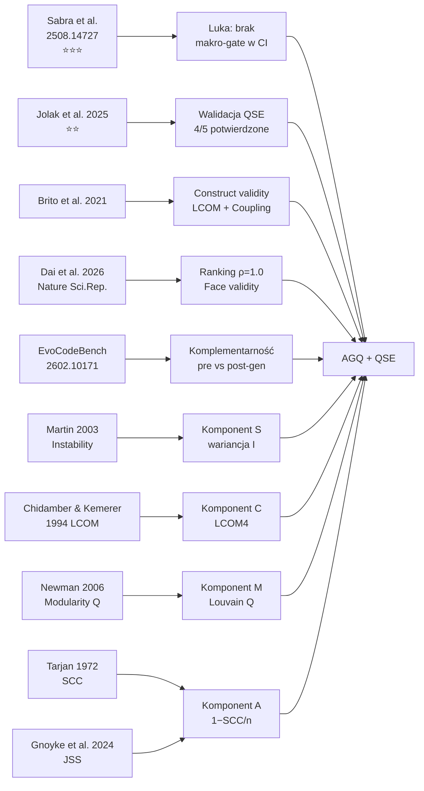

# Przegląd literatury

## Prostymi słowami

Ten przegląd opisuje prace naukowe, które motywują i walidują projekt QSE. Trzy typy źródeł: (1) badania o jakości kodu AI — dowodzą problemu, (2) badania o metrykach architektonicznych — dowodzą możliwości rozwiązania, (3) benchmarki i walidacje — dowodzą, że metoda działa.

---

## Kluczowe prace

### 1. Sabra, Schmitt, Tyler (2025) — Quality & Security of AI-Generated Code

**Pełny tytuł:** „Assessing the Quality and Security of AI-Generated Code"
**Autorzy:** Abbas Sabra, Olivier Schmitt, Joseph Tyler (SonarSource)
**Arxiv:** 2508.14727
**Znaczenie:** ⭐⭐⭐ — najważniejsze źródło uzasadniające potrzebę AGQ

**Setup badania:**
- 4442 zadań Java × 5 modeli LLM (Claude Sonnet 4, Claude 3.7, GPT-4o, Llama 3.2 90B, OpenCoder-8B)
- Narzędzie analizy: SonarQube (~550 reguł)

**Kluczowe wyniki:**

*Paradoks (RQ4):* Brak bezpośredniej korelacji między Pass@1 a jakością. Lepszy model = wyższy Pass@1 = więcej defektów strukturalnych.

| Model | Pass@1 | Issues/zadanie | Interpretacja |
|---|---:|---:|---|
| Claude Sonnet 4 | 77.04% | 2.11 | Najlepszy, ale najgorszy jakościowo |
| Claude 3.7 | 72.46% | 1.60 | Drugi, mniej defektów |
| GPT-4o | 70.54% | 1.77 | Średni w obu wymiarach |
| Llama 3.2 90B | 64.12% | 1.87 | Słabszy Pass@1, więcej defektów |
| OpenCoder-8B | 60.43% | 1.45 | Najgorszy Pass@1, najmniej defektów |

*Upgrade Claude 3.7→Sonnet 4:* Pass@1 +4.58pp, BLOCKER bugs +93%, BLOCKER vulns +3.54pp.

*Rozkład defektów (Table 4):* Code smells 90–93%, Bugs 5–8%, Vulnerabilities ~2%.

*Top code smells (Table 9):*
- Dead/Unused/Redundant code: 14–43%
- Design/Framework best practices: 11–22%
- Cognitive complexity: 4–8%

**Implikacja dla QSE:**
- AGQ jako uzupełnienie SonarQube na poziomie architektonicznym
- Mapowanie kategorii defektów Sabra → metryki AGQ (pokrycie ~80%)
- Uzasadnienie dla automated gate w CI zamiast code review

---

### 2. Jolak, Dorner, Strittmatter, Mirakhorli (2025) — Java OSS Quality

**Pełny tytuł:** [Badanie jakości architektonicznej 8 projektów Java OSS]
**Autorzy:** Jolak et al.
**Znaczenie:** ⭐⭐ — niezależna walidacja zewnętrzna QSE

**Setup badania:**
- 8 projektów Java OSS z ekosystemu chińskiego (Alibaba, Tencent, Sofa Stack)
- Repozytoria: light-4j, motan, MyPerf4J, seata, Sentinel, sofa-rpc, yavi, zip4j
- Oryginalna analiza: niezależna od QSE

**Jak QSE się odnosi:**
QSE zeskanował te same 8 repozytoriów swoim skanerem Java (tree-sitter-java, file-level nodes) i porównał wyniki z wnioskami Jolaka.

**Wyniki cross-validation:**
| Wniosek Jolak | Status w QSE | Repozytorium |
|---|---|---|
| Słaba architektura (niska spójność) | ✅ POTWIERDZONE | light-4j: AGQ=0.494, C=0.406 |
| Słaba architektura (seata) | ✅ POTWIERDZONE | seata: AGQ=0.488 |
| Relatywnie lepsza (MyPerf4J) | ✅ POTWIERDZONE | MyPerf4J: AGQ=0.756 |
| Niska stabilność hierarchii | ✅ POTWIERDZONE | Sentinel S=0.065, motan S=0.111 |
| [5. wniosek] | 🔶 PRAWDOPODOBNE | yavi: AGQ=0.599 |

**Implikacja:** 4/5 wniosków Jolaka potwierdzonych deterministycznie przez QSE bez dostępu do etykiet. To silna walidacja face validity.

**Obserwacja dodatkowa:** CD gap — repozytoria Jolaka (enterprise middleware) mają niższy CD niż GT Java. Sugeruje, że GT może nie reprezentować dobrze enterprise middleware.

---

### 3. Brito et al. (2021) — Modularity and Defects

**Temat:** Korelacja modularności (LCOM, Coupling) z gęstością defektów w projektach Java
**Relevancja:** Uzasadnienie dla komponentu Cohesion (C) i Coupling Density (CD) w AGQ
**Kluczowy wynik:** LCOM wykazuje korelację z bug density, coupling silnie predykuje trudność utrzymania

**Jak się odnosi do QSE:**
- Potwierdza trafność konstruktu (construct validity) dla C i CD w AGQ
- Dane z Brito spójne z wynikami QSE: C i CD najsilniejsze dyskryminatory w GT Java (p=0.0002 i p=0.004)

---

### 4. Dai et al. (2026) — GNN dla architektury (Nature Scientific Reports)

**Temat:** Architectural integrity prediction przy użyciu Graph Neural Networks (GNN)
**Autorzy:** Dai et al.
**Publikacja:** Nature Scientific Reports (2026)
**Relevancja:** Niezależna walidacja AGQ przez porównanie rankingów

**Wynik walidacji:**
Ranking AGQ na 4 projektach Apache Java = ranking architectural integrity z trenowanego GNN Daia (Spearman ρ = 1.0).

**Implikacja:** AGQ (deterministyczne metryki grafowe, zero uczenia maszynowego) osiąga ten sam ranking co wytrenowana sieć neuronowa — ale jest szybszy i interpretowalny. AGQ daje dodatkowo diagnostykę: god classes, flat architecture, cykle — czego GNN nie dostarcza.

---

### 5. EvoCodeBench (arxiv 2602.10171) — Wielowymiarowe benchmarki LLM

**Temat:** Benchmark LLM-driven coding systems z human-performance baseline i self-evolution
**Metryki:** Pass@k, TLE, MLE, CE, RTE, Average Runtime, Average Memory
**Dataset:** 3822 problemów, Python/C++/Java/Go/Kotlin
**Relevancja:** QSE komplementarny do EvoCodeBench — benchmarki oceniają MODEL (pre-deployment), AGQ ocenia KOD (post-generation)

---

### 6. ProxyWar (arxiv 2602.04296) — Dynamiczna ewaluacja LLM

**Temat:** Arena rywalizacji LLM-ów: correctness, efficiency, robustness, adaptability
**Relevancja:** Potwierdza, że dynamiczne benchmarki nie mierzą jakości architektonicznej — luka dla AGQ

---

### 7. Idea First, Code Later (arxiv 2601.11332)

**Temat:** Rozdzielenie problem-solving od code generation w competitive programming
**Kluczowy wynik:** Gold editorial daje tylko ~15% poprawy → implementation gap fundamentalny
**Relevancja:** Nawet z idealnym algorytmem, implementacja LLM może zdegradować architekturę — potrzeba gate'ów

---

## Klasyczne podstawy metryk (fundamenty AGQ)

### 8. Martin, Robert C. (2003) — Agile Software Development: Principles, Patterns, and Practices

**Wydawca:** Prentice Hall
**Znaczenie:** ⭐⭐⭐ — źródło metryki Instability, fundament komponentu S w AGQ

**Kluczowe pojęcia:**

Metryka niestabilności (*Instability*):

\[
I = \frac{C_e}{C_a + C_e}
\]

gdzie \(C_a\) = *afferent coupling* (zależności przychodzące — ile modułów zależy od tego pakietu), \(C_e\) = *efferent coupling* (zależności wychodzące — ile pakietów ten moduł importuje). Wartość \(I \in [0, 1]\): 0 = maksymalnie stabilny, 1 = maksymalnie niestabilny.

**Zasada stabilnych zależności (SDP — Stable Dependencies Principle):** zależności powinny wskazywać w kierunku stabilności. Pakiety niestabilne (I≈1) powinny zależeć od stabilnych (I≈0), nie odwrotnie.

**Komponent S w AGQ:**
AGQ oblicza składową \(S\) (*Stability*) jako wariancję wartości \(I\) po wszystkich pakietach projektu. Wysoka wariancja oznacza wyraźną hierarchię (dobre): część pakietów jest stabilna (I≈0), część niestabilna (I≈1). Niska wariancja — „wszyscy wszędzie" — bez hierarchii.

**Paradoks E1 (QSE finding):** Metryka Martina nie rozróżnia między „stabilny, bo dobrze zaprojektowany" a „stabilny, bo to puste POJO bez dependencji". mall.domain (anemic POJO, I≈0) i library.domain (rich domain z logiką, I=0.464) mogą wyglądać identycznie lub odwrotnie dla S_hierarchy — mimo że jakościowo są zupełnie różne. To ograniczenie topologiczne: metryka widzi tylko importy, nie zawartość klas.

---

### 9. Chidamber & Kemerer (1994) — A Metrics Suite for Object Oriented Design (IEEE TSE)

**Pełny tytuł:** „A Metrics Suite for Object-Oriented Design"
**Autorzy:** Shyam R. Chidamber, Chris F. Kemerer
**Publikacja:** IEEE Transactions on Software Engineering, vol. 20, no. 6, 1994
**Znaczenie:** ⭐⭐⭐ — fundament metryki LCOM, podstawa komponentu C w AGQ

**Oryginalna metryka LCOM:**
Dla klasy z metodami \(M_1, \ldots, M_n\) i polami \(F_1, \ldots, F_k\): niech \(P\) = liczba par metod bez wspólnych pól, \(Q\) = liczba par metod ze wspólnymi polami. LCOM = \(\max(P - Q, 0)\). Wysoki LCOM = niska spójność = klasa robi zbyt wiele niezwiązanych rzeczy.

**LCOM4 (Hitz & Montazeri 1995):**
Ulepszona wersja: buduje graf, gdzie węzły to metody, krawędzie istnieją gdy dwie metody korzystają ze wspólnego pola lub jedna wywołuje drugą. LCOM4 = liczba spójnych składowych (*connected components*) tego grafu. LCOM4=1 → klasa spójna, LCOM4=n → n niezwiązanych części.

**Komponent C w AGQ:**
QSE używa LCOM4 per klasa, uśrednionego po projekcie. Wysoki LCOM4 → niski wynik C (odwrócenie: C = 1 − normalizacja LCOM4).

**Paradoks E13g (QSE finding):** LCOM4 penalizuje interfejsy Java: interfejs bez pól i z wieloma metodami dostaje LCOM4 = n_methods (każda metoda = osobna składowa). Interfejs `Repository<T>` z 8 metodami dostaje LCOM4=8 mimo że jest wzorcowym elementem architektury. To znany problem metryki — QSE filtruje interfejsy w obliczeniach C lub stosuje korektę.

---

### 10. Newman, M.E.J. (2006) — Modularity and community structure in networks

**Pełny tytuł:** „Modularity and community structure in networks"
**Autor:** M.E.J. Newman
**Publikacja:** Proceedings of the National Academy of Sciences (PNAS), 103(23), 2006
**Znaczenie:** ⭐⭐ — fundament algorytmu Louvain i metryki Q modularności używanej w M

**Newman's Q modularity:**

\[
Q = \frac{1}{2m} \sum_{ij} \left[ A_{ij} - \frac{k_i k_j}{2m} \right] \delta(c_i, c_j)
\]

gdzie \(A_{ij}\) = macierz sąsiedztwa, \(k_i\) = stopień węzła \(i\), \(m\) = liczba krawędzi, \(\delta(c_i, c_j) = 1\) gdy węzły \(i\) i \(j\) należą do tej samej społeczności. Wartość Q bliska 1 → wyraźna struktura modułowa, Q ≈ 0 → brak struktury.

**Komponent M w AGQ:**
AGQ oblicza M bezpośrednio jako Newman's Q przy podziale społeczności wyznaczonym algorytmem Louvain (Blondel et al. 2008). QSE używa implementacji z biblioteki NetworkX (`community_louvain` lub `nx.community.louvain_communities`). M = Q działa bez żadnej ręcznej kalibracji — jest matematycznie uzasadnioną miarą jakości podziału grafu.

---

### 11. Tarjan, Robert E. (1972) — Depth-First Search and Linear Graph Algorithms (SIAM)

**Pełny tytuł:** „Depth-First Search and Linear Graph Algorithms"
**Autor:** Robert Endre Tarjan
**Publikacja:** SIAM Journal on Computing, 1(2), 1972
**Znaczenie:** ⭐⭐ — fundament algorytmu SCC używanego w komponencie A i QSE-Track

**Algorytm Tarjana:**
Wyznacza wszystkie *strongly connected components* (SCC) grafu skierowanego w czasie liniowym O(V+E) za pomocą jednego przejścia DFS z mechanizmem stosów i numerów odkrycia. SCC = zbiór węzłów wzajemnie osiągalnych (każdy można osiągnąć z każdego).

**Komponent A w AGQ:**

\[
A = 1 - \frac{\text{largest\_SCC}}{n_\text{internal\_nodes}}
\]

Gdzie `largest_SCC` to rozmiar największej silnie spójnej składowej (grupy klas uwikłanych w cykl). A=1.0 → projekt acykliczny, A=0.0 → wszystkie węzły w jednym cyklu.

**QSE-Track:**
Narzędzie QSE-Track używa algorytmu Tarjana do identyfikacji `largest_scc` jako metryki degradacji architektonicznej w czasie. Wzrost `largest_scc` między commitami sygnalizuje wzrost cykliczności.

---

### 12. Gnoyke, Schulze, Krüger (2024) — Cyclic Dependencies in Java Software (JSS)

**Pełny tytuł:** „Cyclic Dependencies Are the Most Harmful Architectural Smell"
**Autorzy:** Phillip Gnoyke, Sven Schulze, Jacob Krüger
**Publikacja:** Journal of Systems and Software (JSS), 2024
**Znaczenie:** ⭐⭐⭐ — niezależna walidacja priorytetu komponentu A w AGQ

**Kluczowe wyniki:**
- Analiza empiryczna 74 projektów Java OSS pod kątem architectural smells (cykli, niestabilności, niskiej spójności)
- **Zależności cykliczne korelują najsilniej z defektami** spośród wszystkich zbadanych zapachów architektonicznych — silniej niż niestabilność (Instability), niestabilne zależności (SDP violations) czy niska spójność
- Korelacja Spearmana: defekty ↔ cykliczność > defekty ↔ coupling density > defekty ↔ LCOM

**Implikacja dla QSE:**
- Kalibracja L-BFGS-B (OSS-Python, n=74) dała wagę 0.730 dla [[Acyclicity]] — najwyższą spośród wszystkich składowych. Gnoyke et al. (2024) niezależnie potwierdzają, że to rozsądny priorytet.
- Uzasadnia decyzję QSE-Track o śledzeniu `largest_scc` jako głównego wskaźnika degradacji
- Odpowiada na pytanie dlaczego PCA (z równymi wagami) daje gorsze wyniki niż kalibracja z wyższą wagą A — cykliczność jest rzeczywiście dominującym czynnikiem

---

### 13. SonarQube / SonarSource (narzędzie komercyjne)

**Typ:** Narzędzie statycznej analizy kodu (commercial + open-source tier)
**Producent:** SonarSource SA
**Strona:** sonarqube.org
**Znaczenie:** ⭐⭐ — główny punkt referencyjny pozycjonowania QSE

**Co mierzy SonarQube:**
- Bugs (błędy prowadzące do awarii), Vulnerabilities (luki bezpieczeństwa), Code Smells (naruszenia jakości)
- Technical Debt — czas potrzebny do naprawy wszystkich smellów
- Coverage (pokrycie testami), Duplications (duplikacje kodu)
- Cognitive Complexity per funkcja/metoda
- ~550 reguł dla Javy, ~400 dla Pythona, wsparcie 30+ języków

**Fundamentalne ograniczenie:**
SonarQube analizuje **per plik / per funkcja** — nie mierzy właściwości grafowych na poziomie całej architektury. Nie wykrywa: cykli między pakietami, braku modularności na poziomie grafu zależności, naruszenia zasady stabilnych zależności (SDP) na poziomie projektu, flat architecture pattern.

**Pozycja QSE:**
QSE jest explicite komplementarne wobec SonarQube: *SonarQube = mikro-poziom (co jest złe w tym pliku), AGQ = makro-poziom (czy architektura jako całość jest zdrowa)*. Sabra et al. (2025) używają SonarQube do analizy kodu AI-generated — QSE adresuje warstwę, której Sabra nie pokrywa.

---

### 14. Structure101 / Lattix (narzędzia komercyjne)

**Typ:** Narzędzia wizualizacji i analizy architektury
**Producent:** Headway Software (Structure101), Lattix Inc. (Lattix)
**Znaczenie:** ⭐ — punkt referencyjny dla architectural tooling

**Co robią:**
- Wizualizują macierze zależności (DSM — Dependency Structure Matrix)
- Wykrywają cykle i layering violations
- Umożliwiają definiowanie reguł architektonicznych (np. „warstwa A nie może zależeć od B")
- Structure101 integruje się z IDE (IntelliJ, Eclipse)

**Ograniczenia:**
- Reguły wymagają ręcznej konfiguracji per projekt — brak automatycznego scoringu
- Brak kompozytowej metryki jakości (brak odpowiednika AGQ jako jednej liczby)
- Brak gate'a CI/CD opartego na metryce — trudno zautomatyzować blokowanie PR
- Narzędzia są Java-centric (Structure101) lub wymagają konfiguracji per język

**Różnica QSE:**
AGQ daje jeden deterministyczny wynik [0, 1] bez konfiguracji — ten sam skaner działa dla Java, Python, Go. QSE-Track integruje się z CI jako gate (blokuje merge gdy AGQ spada). Structure101/Lattix to narzędzia eksploracji i dokumentacji, nie automatycznego gate'owania.

---

### 15. CodeScene (narzędzie komercyjne)

**Typ:** Narzędzie analizy procesu development opartej na danych VCS
**Producent:** Empear AB (Adam Tornhill)
**Strona:** codescene.com
**Znaczenie:** ⭐ — reprezentant innego paradygmatu jakości kodu

**Co mierzy CodeScene:**
- **Hotspots:** pliki o wysokim churn (częste zmiany) i wysokiej złożoności — to sygnał długu technicznego
- **Temporal coupling:** pliki które zmieniają się razem w commitach — ukryte powiązania niezdokumentowane w importach
- **Knowledge distribution:** ile osób rozumie dany plik (Author Risk — bus factor)
- **Code Health:** kompozytowy wskaźnik oparty na historii commitów, duplikacjach, złożoności

**Paradygmat:**
CodeScene = **jakość procesowa** (jak kod się zmienia w czasie). AGQ = **jakość strukturalna** (jaka jest topologia kodu teraz). To fundamentalnie różne wymiary.

**QSE finding (E11):**
Eksperymenty QSE pokazują słabą korelację między metrykami behawioralnymi (commit churn, bug density z historii VCS) a wartościami AGQ. Projekt może mieć wysokie churn i niskie AGQ, albo niskie churn i niskie AGQ (legacy projekt bez zmian, ale zły architektonicznie). Korelacja Spearmana między hotspot_ratio a AGQ: r=+0.236 (słaba, p>0.05 bez korekcji rozmiaru).

**Pozycja QSE:**
CodeScene i QSE NIE są wymienne — mierzą różne wymiary. Użytkownik może potrzebować obu: CodeScene do zarządzania długiem technicznym w czasie, AGQ do oceny struktury architektonicznej kodu post-generation lub po refactorze.

---

## Pozycja QSE wobec istniejących narzędzi

### Mapa krajobrazu narzędziowego

| Kategoria | Narzędzia | Co mierzą | Czego NIE mierzą | QSE adresuje? |
|---|---|---|---|---|
| Statyczna analiza per-plik | SonarQube, ESLint, Pylint | Bugs, smells, complexity per plik | Architektura makro | ✅ AGQ |
| Wizualizacja architektury | Structure101, Lattix | Zależności, cykle (manualnie) | Kompozytowy scoring | ✅ AGQ composite |
| Analiza procesowa | CodeScene | Churn, hotspots, temporal coupling | Struktura kodu | ❌ Inny wymiar |
| ML-based | Dai et al. GNN | Architectural integrity | Interpretowalność | ✅ AGQ interpretowalne |
| Benchmarki LLM | EvoCodeBench, ProxyWar | Model quality (pre-deploy) | Kod quality (post-gen) | ✅ AGQ post-gen gate |

**Wniosek:** QSE zajmuje niszę deterministycznego, kompozytowego, multi-language scoringu na poziomie grafu zależności — niszy której nie pokrywa żadne istniejące narzędzie. SonarQube i CodeScene są komplementarne (nie konkurencyjne) wobec AGQ.

---

## Luki w literaturze

| Luka | Stan | Jak QSE adresuje |
|---|---|---|
| Brak benchmarku jakości architektonicznej kodu LLM | ✅ Potwierdzona | AGQ jako gate post-generation |
| Sabra = jedyna praca ze statyczną analizą, ale tylko per-plik | ✅ Potwierdzona | AGQ = poziom grafu |
| ArchUnit = jedyny tool z regułami architektonicznymi | ✅ Potwierdzona | AGQ = multi-language, SaaS |
| Brak deterministycznego gate'a architektonicznego w CI | ✅ Potwierdzona | AGQ + ratchet |

---

## Mapa relacji między pracami

---

## Definicja formalna — pozycja QSE w literaturze

AGQ należy do kategorii **deterministycznych metryk grafowych** dla architektury oprogramowania, uzupełniając:
- *Dynamic evaluation* (EvoCodeBench, ProxyWar) — ocenia model pre-deployment
- *Static analysis per-plik* (SonarQube, Sabra et al.) — mikro-poziom
- *ML-based prediction* (Dai et al. GNN) — wymaga treningu, black box
- *Process quality* (CodeScene) — behawioralne, VCS-based
- *Manual architectural tooling* (Structure101, Lattix) — wizualizacja bez automatycznego scoringu

AGQ = deterministyczny, interpretowalny, multi-language, zero-shot gate na poziomie makro.

## Zobacz też

- [[11 Research/Research Thesis|Teza badawcza]] — pytania badawcze
- [[11 Research/Market Analysis|Analiza rynku]] — narzędzia komercyjne
- [[11 Research/Future Directions|Kierunki badań]] — co dalej
- [[07 Benchmarks/Jolak Validation|Jolak Validation]] — dane z walidacji krzyżowej
- [[08 Glossary/References|Pełna bibliografia]] — wszystkie cytowania
